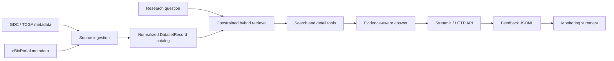

# Biomedical Dataset Discovery Assistant

An evidence-aware RAG application for finding public biomedical datasets across
GDC/TCGA and cBioPortal.

Researchers can ask questions about diseases, mutations, assays, and data
modalities. The assistant returns candidate datasets, source links, retrieval
evidence, and explicit limitations when the catalog cannot verify a claim such
as a KRAS G12C-positive case count.

> This project supports dataset discovery and research navigation. It does not
> provide medical advice, diagnosis, prognosis, or treatment recommendations.

## Demo

https://github.com/user-attachments/assets/a009d40e-b296-482c-b3d3-759129d27c13

The 50-second demo shows:

- Live OpenAI RAG
- grounded dataset evidence and source links
- explicit claim limitations
- tool traces
- feedback collection and monitoring

[GitHub Release](https://github.com/AI-Precision-Medicine-Zoomcamp/biomedical-dataset-discovery-assistant/releases/tag/capstone-demo-v1.0.0)
·
[Download the original WebM](https://github.com/AI-Precision-Medicine-Zoomcamp/biomedical-dataset-discovery-assistant/releases/download/capstone-demo-v1.0.0/streamlit-streamlit_app-2026-07-27-20-34-51.webm)

## What the Application Does

Given a question such as:

```text
Are there public datasets for KRAS G12C NSCLC with RNA-seq data?
```

the application:

1. searches a normalized GDC and cBioPortal catalog;
2. retrieves the best source-specific records;
3. loads dataset evidence and limitations;
4. produces a grounded answer;
5. exposes the tool trace and source URLs;
6. records optional reviewer feedback.

The central safety rule is simple: mutation profiling does not prove that a
dataset contains confirmed variant-positive cases. When the metadata does not
support that conclusion, the answer labels the dataset as a candidate and says
what must be checked next.

## Screenshots

### Live dataset comparison


### Evidence-aware retrieval


### Feedback monitoring


## Reviewer Quick Start

The complete local reviewer path does not require an API key.

Prerequisites:

- Python 3.11+
- [`uv`](https://docs.astral.sh/uv/)
- `make`

```bash
git clone https://github.com/AI-Precision-Medicine-Zoomcamp/biomedical-dataset-discovery-assistant.git
cd biomedical-dataset-discovery-assistant
uv sync
make reviewer-check
make ui
```

Open [http://127.0.0.1:8501](http://127.0.0.1:8501).

`make reviewer-check` rebuilds and validates the seed catalog, runs the unit
tests, compares retrieval methods, evaluates answer quality, verifies claims,
and regenerates `docs/evaluation_report_seed.md`.

For a shorter UI-only review:

```bash
uv sync
make ui
```

Select **Local reviewer mode** in Streamlit.

## Live OpenAI Mode

Copy the example environment file:

```bash
cp .env.example .env
```

Add your own credential:

```env
OPENAI_API_KEY=your-key
OPENAI_MODEL=gpt-4o-mini
# Optional:
# OPENAI_BASE_URL=https://api.openai.com/v1
```

Then run:

```bash
make ui
```

Select **Live OpenAI RAG** in Streamlit. The `.env` file is ignored by Git and
must never be committed.

## Architecture



### Main components

| Component | Implementation |
|---|---|
| Data model and catalog | `src/models.py`, `src/catalog.py` |
| GDC and cBioPortal ingestion | `scripts/ingest_gdc.py`, `scripts/ingest_cbioportal.py` |
| Catalog build and validation | `scripts/build_catalog.py`, `scripts/validate_catalog.py` |
| Keyword, TF-IDF, and hybrid retrieval | `src/retriever.py` |
| Evidence-aware deterministic answer | `src/answer.py` |
| RAG prompt and live OpenAI flow | `src/rag.py` |
| Tool-using workflow and trace | `src/tools.py`, `src/agent.py` |
| Reviewer UI and monitoring | `src/streamlit_app.py` |
| HTTP API and fallback browser UI | `src/api.py` |
| Evaluation | `evaluation/` |
| Orchestration examples | `flows/catalog_pipeline.yml`, `dags/catalog_pipeline_dag.py` |

## Data and Retrieval

The catalog stores GDC and cBioPortal as separate source records while linking
equivalent studies through `canonical_dataset_id`.

For example:

```text
gdc:TCGA-LUAD
cbioportal:luad_tcga_pan_can_atlas_2018
canonical_dataset_id: TCGA-LUAD
```

The seed catalog contains source views for:

- TCGA-LUAD
- TCGA-LUSC
- TCGA-BRCA as an out-of-scope comparison record

The default retriever is a constrained hybrid method. Keyword retrieval keeps
source and disease-scope guardrails intact; TF-IDF adds a lightweight reranking
signal within the safer candidate set.

Optional live ingestion can discover broader GDC and cBioPortal metadata:

```bash
make live-gdc-catalog
make live-catalog
make expanded-live-catalog
make broad-live-catalog
```

See [Data Sources](docs/data_sources.md),
[Dataset Schema](docs/data_schema.md), and
[Data Pipeline](docs/data_pipeline.md).

## Evaluation Results

The reproducible seed reviewer check currently reports:

| Check | Result |
|---|---:|
| Unit tests | 62 passed |
| Retrieval dataset hit rate | 1.00 |
| Retrieval top-hit rate | 1.00 |
| Retrieval source hit rate | 1.00 |
| Expected-absent handling | 1.00 |
| Answer pass rate | 1.00 |
| Claim verification pass rate | 1.00 |

The evaluation set contains 14 questions covering:

- NSCLC, LUAD, LUSC, and BRCA scope;
- RNA-seq, mutation, clinical, and copy-number modalities;
- GDC and cBioPortal source constraints;
- comparisons and exclusion behavior;
- unsupported KRAS G12C-positive case-count claims.

The small seed catalog makes the checks reproducible, but these scores do not
claim broad biomedical coverage. Larger live catalogs and a stricter
reliability set are evaluated separately.

Run individual evaluation workflows:

```bash
make retrieval-compare
make answer-eval
make claim-eval
make llm-judge-eval
make eval-report
```

For recorded live RAG and live judge results, see
[Live LLM Evaluation Results](docs/live_llm_eval_results.md).

For per-question evidence, see
[Seed Evaluation Report](docs/evaluation_report_seed.md) and
[Reliability Evaluation Report](docs/evaluation_report_reliability.md).

## Running with Docker

Start the Streamlit UI and HTTP API:

```bash
docker compose up --build
```

Services:

| Service | URL |
|---|---|
| Streamlit reviewer UI | [http://127.0.0.1:8501](http://127.0.0.1:8501) |
| API and fallback UI | [http://127.0.0.1:8000](http://127.0.0.1:8000) |
| API health check | [http://127.0.0.1:8000/health](http://127.0.0.1:8000/health) |
| Monitoring JSON | [http://127.0.0.1:8000/monitoring](http://127.0.0.1:8000/monitoring) |

Both Compose services include health checks.

## HTTP API

Available endpoints:

| Method | Endpoint | Purpose |
|---|---|---|
| `GET` | `/health` | Service and catalog status |
| `GET` | `/search?question=...` | Catalog search |
| `POST` | `/ask` | Grounded tool-using answer |
| `POST` | `/feedback` | Save a rating and comment |
| `GET` | `/feedback/summary` | Feedback metrics |
| `GET` | `/monitoring` | Browser monitoring page or JSON summary |

Example:

```bash
curl -s -X POST http://127.0.0.1:8000/ask \
  -H "Content-Type: application/json" \
  -d '{"question": "What datasets are available for KRAS G12C research in NSCLC?"}'
```

## Course Rubric Evidence

| Rubric area | Evidence |
|---|---|
| Problem description | This README and `docs/domain_background.md` |
| Knowledge-base ingestion | `scripts/`, normalized catalog, and pipeline docs |
| Retrieval and RAG | `src/retriever.py`, `src/rag.py`, `src/agent.py` |
| Retrieval evaluation | `evaluation/retrieval_eval.py`, `evaluation/retrieval_compare.py` |
| End-to-end evaluation | answer, claim, live RAG, and LLM-judge workflows |
| User interface | Streamlit Assistant and Monitoring tabs |
| Monitoring | feedback capture, metrics, recent-event view |
| Containerization | Dockerfile and Docker Compose health checks |
| Reproducibility | `uv.lock`, seed data, Make targets, tests, reviewer guide |
| Documentation | README, screenshots, video, reports, project map |

See the full [Course Requirements Checklist](docs/course_requirements_checklist.md).

## Scope and Limitations

- The seed catalog is intentionally small and focused on reproducibility.
- GDC and cBioPortal records currently provide project/study-level metadata,
  not patient-level alteration verification.
- KRAS G12C and EGFR relevance can be inferred from disease scope and mutation
  availability, but variant-positive case counts remain unverified unless the
  source metadata states otherwise.
- Live catalog ingestion expands breadth but not patient-level depth.
- The current agent exposes a deterministic local tool workflow; autonomous LLM
  tool selection is a future extension.
- Docker Compose, Kestra, and Airflow support local reproducibility and
  orchestration examples; this project is not presented as a production cloud
  deployment.

## Project Documentation

- [Reviewer Walkthrough](docs/reviewer_walkthrough.md)
- [Project Map](docs/project_map.md)
- [Project Status](docs/project_status.md)
- [Domain Background](docs/domain_background.md)
- [Data Sources](docs/data_sources.md)
- [Dataset Schema](docs/data_schema.md)
- [Data Pipeline](docs/data_pipeline.md)
- [Engineering Setup](docs/engineering_setup.md)
- [RAG Prompt Contract](docs/rag_prompt.md)
- [Evaluation Plan](docs/evaluation_plan.md)
- [Orchestration](docs/orchestration.md)

## License and Attribution

This educational capstone uses public metadata from GDC/TCGA and cBioPortal.
Follow each source platform's terms and attribution requirements when extending
the project or redistributing derived data.
