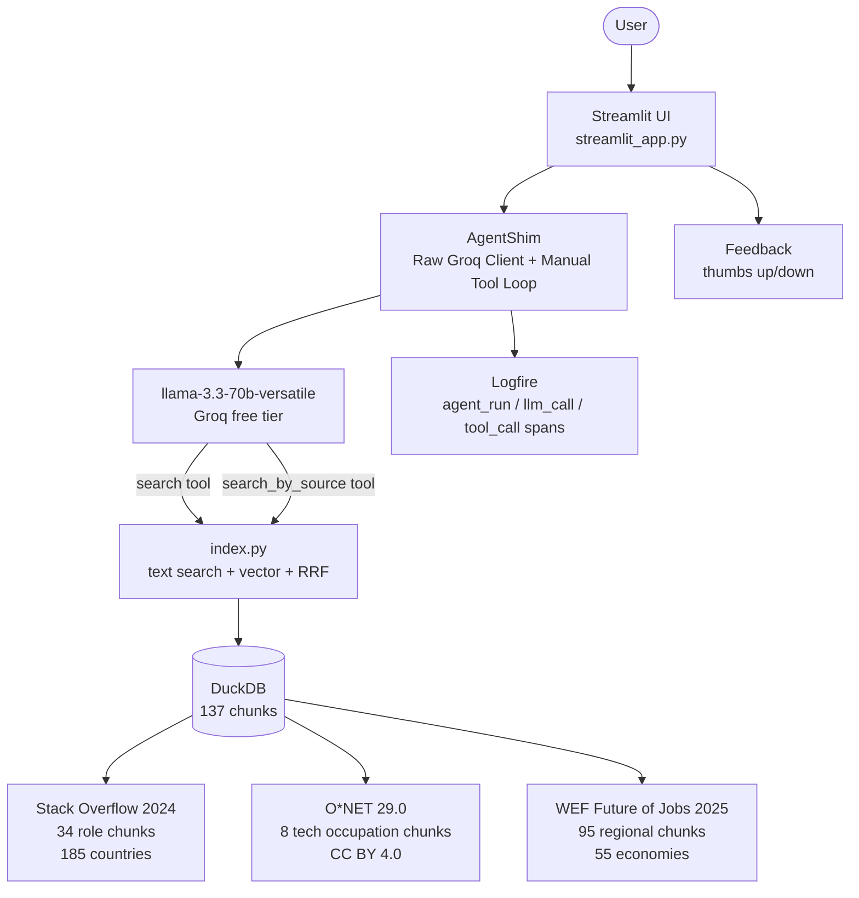

# DevPath: Tech Career Roadmap Agent

> A RAG + agentic assistant that answers developer career questions grounded in data from 65,000+ real developers and global labor market research.

**Live app**: https://devpath-tech-career-roadmap-agent.streamlit.app/


> Note: First load may take 60 seconds as Streamlit Community Cloud wakes up on demand. Please be patient when accessing the site.

Built as a final project for [LLM Zoomcamp 2026](https://github.com/DataTalksClub/llm-zoomcamp) by DataTalksClub.

---

## The Problem

Developers often don't know what to learn next or how to plan their careers. Most advice online is:

- **Too generic** - "Learn Python and SQL" without explaining when, why, or where those skills are actually used.
- **US-focused** - Salary data, hiring trends, and recommended tools often reflect the US market, making them less useful for developers elsewhere.
- **Based on opinions** - Many recommendations come from blogs or personal experiences instead of real data.

Someone in the Philippines asking, "How do I become a data engineer?" needs different guidance than someone in Germany. Local job markets, salaries, and skill demand vary from country to country.

DevPath provides recommendations backed by real developer survey data, official occupation standards, and regional job market forecasts, with clear source citations so users can see where the information comes from.

---

## Demo


Try asking:
- *"I know Python and SQL. How do I become a data engineer?"*
- *"What tools do ML engineers use most in 2024?"*
- *"I am in the Philippines - is data science growing in Southeast Asia?"*
- *"What skills do I need to transition from data analyst to data scientist?"*

**Example answer:**

> To become a data engineer with Python and SQL, here are the key steps based on real data:
>
> According to the Stack Overflow Developer Survey 2024, 65.1% of data engineers use Python and 57.4% use SQL as primary languages (65,437 respondents worldwide). This confirms your current skills are well-aligned.
>
> According to O*NET 29.0 (US Dept of Labor), data engineers typically require skills in: Programming, Systems Analysis, Technology Design, and Database Management. Key tools include Apache Spark, Hadoop, AWS, and dbt...

---

## How It Works

DevPath uses a **RAG + agentic** architecture:

```
You type a question
       |
       v
Streamlit chat interface
       |
       v
AgentShim (Groq llama-3.3-70b-versatile)
  - Decides what to search and how many times
  - Uses 2 tools: search() and search_by_source()
       |
       v
Knowledge base (137 chunks in DuckDB)
  - Stack Overflow Survey 2024 (34 role chunks)
  - O*NET 29.0 occupation data (8 tech role chunks)
  - WEF Future of Jobs 2025 (95 regional forecast chunks)
       |
       v
Answer with specific statistics and source citations
```

**Why AgentShim instead of Pydantic AI directly?**
Pydantic AI 2.22.0 has a confirmed bug with Groq tool calling, as it generates malformed function call format. AgentShim is a raw Groq client with a manual tool loop that produces correct tool calls. Pydantic is still used for `BaseModel` and `dataclass` type safety.

---

## Dataset

| Source | Organization | License | Coverage | Why |
|--------|-------------|---------|----------|-----|
| [Stack Overflow Survey, 2024](https://survey.stackoverflow.co/2024/) | Stack Overflow | ODbL | 65,437 devs, 185 countries | Real tool adoption - what developers actually use |
| [O*NET 29.0](https://www.onetcenter.org/database.html) | U.S. Dept of Labor | CC BY 4.0 | 900+ occupations | Formal skill requirements - career roadmap data |
| [WEF Future of Jobs 2025](https://www.weforum.org/publications/the-future-of-jobs-report-2025/) | World Economic Forum | Free w/ attribution | 55 economies | Regional job growth forecasts - non-US context |

All datasets are **static snapshots**, meaning the knowledge base remains the same between runs. This makes the results reproducible and keeps evaluation metrics consistent.

**Why combine these three sources?** No single dataset can answer every career-related question:

- **Stack Overflow Developer Survey** shows what technologies developers actually use, but not the formal requirements for a role or future demand.
- **O*NET** defines the skills and responsibilities associated with occupations, but not which tools and technologies are most commonly used in practice.
- **WEF Future of Jobs** provides insights into regional labor market trends and demand, but not the specific technical skills needed for each role.

---

## Architecture



---

## Retrieval Evaluation

Ground truth: **60 questions** generated from the knowledge base using Groq (3 questions per chunk, first 20 chunks). Evaluation uses fuzzy `dev_type` matching. This is fairer than exact chunk ID matching for a multi-source knowledge base.

| Method | Hit Rate | MRR | Selected |
|--------|----------|-----|----------|
| text_search | **0.4111** | **0.2143** | YES |
| vector_search | 0.2111 | 0.0815 | |
| hybrid_search (RRF k=60) | 0.3889 | 0.2031 | |

**text_search selected** as the agent's primary retrieval method, since it is the best on both Hit Rate and MRR.

To reproduce:
```bash
rm -f data/processed/ground_truth.json
uv run python rag/evaluate.py
```

---

## Monitoring

DevPath uses [Logfire](https://logfire.dev) for observability. Every agent run produces a trace with child spans for each LLM call, tool call, and fallback recovery.


**What is tracked per run:**
- `agent_run` : full question-to-answer duration (avg ~2.5s)
- `llm_call` : each Groq API call with token usage
- `tool_call` : each search tool invocation with query and source
- `llm_fallback` : triggered when Groq generates malformed tool calls (auto-recovery)

Configure `LOGFIRE_TOKEN` in `.env` to enable tracing.
View live traces at [logfire.dev](https://logfire.dev).

User feedback (thumbs up / thumbs down) is collected per answer via the Streamlit UI.

---

## Project Structure

```
devpath/
├── agent.py                  # Raw Groq agent + AgentShim manual tool loop
├── index.py                  # text + vector + hybrid search (RRF)
├── embedder.py               # ONNX embedder (all-MiniLM-L6-v2)
├── streamlit_app.py          # Streamlit Cloud entry (calls agent directly)
├── requirements.txt          # Streamlit Cloud dependencies
├── pyproject.toml            # uv / Docker dependencies
├── uv.lock                   # Locked dependency versions
├── Dockerfile.api            # FastAPI container
├── Dockerfile.ui             # Streamlit container
├── docker-compose.yml        # Local: API + UI orchestration
├── devpath_pipeline.duckdb   # DuckDB knowledge base (committed)
├── api/main.py               # FastAPI: /ask /feedback /health /stats
├── ui/app.py                 # Streamlit UI for local Docker run
├── ingestion/
│   ├── clean_so.py           # SO Survey -> so_chunks.json
│   ├── clean_onet.py         # O*NET -> onet_chunks.json
│   ├── extract_wef.py        # WEF PDF -> wef_chunks.json
│   └── pipeline.py           # dlt: JSON chunks -> DuckDB
├── rag/
│   ├── download.py           # Downloads ONNX model
│   └── evaluate.py           # Hit Rate + MRR evaluation
├── models/                   # ONNX model files (committed, ~90MB)
└── data/processed/           # JSON chunks + eval results (committed)
    ├── so_chunks.json        # 34 developer role chunks
    ├── onet_chunks.json      # 8 tech occupation chunks
    ├── wef_chunks.json       # Regional forecast chunks
    ├── ground_truth.json     # 60 evaluation Q&A pairs
    └── eval_results.json     # Hit Rate + MRR results
```

---

## Setup

### Requirements
- Python 3.11+
- [uv](https://astral.sh/uv) (package manager)
- Docker Desktop (for local containerized run)
- Groq API key (free at [console.groq.com](https://console.groq.com))
- Logfire token (free at [logfire.dev](https://logfire.dev))

### Installation

```bash
git clone https://github.com/CalistaJajalla/devpath.git
cd devpath
uv sync
cp .env.example .env
# Edit .env and add your GROQ_API_KEY and LOGFIRE_TOKEN
```

### Download datasets

**Stack Overflow Survey 2024:**
```bash
mkdir -p data/raw
curl -L -o data/raw/survey_results_public.csv \
  'https://raw.githubusercontent.com/rfordatascience/tidytuesday/master/data/2024/2024-09-03/stackoverflow_survey_single_response.csv'
```

**O*NET 29.0:**
```bash
BASE='https://www.onetcenter.org/dl_files/database/db_29_0_excel'
curl -L -o data/raw/onet_occupations.xlsx "$BASE/Occupation%20Data.xlsx"
curl -L -o data/raw/onet_skills.xlsx "$BASE/Skills.xlsx"
curl -L -o data/raw/onet_tech_skills.xlsx "$BASE/Technology%20Skills.xlsx"
```

**WEF Future of Jobs 2025** (must download manually):
1. Go to [weforum.org/publications/the-future-of-jobs-report-2025/](https://www.weforum.org/publications/the-future-of-jobs-report-2025/)
2. Download the PDF
3. Save as `data/raw/wef_2025.pdf` (~18MB)

### Run ingestion pipeline

```bash
uv add openpyxl
uv run python ingestion/clean_so.py      # -> data/processed/so_chunks.json
uv run python ingestion/clean_onet.py   # -> data/processed/onet_chunks.json
uv run python ingestion/extract_wef.py  # -> data/processed/wef_chunks.json
uv run python ingestion/pipeline.py     # -> devpath_pipeline.duckdb
```

> Note: Processed chunks are already committed to the repo. You only need to run ingestion if you want to rebuild from raw data.

### Run locally

**With Docker (recommended):**
```bash
docker compose up
# Open http://localhost:8501
```

**Without Docker:**
```bash
# Terminal 1: API
uv run uvicorn api.main:app --port 8000

# Terminal 2: UI
API_URL=http://localhost:8000 uv run streamlit run ui/app.py
```

### Environment variables

```bash
# .env (copy from .env.example)
GROQ_API_KEY=gsk_your-groq-key-here
LOGFIRE_TOKEN=your-logfire-write-token
LOGFIRE_READ_TOKEN=your-logfire-read-token
API_URL=http://localhost:8000
```

---

## Evaluation Criteria Checklist

For peer reviewers - here is where to find each criterion:

| Criterion | Where |
|-----------|-------|
| Problem description | This README: Problem and Dataset sections |
| Retrieval flow | `index.py`, `agent.py`: RAG + agentic with 2 search tools |
| Retrieval evaluation | `rag/evaluate.py`, `data/processed/eval_results.json`, table above |
| LLM evaluation | `rag/evaluate.py`: single prompt variant (2nd prompt in Aug 18) |
| Interface | Live at devpath.streamlit.app / locally via docker compose up |
| Ingestion pipeline | `ingestion/` folder: 4 scripts + dlt pipeline to DuckDB |
| Monitoring | Logfire traces at logfire.dev + thumbs feedback in UI |
| Containerization | `docker-compose.yml`, `Dockerfile.api`, `Dockerfile.ui` |
| Reproducibility | This README setup section + `.env.example` + `uv.lock` |

---

## Known Limitations

- **Pydantic AI compatibility**: The version used has issues with tool calling when paired with Groq, so the application uses the native Groq client as a workaround.
- **WEF data extraction**: The quality of extracted text depends on the PDF structure. If extraction is incomplete, the system falls back to using only the Stack Overflow Survey and O*NET datasets.
- **Memory usage**: The ONNX embedding model requires around 300 MB of memory. On Streamlit Cloud's 1 GB limit, the initial load may take longer.
- **Groq rate limits**: The free tier may occasionally throttle requests. If a request is delayed or fails due to rate limiting, wait about a minute before trying again.
- **Evaluation metrics**: A Hit Rate of 0.41 is expected because the knowledge base combines heterogeneous sources, including PDF text and aggregated survey data. To improve retrieval quality, the agent performs multiple searches for each query.
