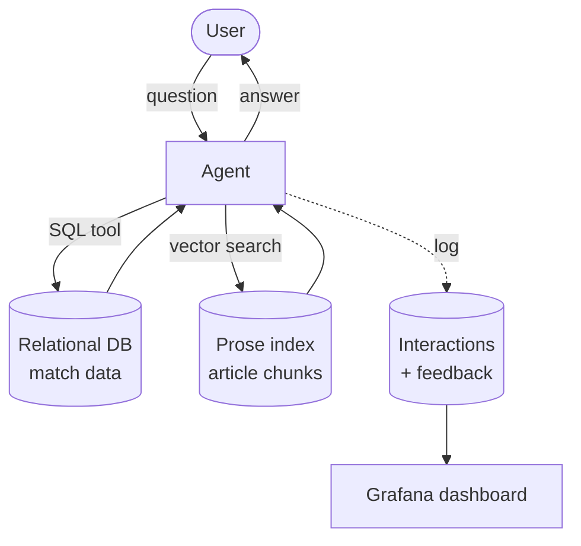

# World Cup 2022 — LLM Knowledge Base

*A knowledge base for the previous World Cup*

## The Problem Statement

Weeks after the 2026 final, every storyline is still vivid, the upsets, the
goals, the controversies. Qatar 2022 however, not so much. Most people will remember 
the final, which was the best in living memory, and the controversies
around the host. 

Those details about the 63 other games and many details surrounding them are not lost,
they just need to be recalled. Wikipedia holds the spoken narrative, spread across a few
articles and a hundred tables. The questions one actually wants to ask fall into two very
different categories:

- *Did Messi and Mbappé play against each other?* — a **relational fact**, and answering it
  means joining lineups across 64 fixtures to find two players on opposite sides
  of the same match. Perfect for relational databases.
- *What was the biggest scandal involving Switzerland?* — a **narrative**, and
  answering it means reading prose.

This project builds both halves and puts a router in front of them. It
combines a **relational database** (structured match data), a **vector index**
(tournament prose), and an **agent** that sends each question to the right
source — or to both, when a question needs a fact and a narrative at once.
---

## How it works

The user asks a question in a chat UI. An agent decides which of two surfaces to query:

- **Relational DB** — structured facts, via SQL tool calls (results, standings, lineups, venues…)
- **Prose index** — narrative/semantic questions, via vector search over encoded Wikipedia articles


## Setup

```bash
cp .env.example .env     # POSTGRES_* are already filled in
# add your OPENAI_API_KEY
docker compose up -d
```

That is it. Chat at http://localhost:8501, dashboard at
http://localhost:3000 (admin / admin).

**No football API key is strictly needed.** The knowledge base ships pre-loaded:
`data/kb.sql.gz` (614 KB) is restored automatically the first time Postgres
starts on an empty volume. Rebuilding it from the live API would cost ~131
requests against a free-tier cap of 100/day — two days — which is I decided to ship
it with data. `FOOTBALL_API_KEY` matters only if you want to re-run the structured
ingestion yourself and you are certainly welcome to (see [Rebuilding from source](#rebuilding-from-source)).

The dashboard is populated on first boot too, by a one-shot `seed` service that
fabricates back-dated traffic. It makes no LLM calls, and its rows are marked
`[seed]`. It's meant to be an illustration of what a used app would look like.

If a port is already taken — a local Postgres on 5432 is the usual culprit —
set `POSTGRES_PORT`, `GRAFANA_PORT` or `APP_PORT` in `.env`.

---

## Data sources

### Structured — API-Football

Ingested **once** from API-Football (World Cup = `league id 1`). Entities pulled:

- leagues, standings, teams, venues, coaches, players
- fixtures / matches, lineups
- in-match events (goals, cards, substitutions — with the minute they happened)

Lineups are the key table: they power relational questions like *"did players X and Y play against each other?"* — a self-join on appearances in the same match on opposite teams.

**Ingestion:** dlt (REST-API source → Postgres destination), re-runnable. Makes 132 calls to Football API, so takes 2 days to fully populate on their free tier.

*Data-source reference: [API-Football data model](https://www.api-football.com/public/img/news/archi-beta.jpg)*

### Unstructured — Wikipedia

A small, curated **manifest** of *tournament-level* articles (Qatar 2022, matching the structured data):

- `2022 FIFA World Cup` — the main article, and the workhorse of the corpus
- `2022 FIFA World Cup final`
- `2022 FIFA World Cup knockout stage`
- `2022 FIFA World Cup opening ceremony`
- `List of 2022 FIFA World Cup controversies`

Each article is pinned to a specific **revision id** (`ingestion/prose/manifest.py`) so the corpus is reproducible and doesn't drift as Wikipedia keeps updating.

Table-shaped sections (group standings, squads, base camps) are **not** ingested as prose — that data comes from the structured side. The rule: *sentences → prose index; cells → SQL.*

---

## Ingestion flows

### Prose (Wikipedia → vector index)

```
read pinned-revision manifest
  → fetch each article        (MediaWiki Action API, by oldid)
  → split into sections       (mwparserfromhell — strip markup, get sections)
  → tag chunk {source_article, section, teams_mentioned}
  → embed
  → write to vector index
```

### Structured (API-Football → SQL)

```
dlt REST-API pipeline → Postgres
  (leagues, teams, venues, coaches, players, fixtures, lineups, standings)
```

---

## Storage

- **Relational:** Postgres (dockerized)
- **Prose / vector index:** Postgres + `pgvector` extension for embeddings (`pgvector/pgvector:pg16` image)

---

## Interface

A simple **Streamlit** chat app, served by `docker compose up` at
http://localhost:8501. Each answer
carries a 👍 / 👎 feedback control, and every interaction is logged to Postgres
for the monitoring dashboard.

---

## Monitoring

Online evaluation on live traffic:

- Every interaction logged — question, answer, model, tokens, cost, latency, tools used, feedback
- **LLM-as-judge** scores answer relevance on real traffic
- **Grafana dashboard** (≥ 5 charts): feedback rate, response time, cost/tokens, judge relevance, tool-routing breakdown, feedback split by tool path

Built — see [Monitoring (judge + Grafana)](#monitoring-judge--grafana) below.

---

## Evaluation

Offline evaluation against a fixed, committed dataset — distinct from the
monitoring above, which scores live traffic:

- **Retrieval:** lexical vs. vector vs. hybrid scored on Hit Rate and MRR; the
  winner becomes `DEFAULT_ARM`
- **Answer quality:** three agent prompt variants scored by a reference-aware
  LLM-as-judge; the winner becomes `agent/instructions.py`

Both reuse `monitoring/llm.py`'. The offline judge defines its own
labels rather than reusing `RelevanceVerdict` — relevance and correctness are
different questions, and sharing the model would make two incomparable numbers
look comparable.

Built — see [Evaluation (retrieval arms + prompt variants)](#evaluation-retrieval-arms--prompt-variants)
below, and the generated results in [docs/evaluation-results.md](docs/evaluation-results.md).

---


### Dependency versions

`uv.lock` is committed and pins every transitive dependency exactly; the image
installs with `uv sync --frozen`, which fails rather than re-resolving if the
lockfile and `pyproject.toml` disagree. The `>=` floors in `pyproject.toml` are
the supported range, not the pin.

### Running on the host instead

The pipelines and the app still run under `uv run` against the published
Postgres port. That path needs the ONNX embedding model, which is not committed:
`uv run python scripts/download_model.py` fetches it once into `models/`. The
container downloads its own copy at build time.

### Rebuilding from source

Two profiles, off by default, so nothing expensive runs on a plain `up`:

```bash
docker compose --profile ingest run --rm ingest-prose        # free (Wikipedia only)
docker compose --profile ingest run --rm ingest-football     # needs FOOTBALL_API_KEY; 2 days under the free cap
docker compose --profile eval   run --rm eval-retrieval      # free, deterministic
docker compose --profile eval   run --rm eval-answers        # ~$0.13 of OpenAI; resumable
```

Every service shares one image, so anything else runs the same way:

```bash
docker compose run --rm app python -m agent.cli "Who won the final?"
docker compose run --rm app python -m evaluation.report
```

After a deliberate rebuild, regenerate the committed dump with
`./scripts/dump_kb.sh`. This matters after any change to chunking or the
embedding model: the dump carries **derived embeddings**, so a stale one would
restore cleanly while describing a corpus that no longer exists. A test asserts
the dump's vector dimension still matches `EMBEDDING_DIM`, which catches a model
swap but not a re-chunk.

---

## Ingestion (API-Football → Postgres)

One dlt pipeline loads teams, standings, fixtures, lineups, and match events for the
FIFA World Cup (league 1). The season is pinned to 2022 (Qatar) because API-Football's
free plan only exposes seasons 2022–2024 — season 2026 requires a paid plan; flip `SEASON` in
`ingestion/football/__init__.py` if that changes. Lineups and events each cost 1 API call
per fixture, so the pipeline is budgeted (`MAX_REQUESTS_PER_RUN`, default 90) and
resumable — re-run it daily until complete; finished runs are no-ops on the expensive
endpoints. Events carry the minute (`time__elapsed`) for goals, cards, and
substitutions; in `subst` rows, `player` is the one coming off and `assist` the one
coming on.

> You do not need to run this to use the project — the loaded data ships in
> `data/kb.sql.gz` and restores automatically. This section is for rebuilding it
> from the live API, which needs a key and takes two days under the free cap.

```bash
docker compose --profile ingest run --rm ingest-football   # containerized
uv run python -m ingestion.football.pipeline               # or on the host
uv run pytest                                     # tests (never hit the live API)
uv run python scripts/smoke_test.py               # MANUAL: 1 real API call to /status
```

Required in `.env`: `FOOTBALL_API_KEY`, `POSTGRES_USER`, `POSTGRES_PASSWORD`,
`POSTGRES_DB` (optional: `POSTGRES_HOST`, `POSTGRES_PORT`, `MAX_REQUESTS_PER_RUN`).
Re-run `./scripts/dump_kb.sh` afterwards to refresh the committed dump.

## Ingestion (Wikipedia → pgvector)

The prose pipeline fetches the 5 pinned articles, splits them into per-section
chunks (≤256 tokens, tables and boilerplate dropped), tags each chunk with the
teams it mentions, embeds with `all-MiniLM-L6-v2` (ONNX, 384-dim), and writes to
`prose.chunks` in the same Postgres. Full refresh on every run — no API keys or
quotas involved. Embedding code follows the llm-zoomcamp course (ONNX Runtime
instead of PyTorch).

> Also not needed for a normal run — the embedded chunks ship in the dump. This
> one is free to re-run, though: Wikipedia needs no key and no quota.

```bash
docker compose --profile ingest run --rm ingest-prose      # containerized
uv run python scripts/download_model.py           # host only: fetch the ONNX model
uv run python -m ingestion.prose.pipeline         # fetch + chunk + embed + load
uv run python -m ingestion.prose.search "Who scored in the final?"          # smoke search
uv run python -m ingestion.prose.search "biggest scandal?" Switzerland      # team-filtered
```

Requires the structured pipeline to have run first (`football.teams` powers the
team tagging). Re-run `./scripts/dump_kb.sh` afterwards — a re-chunk changes
every embedding, and the committed dump would otherwise be stale.

## Agent (CLI chat)

A handwritten agentic loop (OpenAI Responses API function calling, following the
llm-zoomcamp agentic-RAG module) routes each question across three tools:

- `execute_sql` — raw read-only SQL against `football.*`; the schema (including
  the dlt child-table joins for lineups) is documented in the instructions, and
  query errors are fed back to the agent so it can fix its own SQL
- `search_prose` — pgvector cosine search over `prose.chunks`, optional team filter
- `read_section` — expands a search hit into its full article section

```bash
uv run python -m agent.cli                                        # interactive chat (multi-turn)
uv run python -m agent.cli "Did Messi and Mbappé play against each other?"   # one-shot
```

Each answer prints a footer with the tools used, token count, and latency —
the raw material for the monitoring milestone. Requires `OPENAI_API_KEY` in
`.env` (optional: `OPENAI_MODEL`, default `gpt-5.4-mini`) and both ingestion
pipelines to have run.

## Chat UI (Streamlit)

The Streamlit app wraps the same agent loop as the CLI in a chat transcript
with multi-turn history. Each answer shows the CLI-style footer (tools, tokens,
latency, plus cost), an LLM-as-judge relevance badge, and a 👍/👎 control. Every
interaction is logged to `monitoring.conversations` (question, answer, model,
tokens, latency, cost, tool calls as JSONB); each thumb click and each judge
verdict goes to `monitoring.feedback`. Logging follows the llm-zoomcamp
monitoring module; tables are created idempotently on first launch.

```bash
docker compose up -d                              # chat at http://localhost:8501
uv run streamlit run app/main.py                  # or on the host
uv run python -m monitoring.db                    # optional: init tables standalone
```

Same requirements as the CLI agent.

## Monitoring (judge + Grafana)

### LLM-as-judge

Every answer is scored for relevance by a second LLM call, inline in the chat
turn, following the course's lesson-09 judge: answer → log the conversation →
judge → log the verdict as `source='judge'` feedback. Verdicts are
`RELEVANT` / `PARTLY_RELEVANT` / `NON_RELEVANT` with a written explanation,
obtained as structured output (`client.responses.parse`) so the label is always
one of the three.

The prompt is rewritten for this domain. Two rules matter for reading the
chart: a multi-part question needs *every* clause answered to count as
RELEVANT, and declining to answer is NON_RELEVANT even though declining is the
right behaviour when the tools found nothing — the score measures whether the
user got what they asked for, not whether the system behaved well.

Two deviations from the course. The judge records **its own cost** in
`feedback.cost`, because judging every answer roughly doubles the per-question
spend and a cost chart that ignores it is wrong by half. And the judge can
never break the chat: if there is no answer to score (the agent hit its
iteration cap) it is skipped without spending a call, and if the judge itself
fails after retries the answer still renders, just without a badge.

```bash
uv run python -m monitoring.judge                 # smoke test: one real call
```

### Tool paths

Three panels group conversations by which half of the knowledge base the agent
actually reached, derived from the logged `tool_calls`:

| path | meaning |
|---|---|
| `sql-only` | `execute_sql` only |
| `prose-only` | `search_prose` / `read_section` only |
| `mixed` | both — the questions in `docs/mixed-routing-questions.md` |
| `none` | answered or declined without calling a tool |

### Dashboard

Nine panels: feedback rate, response time (avg + p95), cost split agent vs
judge, tokens, judge relevance, tool routing, tool calls by tool, feedback by
tool path, and a recent-conversations table.

Grafana is **provisioned from committed files** (`grafana/provisioning/`) rather
than clicked together in the UI as the course does, so `docker compose up`
yields a working dashboard with nothing to configure. The datasource takes its
credentials from the environment, so no password is committed.

Seeding happens automatically: a one-shot `seed` service runs on every
`docker compose up`, purging and re-seeding so a repeated `up` does not stack
duplicate rows. The rows cannot simply ship inside `data/kb.sql.gz` because they
are back-dated relative to *now* — a dump of them would render an empty
dashboard within a day, since the panels default to a `now-6h` window.

To drive it by hand:

```bash
uv run python -m monitoring.seed --hours 6 --count 150   # fabricated back-dated traffic
uv run python -m monitoring.seed --purge          # remove it again
```

Grafana is at http://localhost:3000 (admin / admin — local only). The seed
script makes no LLM calls; it fabricates conversations and feedback spread over
the last few hours so a fresh dashboard opens on a full time axis. Seeded
questions are prefixed `[seed]` so they are obvious in the table panel and can
be purged cleanly.

## Evaluation (retrieval arms + prompt variants)

Two independent comparisons, each ending in the configuration the system runs
on. Results — both full tables, the questions every variant missed, and the
caveats — are generated into
[docs/evaluation-results.md](docs/evaluation-results.md); it is written by
`evaluation/report.py` and should never be edited by hand.

Both comparisons confirmed what was already shipped rather than overturning it:
**vector** retrieval (MRR 0.6124 over hybrid's 0.5924, on 534 generated
questions) and the **full** prompt (70.0% CORRECT against lean's 66.7% and
guided's 63.3%, on 30 curated references). The prompt spread is a few answers
out of thirty, so the honest reading is that neither alternative beats the
shipped prompt — not that it is the best possible one.

The more useful output was the six questions *no* variant got right. Two are
real defects, both below the prompt layer: shootout penalties are stored as
`Goal` events at minute 120 and inflate every goal count, and the agent answers
off-topic coding requests instead of declining.

### Retrieval — which arm the agent searches with

`ingestion/prose/search.py` holds three arms over the same 208 chunks:

| arm | how it ranks |
|---|---|
| `search_vector` | pgvector cosine over the 384-dim embeddings |
| `search_lexical` | Postgres full-text search, `ts_rank_cd` over a generated `content_tsv` column (section weighted `A`, body `B`) |
| `search_hybrid` | both, fused with Reciprocal Rank Fusion |

`search()` delegates to whichever arm `DEFAULT_ARM` names, so adopting a winner
is a one-line change and `agent/tools.py` never has to know.

Ground truth is synthetic: `evaluation/ground_truth.py` asks the model for
questions each chunk would answer, so that chunk is by construction the gold
document. Rows are keyed on `(article, section, chunk_index)` rather than
`chunks.id`, because the prose pipeline drops and recreates the table on every
run and the `SERIAL` is reassigned — a CSV keyed on it would silently start
scoring against different chunks.

One non-obvious detail in the lexical arm: `plainto_tsquery` ANDs every lexeme,
so a question phrased as a sentence matches only chunks containing all of its
content words. Measured on this corpus, *"What was the biggest controversy about
migrant workers?"* returns 0 rows under AND and 42 under OR. The arm rewrites
the operator to `|`, which turns it from a filter into a ranker.

```bash
uv run python -m ingestion.prose.pipeline          # builds content_tsv + the GIN index
uv run python -m evaluation.ground_truth           # ~208 LLM calls, writes the CSV
uv run python -m evaluation.retrieval --k 5 --candidates 20
```

### Answer quality — which prompt the agent runs

`evaluation/variants.py` holds three developer prompts: **full** (the shipped
one, imported rather than copied so it cannot drift), **lean** (routing rules
and a bare schema, no coaching), and **guided** (full plus worked routing traces
for mixed questions). `run_agent_loop` takes an `instructions=` parameter so the
same agent, tools and model run under each.

Answers are scored against ~30 hand-written references in
`evaluation/data/answer-ground-truth.csv` by `evaluation/judge_offline.py`,
following the course's A→Q→A' judge. Two things it does differently from the
online judge in `monitoring/judge.py`:

- it sees a **reference answer**, so it scores correctness rather than relevance,
  with its own `CORRECT` / `PARTLY_CORRECT` / `INCORRECT` labels;
- for the off-topic rows the reference *is* "the system should decline", so a
  correct refusal scores CORRECT — the opposite of the online judge, where
  declining is always NON_RELEVANT.

A verdict the judge cannot produce after retries is recorded as `MISSING` and
stays in the denominator, so a variant cannot look better by failing to be
scored. The runner is resumable: a `(variant, id)` pair already in
`answer-runs.csv` is skipped, and a failed run leaves no row so it is retried.

```bash
uv run python -m evaluation.answers                # 3 variants x 30 questions, resumable
uv run python -m evaluation.answers --variant lean # or one at a time
uv run python -m evaluation.judge_offline          # score them
uv run python -m evaluation.report                 # render docs/evaluation-results.md
```