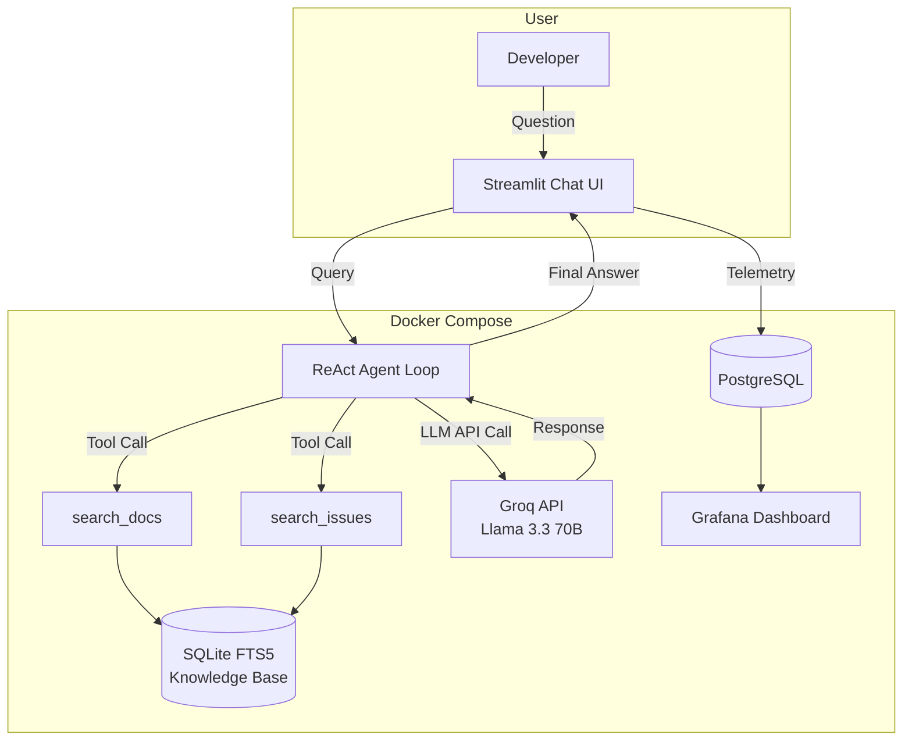

# 🔧 Open-Source Support Assistant

> An Agentic RAG system that provides expert-level support for FastAPI developers by dynamically searching official documentation and real GitHub issues.

**LLM Zoomcamp 2026 — Capstone Project**

---

## 📋 Table of Contents

- [Problem Statement](#-problem-statement)
- [Dataset](#-dataset)
- [Architecture](#-architecture)
- [Technologies Used](#-technologies-used)
- [Project Structure](#-project-structure)
- [Getting Started](#-getting-started)
- [Using the Application](#-using-the-application)
- [RAG Evaluation](#-rag-evaluation)
- [Monitoring & Observability](#-monitoring--observability)
- [Acknowledgements](#-acknowledgements)

---

## 🎯 Problem Statement

Developers using FastAPI constantly run into issues where:

- **Documentation is vast** — FastAPI has 200+ pages of markdown docs. Finding the right page for a specific problem is like searching for a needle in a haystack.
- **GitHub issues hold hidden gold** — Many real-world bugs and workarounds are buried in closed GitHub issues that never make it into the docs.
- **Generic LLMs hallucinate** — Asking ChatGPT or similar models about FastAPI often produces outdated or fabricated API calls.

This project solves all three problems by building an **Agentic RAG Assistant** that:

1. Ingests the entire FastAPI documentation and top closed GitHub issues.
2. Chunks and indexes them using Full-Text Search.
3. Uses a **ReAct Agent** (not linear RAG) that autonomously decides what to search, iterates with different keywords, and synthesizes accurate, source-backed answers.

---

## 📊 Dataset

The knowledge base is built **automatically at startup** from two live sources:

| Source | Type | Count | Method |
|--------|------|-------|--------|
| [FastAPI Docs](https://github.com/fastapi/fastapi/tree/master/docs/en/docs) | Official Markdown documentation | ~200 pages | Pulled via `gitsource` library from GitHub |
| [FastAPI Issues](https://github.com/fastapi/fastapi/issues) | Closed GitHub issues (bugs, questions, workarounds) | Top 200 | Fetched via GitHub REST API |

**Chunking Strategy:** All documents are split using a sliding window (size=2000 chars, step=1000 chars) to create overlapping chunks that preserve context across boundaries.

The final knowledge base contains **~1,400+ chunks** stored in a persistent SQLite FTS5 index (`data/knowledge_base.db`).

---

## 🏗 Architecture



### How the ReAct Agent Works

Unlike traditional RAG (retrieve once → generate), this project implements a **ReAct (Reason + Act) loop**:

1. The user asks a question.
2. The LLM **reasons** about what information it needs.
3. It **acts** by calling `search_docs` or `search_issues` with specific keywords.
4. It reads the search results and decides: *"Do I have enough information, or should I search again with different keywords?"*
5. Steps 2–4 repeat (up to 10 iterations) until the LLM is satisfied.
6. The LLM synthesizes a comprehensive, source-backed answer.

**Self-Correction:** If the LLM generates a malformed tool call (a known issue with open-source models), the agent catches the error, feeds it back into the conversation history, and the LLM self-corrects on the next iteration.

---

## 🛠 Technologies Used

| Component | Technology | Purpose |
|-----------|-----------|---------|
| **LLM** | Groq (Llama-3.3-70b-versatile) | Fast, free-tier inference for the ReAct agent |
| **Search Engine** | SQLite FTS5 (`sqlitesearch`) | Persistent full-text search index for document retrieval |
| **Frontend** | Streamlit | Interactive chat UI with feedback buttons |
| **Monitoring DB** | PostgreSQL 16 | Stores conversation logs, token usage, and user feedback |
| **Dashboards** | Grafana 11.1 | Visualizes latency, token costs, and feedback trends |
| **Ingestion** | `gitsource` + GitHub REST API | Pulls docs from GitHub repo and fetches closed issues |
| **Containerization** | Docker Compose | One-command deployment of all 3 services |

---

## 📁 Project Structure

```
oss-support-assistant/
│
├── agent/                          # Core agent logic
│   ├── loop.py                     # ReAct loop with self-correction
│   └── tools.py                    # Tool schemas and dispatch map
│
├── app/
│   └── streamlit_app.py            # Chat UI with feedback & metrics
│
├── evaluation/                     # Offline evaluation pipeline
│   ├── generate_ground_truth.py    # LLM-generated synthetic questions
│   ├── evaluate_search.py          # Hit Rate & MRR for retrieval
│   ├── evaluate_agent.py           # LLM-as-a-Judge for answer quality
│   └── run_all.sh                  # Run entire evaluation pipeline
│
├── ingestion/                      # Data ingestion pipeline
│   ├── ingest.py                   # Main orchestrator
│   ├── chunker.py                  # Sliding window chunker
│   └── github_issues.py            # GitHub REST API client
│
├── monitoring/                     # Telemetry & observability
│   ├── database.py                 # PostgreSQL client (save/query)
│   └── init_db.sql                 # Schema for conversations & feedback
│
├── retrieval/                      # Search backends
│   ├── search_fts.py               # SQLite FTS5 search implementation
│   └── search_vector.py            # (Placeholder for future vector search)
│
├── grafana/                        # Pre-configured Grafana dashboards
│   └── provisioning/
│       ├── datasources.yaml        # Auto-connects to PostgreSQL
│       └── dashboards/
│           └── monitoring.json     # Token usage, latency, feedback panels
│
├── docker-compose.yaml             # 3-service deployment
├── Dockerfile                      # Python 3.11 slim image
├── entrypoint.sh                   # Auto-ingestion + Streamlit launch
├── pyproject.toml                  # Python dependencies
├── .env.example                    # Template for API keys
└── README.md
```

---

## 🚀 Getting Started

### Prerequisites

- [Docker](https://docs.docker.com/get-docker/) and Docker Compose installed
- A free [Groq API key](https://console.groq.com/) (for LLM inference)

### Setup

1. **Clone the repository:**
   ```bash
   git clone https://github.com/Divyanshneginot/LLM-Datatalks-Project.git
   cd LLM-Datatalks-Project
   ```

2. **Create your environment file:**
   ```bash
   cp .env.example .env
   ```

3. **Add your Groq API key** to `.env`:
   ```
   GROQ_API_KEY=gsk_your_key_here
   ```

4. **Launch all services:**
   ```bash
   docker compose up --build
   ```

5. **Wait for ingestion to finish.** On first startup, the app automatically pulls FastAPI docs from GitHub, chunks them, and builds the search index. You'll see:
   ```
   ✅ Ingestion complete!
      Doc chunks:   1200+
      Issue chunks: 200+
   🚀 Starting Streamlit on port 8501 …
   ```

6. **Open the app:**
   - 🖥️ **Chat UI:** [http://localhost:8501](http://localhost:8501)
   - 📊 **Grafana:** [http://localhost:3000](http://localhost:3000) (login: `admin` / `admin`)

---

## 💬 Using the Application

Once the app is running, you can ask any FastAPI question in the chat box:

**Example questions:**
- *"How do I add authentication to my FastAPI app?"*
- *"What's the difference between `Query` and `Path` parameters?"*
- *"How do I handle file uploads in FastAPI?"*
- *"Is there a known issue with CORS middleware?"*

For each response, the UI shows:
- 🔍 **Expandable tool calls** — See exactly which searches the agent performed
- 🪙 **Token count** — How many tokens were used
- ⏱️ **Latency** — End-to-end response time
- 🔄 **Loop iterations** — How many think-act cycles the agent took
- 👍👎 **Feedback buttons** — Rate the answer (stored in PostgreSQL)

---

## 📈 RAG Evaluation

The `evaluation/` module implements a full offline evaluation pipeline following the LLM Zoomcamp Module 4 methodology.

### Pipeline

| Step | Script | What it does |
|------|--------|-------------|
| 1 | `generate_ground_truth.py` | Samples 20 random doc chunks, uses the LLM to generate a realistic question for each |
| 2 | `evaluate_search.py` | Passes each question through FTS5 search, checks if the source chunk appears in top-5 results |
| 3 | `evaluate_agent.py` | Runs the full ReAct agent for each question, then uses **LLM-as-a-Judge** to grade the answer |

### Run it yourself

```bash
docker compose run --rm --entrypoint bash app evaluation/run_all.sh
```

### Results

#### Retrieval Evaluation

| Metric | Score |
|--------|-------|
| **Hit Rate** (top-5) | **90.00%** |
| **MRR** (Mean Reciprocal Rank) | **0.7542** |

> 9 out of 10 times, the correct source document appears in the top 5 search results. On average, it's the 1st or 2nd result.

#### Agent Evaluation (LLM-as-a-Judge)

| Grade | Count | Percentage |
|-------|-------|-----------|
| ✅ RELEVANT | 4 | 100% of evaluated |
| ⚠️ PARTLY_RELEVANT | 0 | 0% |
| ❌ NON_RELEVANT | 0 | 0% |

> **Note:** The full 20-question agent evaluation was limited by Groq's free-tier daily token quota (100k TPD). The first 4 questions were all graded RELEVANT. The remaining 16 hit rate limits. With a paid tier or a longer time window, the full evaluation would complete.

---

## 📊 Monitoring & Observability

Every conversation is automatically logged to PostgreSQL with:
- Question and answer text
- Model name, token counts (input/output/total)
- Response latency (seconds)
- Number of agent loop iterations
- Tool calls made (as JSON)
- User feedback scores (👍 +1 / 👎 -1)

**Grafana** is pre-provisioned with a monitoring dashboard that visualizes:
- 📈 Token usage over time
- ⏱️ Response latency trends
- 👍👎 User feedback distribution
- 🔄 Average loop iterations per query

Access it at [http://localhost:3000](http://localhost:3000) (login: `admin` / `admin`).

---

## 🙏 Acknowledgements

- [DataTalks.Club LLM Zoomcamp](https://github.com/DataTalksClub/llm-zoomcamp) for the course structure and methodology
- [FastAPI](https://github.com/fastapi/fastapi) by Sebastián Ramírez for the documentation and issues dataset
- [Groq](https://groq.com/) for free-tier LLM inference
- [gitsource](https://pypi.org/project/gitsource/) for GitHub data ingestion
