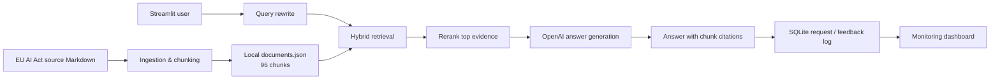

# EU AI Act Compliance Assistant

An English, evidence-grounded RAG application for questions about the EU AI Act and non-binding AI-system risk orientation. This is an original **DataTalksClub LLM Zoomcamp Capstone Project**. You can find the course [here](https://datatalks.club/blog/llm-zoomcamp.html).

The project requirements are listed in ['project.md'](project.md)

> The app is an informational research aid, not legal advice. It answers only from the bundled source and makes uncertainty explicit.

## What it does

- Parses and chunks [`data/EU_AI_Act.md`](data/EU_AI_Act.md) with section/article metadata.
- Uses keyword retrieval, optional OpenAI vector retrieval, reciprocal-rank fusion, query rewriting, and transparent reranking.
- Sends constrained evidence to an LLM model (default;  `gpt-4o-mini`), then displays source chunks alongside the answer.
- Supports “Ask the AI Act” and “Risk orientation” flows.
- Persists requests, sources, latency, token usage, errors, and feedback in SQLite; the app dashboard exposes multiple charts.

## Architecture

```text
EU_AI_Act.md -> ingestion -> storage/documents.json -> hybrid retrieval -> rerank
                                                              |              |
Streamlit UI <- SQLite monitoring <- answer + citations <- gpt-4o-mini <- evidence prompt
```


## Setup and run

Requires Python 3.14+ and [uv](https://docs.astral.sh/uv/).

```powershell
uv sync --all-groups
Copy-Item .env.example .env
# Add OPENAI_API_KEY to .env for embeddings and generated answers.
uv run python -m eu_ai_act.ingestion --embed
uv run python scripts/generate_evaluation_data.py --generate --per-chunk 2
uv run python scripts/review_evaluation_data.py
uv run streamlit run app.py
```

## How it works

The user can choose between one of two app modes:

- **Ask the AI Act** for direct source-based questions.
- In **Risk orientation** mode, the user may enter: “A company uses an AI tool to rank job applicants' CVs before recruiter review.” The app retrieves the relevant employment and Annex III evidence, explains the orientation with chunk citations, and repeats that the result is informational rather than legal advice.

## Screenshots

Ask the AI Act:


Ask the AI Act with evidence / refernces:


Risk Assessment:


Monitoring Dashboard:


## Ingestion

The ingestion module, `src/eu_ai_act/ingestion.py`, parses Markdown headings, preserves section context, identifies references such as “Article 5” or “Annex III,” and splits the text into overlapping 240-word chunks. Each chunk gets a stable ID such as `act-001-01`.

In optional embedding mode `--embed` , ingestion sends chunks to an embedding model.

Without an API key, run ingestion without `--embed` and generate the deterministic seed dataset; the application remains usable for local retrieval verification and displays retrieved evidence instead of an LLM-generated answer. 

Generated documents are saved locally in `storage/documents.json`. The generated documents, evaluation results, and SQLite data are deliberately excluded from Git because it is reproducibly generated from the source file.

## Evaluation

There are two separate evaluation layers.

**Retrieval evaluation:** [`data/evaluation_questions.jsonl`](data/evaluation_questions.jsonl) is a versioned, reviewable evaluation dataset. Each record contains a question, its expected source chunk, and section/article metadata. The dataset contains 192 source-bounded questions generated with `gpt-4o-mini` at temperature 0, plus three hand-written end-to-end risk-orientation questions. [`src/eu_ai_act/evaluation.py`](src/eu_ai_act/evaluation.py) validates that records are non-duplicate and map to existing chunks, then compares keyword, vector, and hybrid retrieval using Recall@5.

The reviewed run used 96 embedded chunks and 195 valid evaluation records, with the following results:

| Method | Recall@5 |
|--------|---------|
| Keyword |	 0.790 |
| Vector |   0.738 |
| Hybrid |	0.851  |

*Hybrid search won, so it is the default application strategy.*

**Answer evaluation:** `src/eu_ai_act/answer_evaluation.py` compares prompt configurations with an LLM-as-a-judge rubric: grounding, citation accuracy, completeness, and legal-safety caveats. The evaluated winner is **strict-grounded-v2**, which the app uses by default. It scored 7.0/8 versus 6.875/8 for `baseline-v1`. The methodology is documented in `docs/evaluation.md`. The full reproducible result is stored locally in `storage/answer_evaluation.json`.

## Monitoring and feedback

`src/eu_ai_act/monitoring.py` creates and writes to a local SQLite database. Each request records the mode, question, answer, retrieved chunk IDs, latency, token use, model, error, and optional feedback.
The dashboard displays:

- request count;
- median latency;
- positive-feedback percentage;
- error count;
- requests over time;
- mode usage;
- latency distribution;
- feedback distribution;
- model usage;
- raw audit data.

## Quality checks

```powershell
uv run pytest
uv run ruff check .
```

Tests cover parsing, stable chunk metadata, retrieval fusion, prompts/citations, dataset validation, and feedback persistence. API integration should be tested with mocked `OpenAI` responses; no calls are made by the test suite.

## Zoomcamp rubric mapping

| Criterion | Implementation |
| --- | --- |
| Retrieval and evaluation | Local knowledge base, keyword/vector/hybrid comparison, hybrid app flow |
| LLM evaluation | Reviewable evaluation schema and constrained answer configurations |
| Interface | Streamlit assistant and dashboard |
| Ingestion | Reproducible Python chunking script |
| Monitoring | SQLite feedback plus five dashboard views |
| Reproducibility | Pinned dependency ranges, `.env.example`, source data, commands |
| Best practices | Query rewriting, hybrid search, reranking, citations |
| Containerization | No containerization  currently provided |

