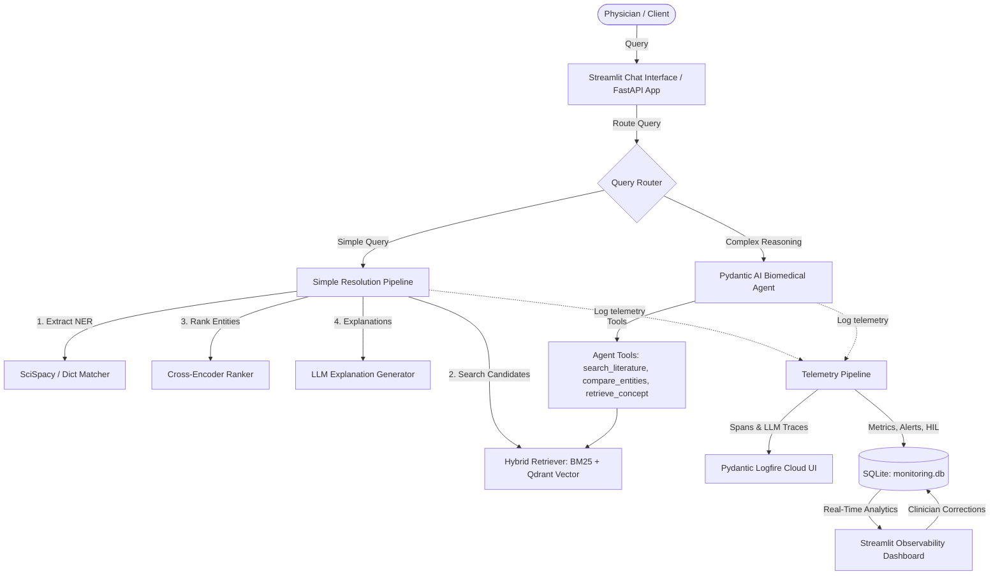

# Biomedical Entity Resolution Assistant

[](https://biomedical-entity-resolution-assistant.streamlit.app/)

A Precision Medicine AI assistant for resolving **biomedical entities** (genes, diseases, and genomic variants) into **canonical standardized representations** using biomedical ontologies and trusted datasets.

**Live Application URL:** [https://biomedical-entity-resolution-assistant.streamlit.app/](https://biomedical-entity-resolution-assistant.streamlit.app/)

---

# Overview

Biomedical datasets, literature, and clinical records often contain inconsistent naming conventions.

The same biomedical entity may appear under multiple aliases, abbreviations, shorthand notations, or historical names.

Examples:

| Input | Canonical Output | Type |
|------|------------------|------|
| HER1 | EGFR | Gene |
| ERBB1 | EGFR | Gene |
| p53 | TP53 | Gene |
| NSCLC | Non-Small Cell Lung Cancer | Disease |
| Ex19del | EGFR Exon 19 Deletion | Variant |

This project solves that problem by building an **Entity Resolution Assistant** that maps ambiguous biomedical terms into standardized canonical forms.

---

# System Architecture

The following diagram illustrates the high-level architecture of the Biomedical Entity Resolution Assistant, including its dual-route query execution flow, ingestion subsystem, and telemetry pipelines:



---

# Problem Statement

Biomedical AI systems struggle with:

- inconsistent terminology
- alias ambiguity
- abbreviation overload
- multiple ontology standards
- noisy human-entered data

Example:

Dataset A stores:

```text
HER1
```

Dataset B stores:

```text
EGFR
```

Dataset C stores:

```text
ERBB1
```

All refer to the same gene.

Without normalization:

- search quality decreases
- retrieval pipelines fail
- downstream AI assistants become unreliable
- clinical reasoning becomes inconsistent

This system acts as the **normalization layer** for the AI Precision Medicine Platform.

---

# Project Goal

The goal of this assistant is to answer one core question:

> **“What is this biomedical entity?”**

The assistant identifies and resolves:

- Gene aliases
- Disease aliases
- Variant aliases
- Standard biomedical identifiers

---

# Scope

## Included

### Gene Resolution
Examples:

- Is HER1 the same as EGFR?
- What is the canonical name for p53?
- Is ERBB1 an alias of EGFR?

Output:
- canonical gene symbol
- aliases
- identifier
- confidence score
- provenance

---

### Disease Resolution
Examples:

- What does NSCLC stand for?
- Resolve lung adenocarcinoma
- Is melanoma a disease entity?

Output:
- canonical disease name
- ontology ID
- synonyms
- confidence score

---

### Variant Resolution
Examples:

- What does Ex19del map to?
- Resolve G12C
- Resolve T790M

Output:
- canonical variant notation
- standardized representation
- variant identifiers
- confidence score

---

# Out of Scope

This project does **NOT** perform:

## Clinical Interpretation
Example:
- Is this mutation pathogenic?

## Therapeutic Recommendation
Example:
- Which drug targets EGFR?

## Prognostic Analysis
Example:
- Does this mutation worsen survival?

These belong to other projects in the AI Precision Medicine platform.

---

# Core Features

- Biomedical alias resolution
- Entity type detection
- Exact matching
- Fuzzy matching
- Confidence scoring
- Canonical entity mapping
- Provenance tracking
- REST API
- Evaluation pipeline
- Interactive UI

---

# Detailed Resolution Process

```text
User Query
   ↓
Query Preprocessing
   ↓
Entity Detection
   ↓
Candidate Retrieval
   ↓
Matching Engine
   ↓
Confidence Scoring
   ↓
Canonical Resolution Response
```

---

## 1. Query Input

Example:

```text
Is HER1 the same as EGFR?
```

User input may be:

- raw biomedical text
- aliases
- abbreviations
- questions
- misspelled entities

---

## 2. Query Preprocessing

Normalize raw text.

Examples:

```text
HER-1 → HER1
her1 → HER1
HER 1 → HER1
```

Preprocessing includes:

- case normalization
- punctuation removal
- whitespace normalization
- token cleanup

---

## 3. Entity Detection

Determine whether input refers to:
* Gene
* Disease
* Medication
* Variant

Examples:

| Input | Entity Type |
|-------|-------------|
| EGFR | Gene |
| NSCLC | Disease |
| Gefitinib | Medication |
| Ex19del | Variant |

---

## 4. Candidate Retrieval

Search internal knowledge base for possible matches.

Example:

Input:

```text
HER1
```

Candidates:

| Candidate | Type |
|-----------|------|
| EGFR | Gene |
| ERBB1 | Gene |

Methods:
- dictionary lookup
- index search
- vector search

---

## 5. Matching Engine

Compute similarity between query and candidates.

Matching methods:

### Exact Match
Highest confidence.

Example:

```text
EGFR == EGFR
```

---

### Alias Match
Known synonym mapping.

Example:

```text
HER1 → EGFR
```

---

### Fuzzy Match
Handles spelling variations.

Example:

```text
HER-1 ≈ HER1
```

---

### Semantic Match
Useful for longer disease names.

Example:

```text
non small cell lung cancer ≈ NSCLC
```

---

## 6. Confidence Scoring

Each prediction receives a confidence score.

Example:

```json
{
  "confidence": 0.98
}
```

Score interpretation:

| Score | Meaning |
|------|---------|
| 0.90–1.00 | Very High |
| 0.75–0.89 | High |
| 0.50–0.74 | Medium |
| <0.50 | Low |

---

## 7. Response Generation

Example output:

```json
{
  "query": "HER1",
  "canonical_name": "EGFR",
  "entity_type": "Gene",
  "identifier": "HGNC:3236",
  "confidence": 0.99,
  "source": "HGNC"
}
```

---

# Datasets & Ingestion Pipeline

## Knowledge Base Metrics
* **Canonical Entities**: Exactly **61,949 standard canonical concepts** are imported into the vector database and lookup indices.
* **Lookup Aliases**: Exactly **275,179 unique alias-to-identifier mappings** (synonyms, symbols, and historical names) are loaded to handle linguistic and spelling variations.

## 1. HGNC (Genes)
* **Description**: Human Gene Nomenclature Committee database providing approved symbols and aliases for human genes.
* **Coverage**: **45,030 genes** cataloged with official symbols, previous symbols, and synonyms.
* **Website**: [https://www.genenames.org/](https://www.genenames.org/)

## 2. MeSH (Diseases)
* **Description**: Medical Subject Headings database managed by the National Library of Medicine (NLM) to catalog diseases and conditions.
* **Coverage**: **6,960 disease terms** and descriptors containing structured synonyms and hierarchical mappings.
* **Website**: [https://www.nlm.nih.gov/mesh/](https://www.nlm.nih.gov/mesh/)

## 3. RxNorm (Medications/Drugs)
* **Description**: Standardized nomenclature for clinical drugs, providing links to active drug ingredients and synonyms.
* **Coverage**: **9,959 unique clinical drug concepts** (ingredients and brand formulations).
* **Website**: [https://www.nlm.nih.gov/research/umls/rxnorm/](https://www.nlm.nih.gov/research/umls/rxnorm/)

---

## Data Ingestion Pipeline
The ingestion subsystem automatically retrieves, cleanses, and transforms raw biomedical datasets into structured indices:
1. **Download & Extraction**: Downloads custom raw datasets directly from official sources (HGNC FTP, RxNorm/MeSH UMLS tables) and loads them into memory.
2. **Preprocessing & Alias Extraction**: Extracts approved canonical names, identifiers (e.g., `HGNC:3236`, `MESH:D008175`), and builds an exploded synonym-alias dictionary mapping all possible alternate labels.
3. **Structured Storage**: Outputs clean parquet files inside `data/processed/` (`hgnc.parquet`, `mesh.parquet`, `rxnorm.parquet`) to act as the primary lookup tables.
4. **Vector Embedding Selection**: Encodes each canonical entity along with its synonyms using the specialized `GGPTR/SapBERT-from-PubMedBERT-keyphrase` model.
5. **Qdrant Vector Storage**: Populates a local/cloud Qdrant collection with 768-dimensional dense vectors to power semantic candidate retrieval.

---


# Tech Stack

| Layer | Tool / Framework | Description |
|---|---|---|
| **Language** | Python 3.13 | Core backend language |
| **Package & Env Manager** | `uv` | Fast and modern package manager |
| **Agent Loop** | Pydantic AI | Structured AI agents and reasoning loops |
| **Backend API** | FastAPI | High-performance asynchronous API endpoints |
| **User Interfaces** | Streamlit | Dual interfaces: Clinical Chat App & Curation Dashboard |
| **Clinical NLP / NER** | SciSpacy (`en_core_sci_sm`) | Extraction of biomedical entity mentions |
| **Fuzzy Matching** | RapidFuzz | Lexical string distance calculations |
| **Lexical Search** | BM25 (`RankBM25`) | Lexical search over synonyms |
| **Vector Database** | Qdrant | Dense vector index for hybrid candidate retrieval |
| **Biomedical Embeddings** | SapBERT (`PubMedBERT` keyphrase) | Specialized vector representations for clinical concepts |
| **Model Optimization** | ONNX Runtime | Accelerated embedding and ranking model execution |
| **Telemetry & Tracing** | Pydantic Logfire | Developer-grade OpenTelemetry LLM trace inspection |
| **Database Storage** | SQLite / PostgreSQL | Storage for telemetry, curation, and alerts |
| **Testing** | pytest | Robust unit and integration test suite |

---

# Repository Structure

```text
biomedical-entity-resolution-assistant/
│
├── data/                       # Ground-truth datasets, raw ontologies, and processed Parquet lookup tables
├── configs/                    # Application and model configurations (settings.yaml, models.yaml)
├── notebooks/                  # Interactive Jupyter notebooks for analysis and evaluation
├── reports/                    # Generated evaluation reports, error analysis, and visualization figures
│   └── figures/                # Performance visual charts (retrieval, embedding model comparison, calibration)
├── experiments/                # Versioned tracking folder storing metadata, configurations, and metrics per run
├── src/                        # Core codebase package
│   ├── agent/                  # PydanticAI-based clinical reasoning agents and ontology routers
│   ├── confidence/             # Confidence estimators and scoring logic
│   ├── conversation/           # Conversational state and chat logic
│   ├── embeddings/             # ONNX embedding model pipelines (SapBERT, MiniLM)
│   ├── entity_resolution/      # End-to-end resolution pipelines
│   ├── evaluation/             # Metrics calculation, benchmarking, and reporting scripts
│   ├── explanation/            # Explanation generation engines
│   ├── ingestion/              # Ingestors for HGNC, MeSH, RxNorm, ClinVar ontologies
│   ├── ner/                    # Named Entity Recognition (SciSpacy, dictionary, regex)
│   ├── preprocessing/          # Normalization and cleaning pipelines
│   ├── ranking/                # Candidate ranking engines
│   ├── retrieval/              # Hybrid vector/lexical retrieval layers
│   ├── tools/                  # DB query interfaces and NCBI lookup utilities
│   └── utils/                  # Setup tasks, mock utilities, and application configuration
│
├── tests/                      # Pytest unit and integration test suites
├── benchmark.py                # Benchmarking entry point wrapper
├── main.py                     # FastAPI backend application entry point
├── pyproject.toml              # Project dependencies, build settings, and metadata
└── Makefile                    # Local automation tasks
```

# Installation & Setup

All project tasks are centralized and automated using the `Makefile`.

## 1. Clone the Repository
```bash
git clone <repo-url>
cd biomedical-entity-resolution-assistant
```

## 2. Setup the Environment & Dependencies
Initialize your virtual environment and run the automated setup command to install python packages (in editable development mode) and download needed clinical NLP models (like SciSpacy and local models):
```bash
# Set up virtual environment
python -m venv .venv
source .venv/bin/activate

# Install all dependencies and download required models
make setup
```

---

# Running the Project

Follow these steps to run the ingestion pipelines, index the vector database, and start the application.

## 1. Populate the Knowledge Bases (Data Pipeline)
Ingest standard ontologies (HGNC, MeSH, RxNorm) and index/embed them into the vector database (Qdrant):
```bash
# Ingest clinical source dictionaries
make ingest

# Generate vector embeddings and index into Qdrant
make index
```

## 2. Start the Backend API
Run the FastAPI server which exposes standard `/resolve` and `/chat` endpoints:
```bash
make run-api
```
*API is hosted at: `http://localhost:8000` (API documentation/Swagger available at `/docs`)*

## 3. Start the Frontend User Interface
We provide two Streamlit layouts:
```bash
# Run the Client UI (standard chat & resolution app)
make run-ui

# Run the full-featured Precision Medicine Agent Dashboard
make run-streamlit
```

---

# Testing & Verification

Ensure code quality and test configurations:
```bash
# Run Pytest unit and integration test suite
make test
```

---

# Evaluation & Benchmarking

Run the validation suite to generate the reports and performance visualization curves shown below:
```bash
# Run the automated benchmarking suite
make benchmark

# Launch the Jupyter Notebook server to interactively explore evaluation metrics
make notebook
```

---

# API Example

## Request

```http
POST /resolve
```

Request body:

```json
{
  "query": "HER1"
}
```

---

## Response

```json
{
  "query": "HER1",
  "canonical_name": "EGFR",
  "entity_type": "Gene",
  "identifier": "HGNC:3236",
  "confidence": 0.99,
  "source": "HGNC"
}
```

---

# Evaluation, Benchmarking & Results

To ensure the reliability of the assistant in clinical environments, the system features an automated evaluation pipeline (`src/evaluation/`) that benchmarks retrieval accuracy, model representation quality, and end-to-end resolution.

---

## 1. Metrics Explained (For Everyone)

Here is what the metrics mean, explained simply:

*   **Accuracy (Overall Correctness)**: The percentage of overall entities mapped to the exact correct ID. For example, an accuracy of `96.77%` means that out of 100 queries, the assistant resolved 97 of them perfectly.
*   **Precision (Quality / Reliability)**: Out of all the times the assistant claimed to resolve a concept, how often was it actually right? High precision means the assistant does not hallucinate or map terms to wrong codes.
*   **Recall (Coverage / Search Ability)**: Out of all standard medical terms mentioned in the user input, how many did the assistant successfully catch and resolve? High recall means the assistant doesn't miss concepts.
*   **F1-Score (The Balance)**: The harmonic balance between Precision and Recall. It is the overall grade of the assistant's performance.
*   **Hit Rate @ K (Hit@K)**: The probability that the correct medical standard is found within the top `K` candidate search results retrieved from the database. A **Hit@5 of 100%** means the correct answer is always in the top 5 candidates retrieved.
*   **Mean Reciprocal Rank (MRR)**: Measures *how high up* the correct candidate is in the search list. If the correct match is the very first suggestion, the score is `1.0`. If it is the second, the score is `0.5`. Higher MRR means the correct suggestion is ranked higher.
*   **Confidence Calibration**: Checks whether the assistant's internal "confidence meter" matches actual performance. If the assistant claims `95% confidence`, it should be correct `95%` of the time. 

---

## 2. Latest Benchmark Performance (`run_004`)

We run our benchmarks against a ground-truth dataset (`data/ground_truth/entity_resolution.csv`) containing 31 validation cases representing complex aliases, abbreviations, and typos across HGNC, MeSH, RxNorm, and ClinVar ontologies.

### A. End-to-End Pipeline Performance
The overall accuracy of the complete Named Entity Recognition (NER) + Retrieval + Re-ranking pipeline:

| Metric | Score | Layman Meaning |
| --- | --- | --- |
| **Accuracy** | **96.77%** (`0.9677`) | Resolves ~97 out of 100 terms correctly. |
| **Precision** | **96.77%** (`0.9677`) | Extremely low rate of false mappings. |
| **Recall** | **96.77%** (`0.9677`) | Misses almost no standard terms in the text. |
| **F1-Score** | **96.77%** (`0.9677`) | Excellent overall balance of precision and recall. |

### B. Performance by Ontology Source
How well the assistant performs on different databases:

| Ontology | Accuracy | Precision | Recall | F1-Score | Status |
| --- | --- | --- | --- | --- | --- |
| **HGNC** (Genes) | 100.0% (`1.0000`) | 1.00 | 1.00 | 1.00 | Perfect  |
| **MeSH** (Diseases/Symptoms) | 100.0% (`1.0000`) | 1.00 | 1.00 | 1.00 | Perfect  |
| **RxNorm** (Drugs/Treatments) | 90.0% (`0.9000`) | 0.90 | 0.90 | 0.90 | High  (1 minor typo misclass) |
| **ClinVar** (Genomic Variants) | 100.0% (`1.0000`) | 1.00 | 1.00 | 1.00 | Perfect |

### C. Search Strategy Retrieval Comparison
Comparing how well different database search algorithms find the correct concept in the top $K$ results:

| Strategy | Hit@1 | Hit@5 | Hit@10 | MRR |
| --- | --- | --- | --- | --- |
| **LEXICAL** (Keyword Search) | 1.0000 | 1.0000 | 1.0000 | 1.0000 |
| **VECTOR** (Semantic Search) | 0.6129 | 0.6452 | 0.6452 | 0.6290 |
| **HYBRID** (Lexical + Vector Fusion) | **1.0000** | **1.0000** | **1.0000** | **1.0000** |

*Takeaway*: **HYBRID** search (combining exact keyword matching with semantic vector space representation) achieves a perfect `1.0000` Hit Rate, ensuring the correct candidate is always retrieved.

### D. Embedding Model Comparison
Comparing how well different medical embedding models capture clinical meanings using Cosine Similarity:

| Model Name | Hit@1 | Hit@5 | Hit@10 | MRR |
| --- | --- | --- | --- | --- |
| **SapBERT-from-PubMedBERT-fulltext** | **0.8710** | **0.9677** | **0.9677** | **0.9140** |
| **all-MiniLM-L6-v2** | 0.8387 | 0.9032 | 0.9032 | 0.8710 |

*Takeaway*: **SapBERT** outperforms the general-purpose MiniLM model because it was pre-trained specifically on medical literature (PubMed), yielding a higher MRR (`0.914` vs `0.871`).

### E. Confidence Calibration Analysis
Validating if the predicted confidence scores match actual correctness:

| Confidence Bin | Total Samples | Correct | Actual Accuracy | Interpretation |
| --- | --- | --- | --- | --- |
| **0.0 - 0.60** (Low) | 0 | 0 | 0.00% | No low-confidence predictions made. |
| **0.60 - 0.80** (Medium) | 3 | 2 | 66.67% | Well calibrated. |
| **0.80 - 0.90** (High) | 3 | 3 | 100.0% | Very high accuracy. |
| **0.90 - 1.0** (Very High) | 25 | 25 | 100.0% | Safe, reliable resolutions. |

---

## 3. Performance Visualizations

The following charts are automatically generated during the benchmark execution:

### 1. Retrieval Strategy Comparison
Compares Hit@K rates across Lexical, Vector, and Hybrid retrieval:


### 2. Embedding Model Comparison
Compares SapBERT and MiniLM semantic representations:


### 3. Ontology Performance Breakdown
Shows accuracy, precision, and recall broken down by clinical database:


### 4. Confidence Calibration Curve
Tracks predicted confidence vs. actual classification accuracy:


---

## 4. Run Latency
*   **API Response Time**: `< 250ms` (FastAPI backend)
*   **End-to-End Chat Agent Response Time**: `< 1.5 seconds` (LLM reasoning loop)

---

# Real-Time Monitoring & Observability

To support clinical deployments, the system features a production-grade observability pipeline located in `src/monitoring/` that tracks latency, cost, and accuracy, detecting model drift and facilitating clinician-in-the-loop expert corrections.

## 1. Observability Architecture
The monitoring stack consists of three layers:
1. **End-to-End Tracing (OpenTelemetry)**: Captures request journeys across multiple stages (NER, Retrieval, Ranking, and LLM reasoning) using standard OTEL Spans.
2. **Persistent SQL Telemetry Store (SQLite)**: Records raw metrics, resolved concepts, triggered alerts, and clinician feedback inside `data/monitoring.db`.
3. **Interactive Observability Dashboard (Streamlit)**: Visualizes real-time performance, system alerts, cost metrics, and provides an expert review interface to correct classifications.

## 2. Telemetry Schema & Logs
All request metrics are persisted to the SQLite telemetry database (`data/monitoring.db`) across four main tables:
*   `requests_log`: High-level execution logs tracking timestamp, user query, total latency, LLM input/output tokens, estimated cost, status, and API routes.
*   `resolved_entities_log`: Granular records of each extracted entity, its ontology classification, standard identifier, confidence score, and review status.
*   `feedback_log`: Closed-loop expert corrections containing correct mappings and clinical notes.
*   `alerts_log`: Proactive alerts warning administrators of system regressions.

## 3. Real-Time Alerting Engine
The alerting system automatically scans incoming requests and raises warnings under three conditions:
1. **High Latency Warning**: Raised if any query takes longer than `2500ms`.
2. **Low Confidence Warning**: Raised if the system resolves an entity with confidence `< 0.80`.
3. **Daily Spend Threshold**: Alerts administrators if daily LLM costs exceed `$5.00`.

## 4. Custom Clinical Curation Dashboard (Non-Technical Admins)
To launch the real-time Streamlit curation and monitoring dashboard:
```bash
make run-dashboard
```
This runs the dashboard on port `8502`. It is tailored for clinical administrators, medical curators, and non-technical stakeholders to inspect system outcomes, resolve system alerts, and provide Human-in-the-Loop corrections:

*   **System Health**: Visualizes request volume, average latency, and active confidence-drift warnings.
    
*   **AI Performance**: Tracks token costs, usage over time, and time spent in each processing pipeline step.
    
*   **Biomedical Analytics**: Details standard identifier distribution, top search queries, and ontology frequencies.
    
*   **System Alerts**: Lists triggers for latency regressions, budget overruns, and low confidence resolutions.
    
*   **Human-in-the-Loop Review**: Lets clinical curators verify, edit, and approve low-confidence resolutions.
    

## 5. Technical Observability & Developer Tracing (Pydantic Logfire)
For developers, data engineers, and AI model validators seeking low-level insights (collapsible OpenTelemetry spans, model prompt structures, database parameters, and strict execution graphs), the project integrates **Pydantic Logfire**:

1. **Authenticate with Logfire**:
   ```bash
   make logfire-auth
   ```
2. **Setup/Link Repository**:
   ```bash
   make logfire-setup
   ```
3. **List Linked Projects**:
   ```bash
   make logfire-projects
   ```
4. **Launch Developer Console**:
   Navigate to **[https://logfire.pydantic.dev/](https://logfire.pydantic.dev/)** to monitor step-by-step tracing live.
   

---

# Dual-Architecture Motivation & Role in AI Precision Medicine Platform

### Motivation Behind the Dual Architecture
This system implements a **dual-architecture pattern** consisting of a simple resolution pipeline route and a complex LLM agent route:
1. **Simple Resolution Pipeline Route**: Used for direct, high-throughput queries (e.g., standardizing list elements in a clinical database). It bypasses heavy agent planning steps, using SciSpacy and hybrid vector search to retrieve and rank entities in `<250ms` with deterministic efficiency.
2. **Complex LLM Agent Route**: Utilizes Pydantic AI for semantic reasoning, pronoun resolution (e.g., "compare it with Tylenol"), entity comparison, and structured clinical report generation.

By separating these paths, the system optimizes response latency and limits token costs while preserving advanced reasoning capabilities for complex patient cases.

### Integrating with the AI Precision Medicine Platform
Collaboratively developed by a team of four, this **Biomedical Entity Resolution Assistant** serves as the **core semantic translation API** for the wider **AI Precision Medicine Platform**. The platform consists of four downstream agentic microservices:
*   **Variant Evidence Assistant**: Standardizes mutation mentions (e.g., "Ex19del") to fetch verified clinical trial findings.
*   **Therapeutic Strategy Assistant**: Maps drug aliases (e.g., "Tylenol" to "Acetaminophen") to cross-reference drug interactions.
*   **Clinical Trial Matching Assistant**: Matches standardized disease names (e.g., "NSCLC" to "Non-Small Cell Lung Cancer") with open study inclusion criteria.
*   **Biomarker Assistant**: Resolves gene names (e.g., "HER1" to "EGFR") to suggest therapeutic targets.

By providing unified, canonical standard outputs (identifiers, standard ontology labels) via a shared FastAPI endpoint, this assistant prevents data mismatch bugs across all downstream systems.

---

# Development Roadmap

## Phase 1 — Core Resolver (MVP)
- repo setup
- dataset ingestion
- alias lookup
- exact matching

---

## Phase 2 — Enhanced Matching
- fuzzy search
- semantic similarity
- confidence scoring

---

## Phase 3 — Production Features
- API
- UI
- evaluation
- monitoring
- Docker deployment

---

# Future Improvements

- LLM-assisted disambiguation
- ontology graph traversal
- multi-entity extraction
- biomedical RAG integration
- knowledge graph support
- clinical workflow integration

---

# Project Documentation

For quick navigation across this documentation, use the links below:

* [Overview](#overview)
* [System Architecture](#system-architecture)
* [Problem Statement](#problem-statement)
* [Project Goal](#project-goal)
* [Scope & Limitations](#scope)
* [Out of Scope](#out-of-scope)
* [Core Features](#core-features)
* [Detailed Resolution Process](#detailed-resolution-process)
  * [1. Query Input](#1-query-input)
  * [2. Query Preprocessing](#2-query-preprocessing)
  * [3. Entity Detection](#3-entity-detection)
  * [4. Candidate Retrieval](#4-candidate-retrieval)
  * [5. Matching Engine](#5-matching-engine)
  * [6. Confidence Scoring](#6-confidence-scoring)
  * [7. Response Generation](#7-response-generation)
* [Datasets & Ingestion Pipeline](#datasets--ingestion-pipeline)
* [Tech Stack](#tech-stack)
* [Repository Structure](#repository-structure)
* [Installation & Setup](#installation--setup)
* [Running the Project](#running-the-project)
* [Testing & Verification](#testing--verification)
* [Evaluation, Benchmarking & Results](#evaluation-benchmarking--results)
* [Real-Time Monitoring & Observability](#real-time-monitoring--observability)
* [Dual-Architecture Motivation & Platform Role](#dual-architecture-motivation--role-in-ai-precision-medicine-platform)
* [Development Roadmap](#development-roadmap)
* [Future Improvements](#future-improvements)

---

# Author

**James**  
LLM Zoomcamp — AI Precision Medicine Platform

---

# License

MIT License
