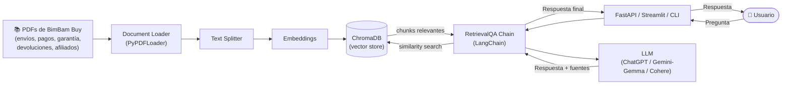

# BimBam Buy

E-commerce multiplataforma enfocado en la experiencia de compra digital ágil y segura. Se destaca por un modelo de negocio orientado al cliente, con políticas robustas de reembolso, un programa de afiliados dinámico y una infraestructura logística optimizada para garantizar entregas rápidas y soporte constante al usuário final.

# 🤖 BimBam Buy AI Support Agent

Agente RAG (Retrieval-Augmented Generation) inteligente:

El asistente responde preguntas de soporte al cliente utilizando la
documentación oficial de la empresa (base de conocimiento en PDF) y
Retrieval-Augmented Generation para recuperar la información relevante antes
de generar una respuesta con un modelo de lenguaje.

---

## 📑 Índice

- [Sobre el proyecto](#-sobre-el-proyecto)
- [Objetivos del challenge](#-objetivos-del-challenge)
- [Arquitectura](#-arquitectura)
- [Tecnologías](#-tecnologías)
- [Funcionalidades](#-funcionalidades)
- [Base de conocimiento](#-base-de-conocimiento)
- [Instrucciones para ejecutar el proyecto](#-instrucciones-para-ejecutar-el-proyecto)
- [Ejemplos de preguntas](#-ejemplos-de-preguntas)
- [Ejemplos de respuestas](#-ejemplos-de-respuestas)
- [Deploy en Oracle Cloud Infrastructure](#️-deploy-en-oracle-cloud-infrastructure-oci)
- [Estructura del repositorio](#-estructura-del-repositorio)
- [Mejoras futuras](#-mejoras-futuras)
- [Proyecto
  ](#-challenge-alura--one)

---

## 📌 Sobre el proyecto

El objetivo es construir un agente inteligente capaz de leer documentos de negocio (PDF), indexar su contenido
y responder preguntas de soporte con información precisa y trazable (citando la fuente exacta).

**BimBam Buy** es una tienda de e-commerce ficticia que opera en LATAM. Su
equipo de soporte necesita responder preguntas frecuentes sobre envíos,
pagos, garantías, devoluciones y el programa de afiliados de forma rápida y
consistente. Este agente resuelve ese problema.

## 🎯 Objetivos del challenge

- ✔ Leer documentos de negocio (PDF)
- ✔ Indexar la información
- ✔ Recuperar contenido relevante (retrieval)
- ✔ Generar respuestas contextuales con un LLM
- ✔ Desplegar la aplicación en Oracle Cloud Infrastructure (OCI)
- ✔ Publicar el proyecto completo en GitHub

## 🏗️ Arquitectura

El diagrama completo está disponible en [`architecture.mmd`](./architecture.mmd)
(Mermaid). Vista resumida:



El flujo completo:

1. Los PDFs de la carpeta `data/` se cargan con `PyPDFLoader`.
2. El texto se divide en chunks (`RecursiveCharacterTextSplitter`) con
   superposición para no perder contexto entre fragmentos.
3. Cada chunk se convierte en un embedding y se guarda en **ChromaDB**,
   persistido en disco para no reconstruir el índice en cada ejecución.
4. Ante una pregunta, el **retriever** busca los `k` chunks más similares.
5. Esos chunks se inyectan como contexto en el prompt del **LLM**, que
   genera la respuesta final citando el/los documento(s) fuente.
6. La respuesta se expone vía **FastAPI** (`/ask`), una **UI en Streamlit**
   o un **CLI** de terminal.

## 🛠️ Tecnologías

- **Python** — lenguaje principal del proyecto
- **LangChain** — orquestación del agente RAG
- **PyPDF** (`PyPDFLoader`) — lectura y procesamiento de los PDF
- **ChromaDB** — base de datos vectorial
- **LLM configurable** — ChatGPT (OpenAI), Gemini/Gemma (Google) o Cohere
- **FastAPI** — API REST (`POST /ask`)
- **Streamlit** — interfaz de chat web
- **Docker / Docker Compose** — contenerización y orquestación local
- **Oracle Cloud Infrastructure (OCI)** — despliegue en la nube

> El stack sigue las sugerencias del challenge, pero es intercambiable: el
> proveedor de LLM y de embeddings se elige por variable de entorno
> (`LLM_PROVIDER` / `EMBEDDINGS_PROVIDER`) sin tocar el código.

## ✨ Funcionalidades

- Ingesta de documentos PDF
- Generación automática de chunks
- Generación de embeddings
- Búsqueda semántica (similarity search)
- Retrieval-Augmented Generation (RAG)
- Citación de la fuente usada para cada respuesta
- Interfaz de conversación (API, chat web y CLI)
- Listo para desplegar en OCI con Docker

## 📚 Base de conocimiento

El agente responde preguntas usando los siguientes documentos oficiales de
BimBam Buy, ubicados en `data/`:

| Archivo                                  | Contenido                                   |
| ---------------------------------------- | ------------------------------------------- |
| `politica_reembolsos_devoluciones.pdf` | Política de Reembolsos y Devoluciones      |
| `faq_metodos_pago.pdf`                 | Preguntas Frecuentes sobre Métodos de Pago |
| `manual_garantia_productos.pdf`        | Manual de Garantía de Productos            |
| `guia_tiempos_costos_envio.pdf`        | Guía de Tiempos y Costos de Envío         |
| `programa_afiliados.pdf`               | Programa de Afiliados                       |

Estos documentos simulan la base de conocimiento interna de un equipo de
soporte de e-commerce.

## ⚙️ Instrucciones para ejecutar el proyecto

### 1. Cloná el repositorio

```bash
git clone https://github.com/<tu-usuario>/bimbam-buy-ai-agent.git
cd bimbam-buy-ai-agent
```

### 2. Configurá las variables de entorno

```bash
cp .env.example .env
# Editá .env y completá la API key del proveedor elegido
# (OPENAI_API_KEY, GOOGLE_API_KEY o COHERE_API_KEY)
```

### 3a. Ejecución local (sin Docker)

```bash
python -m venv .venv
source .venv/bin/activate   # Windows: .venv\Scripts\activate

pip install -r requirements.txt

# Construye el índice vectorial a partir de los PDF en data/
python rag_engine.py

# Levantar la API
uvicorn app:app --reload --port 8000

# (opcional, en otra terminal) Levantar la UI de chat
streamlit run streamlit_app.py

# (opcional) Probar por consola
python cli.py
```

La API queda disponible en `http://localhost:8000` con documentación
interactiva en `http://localhost:8000/docs`.

### 3b. Ejecución con Docker Compose

```bash
docker compose up --build
```

- API: `http://localhost:8000`
- UI (Streamlit): `http://localhost:8501`

### 4. Probar el endpoint

```bash
curl -X POST http://localhost:8000/ask \
  -H "Content-Type: application/json" \
  -d '{"question": "¿Cuánto tarda un reembolso?"}'
```

## ❓ Ejemplos de preguntas

- ¿Cuánto tarda en procesarse un reembolso?
- ¿Puedo devolver un producto después de 10 días?
- ¿Qué métodos de pago aceptan?
- ¿Qué cubre la garantía de los productos?
- Mi pedido está demorado, ¿qué hago?
- ¿Puedo cancelar un pedido después de haber pagado?
- ¿Cómo se calcula la comisión de un afiliado si hay una devolución?

## 💬 Ejemplos de respuestas

Ver el detalle completo, con las fuentes citadas por el agente, en
[`examples/sample_qa.md`](./examples/sample_qa.md).

## ☁️ Deploy en Oracle Cloud Infrastructure (OCI)

La aplicación fue empaquetada con Docker (`Dockerfile` /
`docker-compose.yml`) para poder desplegarse en una instancia de **OCI
Compute**.

- **URL pública:** `<completar con la URL de la instancia de OCI>`
- **Captura de la aplicación en ejecución:** `<agregar screenshot en /docs o /examples>`
- **Información de la VM de OCI:** `<forma/shape, región y sistema operativo utilizados>`

> Reemplazar esta sección con la evidencia real una vez completado el
> despliegue (enlace público y/o captura de pantalla).

## 🗂️ Estructura del repositorio

```text
bimbam-buy-ai-agent/
├── app.py                  # API FastAPI (POST /ask, health checks)
├── rag_engine.py            # Carga de PDFs, chunking, embeddings, cadena RAG
├── cli.py                   # Chat de terminal para pruebas rápidas
├── streamlit_app.py         # UI de chat en Streamlit
├── data/                    # Base de conocimiento (PDFs de BimBam Buy)
├── examples/
│   └── sample_qa.md         # Ejemplos de preguntas y respuestas del agente
├── architecture.mmd         # Diagrama de arquitectura (Mermaid)
├── requirements.txt
├── Dockerfile
├── docker-compose.yml
├── .env.example
└── README.md
```

## 🚀 Mejoras futuras

- Recuperación multi-documento con re-ranking
- Memoria conversacional (multi-turno)
- Búsqueda híbrida (keyword + semántica)
- Soporte OCR para documentos escaneados
- Pipeline de evaluación de calidad de respuestas
- Monitoreo y observabilidad (logs, métricas, trazas)
- Interfaz de voz

## 🏆 Proyecto

El objetivo del challenge es diseñar, implementar y desplegar un agente potenciado por IA capaz de
responder preguntas a partir de documentación de negocio, utilizando técnicas modernas de IA Generativa y RAG.
