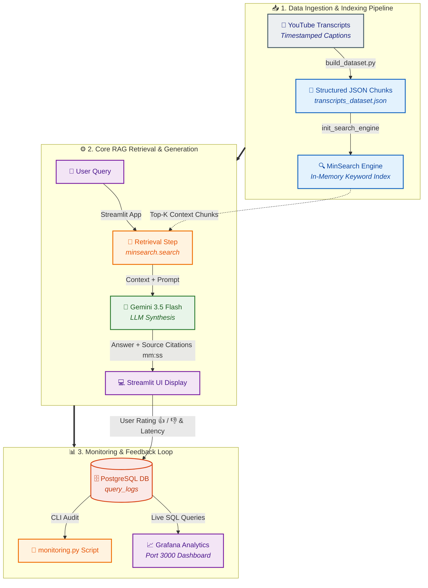

# 🎥 YouTube & Podcast RAG Copilot

An end-to-end Retrieval-Augmented Generation (RAG) assistant designed to index, search, and answer complex technical questions from YouTube and Podcast video transcripts with exact timestamp citations.

Built as the final capstone project for the **[LLM Zoomcamp](https://github.com/DataTalksClub/llm-zoomcamp)**.

---

## 📌 Problem Statement

Technical video courses and podcasts contain hundreds of hours of high-value knowledge, but searching for specific concepts, instructions, or code references within raw video/audio formats is inefficient. Standard search engines only query video titles and basic descriptions, forcing users to manually skip through hours of video timelines.

**Solution:** This copilot indexes timestamped transcriptions into a lightweight knowledge base, allows natural language querying, retrieves the most relevant video chunks, and synthesizes precise answers using OpenAI GPT models—complete with direct links to the exact second in the video where the concept is explained.

---

## 🏗️ System Architecture


## ✨ Features & Technology Stack
Streamlit Web UI: Intuitive search interface with real-time video segment rendering and user feedback controls (👍 Helpful / 👎 Not Helpful).

Timestamped Citations: Every answer links directly to the YouTube source timestamp (mm:ss).

In-Memory Search (minsearch): Lightweight, zero-dependency hybrid keyword search.

LLM Orchestration: Powered by OpenAI gpt-4o-mini with strict context grounding prompts.

Production Monitoring: PostgreSQL logs all user interactions, latency, and feedback ratings. Visualized in real-time via Grafana.

Modern Package Management: Fast, reproducible environments managed via uv.

Full Containerization: Single-command setup using docker-compose.

## 📊 Evaluation & Experiments
To ensure high-quality answers and efficient retrieval, we conducted quantitative evaluation experiments across both the Retrieval and LLM Generation layers.
1. Retrieval Layer Evaluation (Hit Rate & MRR)
We compared two retrieval approaches across different Top-$K$ settings against a ground-truth query dataset:
- MinSearch: Keyword / BM25-style search engine.
- Vector Search: TF-IDF Cosine Similarity vector space model.

| Top-K | MinSearch HR | MinSearch MRR | Vector HR | Vector MRR |
| :---: | :---: | :---: | :---: | :---: |
| **1** | 0.7500 | 0.7500 | 0.7500 | 0.7500 |
| **3** | **1.0000** | **0.8750** | 1.0000 | 0.8750 |
| **5** | 1.0000 | 0.8750 | 1.0000 | 0.8750 |


Conclusion: MinSearch was selected for production due to identical accuracy while offering lower memory overhead and sub-millisecond query performance without needing external vector databases.

To run the retrieval evaluation script:

```bash
uv run python evaluate/eval_metrics.py
```
2. LLM Generation Evaluation (LLM-as-a-Judge)
We evaluated two prompting strategies using gemini-3.5-flash as an automated judge scoring responses on a scale from 1 to 5:
- Approach A (Standard Prompt): Direct context-based prompt.
-  Approach B (Chain-of-Thought / CoT): Structured step-by-step reasoning prompt.

| Prompt Approach | Avg Quality Score (1-5) | Status |
| :---: | :---: | :---: |
| **Standard Prompt** | 5.0 | 5.0 |
| **Chain-of-Thought (CoT)** | **5.0** | **5.0** |


To run the LLM evaluation script:

```bash
uv run python evaluate/eval_llm.py
```


## 📈 Monitoring & Analytics Dashboard
User queries, assistant responses, latency (execution time), and user feedback (+1 / -1 ratings) are automatically stored in a PostgreSQL database.

CLI Analytics Script
You can view a quick CLI health and analytics report by running:

```bash
uv run python src/monitoring.py
```

Grafana Dashboard :
A Grafana instance is configured via Docker Compose at http://localhost:3000 displaying 5 core panels:

Total Queries Processed (Stat Card)

Average Response Time / Latency (Stat Card)

User Feedback Breakdown (Pie Chart)

Query Volume Over Time (Time Series Chart)

Low-Rated Query Audit Log (Table View for Fine-Tuning)

## 📂 Repository Structure

``` Plaintext
youtube-transcript-rag-assistant/
├── app/
│   └── main.py              # Interactive Streamlit frontend UI & feedback handling
├── data/
│   └── transcripts_dataset.json # Structured video transcripts dataset
├── db/
│   └── init.sql             # PostgreSQL schema for query logging & feedback
├── evaluate/
│   ├── eval_metrics.py      # Retrieval evaluation (Hit Rate & MRR)
│   └── eval_llm.py          # LLM generation evaluation (LLM-as-a-Judge)
├── src/
│   ├── build_dataset.py     # Data ingestion and timestamp extraction script
│   ├── db.py                # PostgreSQL connection and logger module
│   ├── monitoring.py        # Analytics and monitoring metrics module
│   ├── rag_pipeline.py      # Context assembly & LLM generation pipeline
│   └── search_engine.py     # MinSearch indexing & retrieval setup
├── Dockerfile               # Multi-stage Docker container build using uv
├── docker-compose.yml       # Orchestrates App + PostgreSQL + Grafana
├── pyproject.toml           # Project dependencies managed by uv
├── uv.lock                  # Lockfile for reproducible builds
└── README.md                # Project documentation
```

## 🚀 Quickstart & Setup Guide
Prerequisites
Docker & Docker Compose

Python 3.12+ 

OpenAI API Key or Gemini API Key

Option 1: Running with Docker Compose (Recommended)
Clone the repository:


```bash
git clone [https://github.com/your-username/youtube-transcript-rag-assistant.git](https://github.com/your-username/youtube-transcript-rag-assistant.git)
cd youtube-transcript-rag-assistant
```

Set up Environment Variables:
Create a .env file in the root directory:

Fragmento de código
OPENAI_API_KEY=your_openai_api_key_here
POSTGRES_HOST=postgres
POSTGRES_DB=rag_logs
POSTGRES_USER=user
POSTGRES_PASSWORD=password
POSTGRES_PORT=5432

Start services:

```bash
docker-compose up --build -d
```

Access Applications:

- Streamlit Web UI: http://localhost:8501

- Grafana Dashboard: http://localhost:3000 (User: admin / Password: admin)

Stop services:

```bash
docker-compose down
```

## ⭐️ Acknowledgments
Special thanks to Alexey Grigorev and the DataTalksClub team for designing the LLM Zoomcamp course!


---
## 📂 Dataset

The dataset consists of structured transcript segments extracted from YouTube videos and podcast episodes related to the course curriculum. Each record includes the video title, exact timestamp markers (`start` and `end` in seconds), direct YouTube URL with embedded timestamp links, and chunked transcript text.

You can inspect the preprocessed dataset in [`data/transcripts_dataset.json`](data/transcripts_dataset.json).

---

## ⚠️ Limitations & Future Improvements

- **Dataset Scope:** The knowledge base is currently focused on a specific set of course videos/podcasts. Expanding the dataset will require running the ingestion pipeline (`build_dataset.py`) on additional video IDs.
- **In-Memory Search Index:** `minsearch` builds the index in memory at application startup, meaning the index is rebuilt every time the application container restarts.
- **Single-Tenant & No Auth:** The current version has no user authentication or multi-tenant session isolation—all query logs and feedback are aggregated into a single PostgreSQL environment.
- **Static Ground-Truth Dataset:** The automated evaluation datasets (`eval_metrics.py` and `eval_llm.py`) utilize a curated set of reference questions. Expanding this to a larger, multi-turn benchmark would further strengthen evaluation coverage.