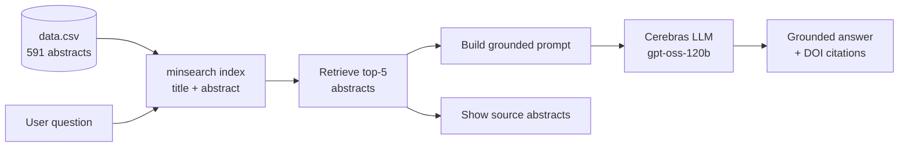

# Research Assistant

This is your friendly research assistant for wearable cardiac signal studies: a
RAG application built as part of LLM Zoomcamp.

> Status — implemented: retrieval + RAG answering, retrieval evaluation
> (text / vector / hybrid + parameter tuning), RAG-answer evaluation
> (LLM-as-a-judge), a Streamlit interface, and Docker containerization.
> Not included: a monitoring dashboard.


## Problem description

Research on wearable cardiac monitoring is growing quickly. New studies on
photoplethysmography (PPG), heart rate variability (HRV), and smartwatch-based
arrhythmia detection are published constantly. For a researcher, clinician, or
student trying to answer a specific question ("how does ECG compare to PPG for
detecting arrhythmia?", "is PPG accurate across different skin tones?"), keeping
up means manually searching databases, skimming dozens of abstracts, and piecing
together an answer.

This assistant makes that literature searchable in plain language. You ask a
natural-language question; the system retrieves the most relevant studies from a
curated corpus of abstracts and uses an LLM to synthesize a grounded answer that
cites the source papers by DOI. Because answers are generated only from the
retrieved studies, the assistant stays anchored to real literature rather than to
the model's own recall.

The current focus is **wearable cardiac signals** — HRV and PPG/smartwatch
monitoring. In practice the corpus also spans adjacent physiological topics that
share these sensors (e.g. stress and respiratory monitoring), reflecting how
closely intertwined this literature is.

## Dataset

The knowledge base is **591 open-access research abstracts** collected from the
[Europe PMC](https://europepmc.org/) literature API (see `ingest.py`). Each
record has an `id`, `title`, `abstract`, `year` (2022–2026, mostly 2025–2026),
and `doi`. The corpus is fetched once and committed to `data/data.csv` so results
stay reproducible.

## Running it

You can run this on your own machine two ways — **Docker** (no Python setup) or
**locally with `uv`**. Both need a free Cerebras API key.

### 1. Get the code

```bash
git clone https://github.com/Roneival/wearable-cardiac-assistant.git
cd wearable-cardiac-assistant
```

### 2. Add your Cerebras API key

The assistant calls the Cerebras API. Create a free key at
[cloud.cerebras.ai](https://cloud.cerebras.ai/), then make a file named `.env` in
the project root:

```bash
CEREBRAS_API_KEY=your_key_here
# optional — defaults to gpt-oss-120b
LLM_MODEL=your_supported_cerebras_model
```

### 3a. Run with Docker 

With [Docker](https://www.docker.com/) installed:

```bash
docker compose up --build
```

Open <http://localhost:8501>. The image installs only the app's runtime
dependencies and bundles `data/data.csv`; your `.env` is passed in at run time and
never baked into the image. (Without Compose:
`docker build -t wearable-cardiac-assistant .` then
`docker run -p 8501:8501 --env-file .env wearable-cardiac-assistant`.)

### 3b. Run locally with uv

With [uv](https://github.com/astral-sh/uv) installed (it manages Python 3.13 and
the dependencies from `pyproject.toml`):

```bash
uv sync
uv run streamlit run app.py
```

Open the local URL Streamlit prints, ask a research question, and the app shows a
grounded answer plus the abstracts it used as context.

### Exploring the experiments (optional)

The retrieval and RAG-evaluation experiments live in the notebook. Run Jupyter
**from the project root** so the data paths resolve:

```bash
uv run jupyter notebook notebooks/notebook.ipynb
```

## Ingestion

The committed `data/data.csv` file is the reproducible knowledge base. To fetch
a new corpus from Europe PMC, run:

```bash
uv run python ingest.py
```

This queries Europe PMC for open-access abstracts about heart-rate variability,
wearables, PPG, and smartwatches, cleans structured-abstract markup, and writes
the results to `data/data.csv`.

## Retrieval

The application uses an in-memory `minsearch` index over paper titles and
abstracts. It retrieves the top five papers using the field weights chosen by the
evaluation below — the abstract weighted above the title (`title` 0.5,
`abstract` 1.0) — then supplies their abstracts to the LLM.

## RAG flow



The RAG prompt instructs the LLM to use only the retrieved abstracts, state
when evidence is insufficient, and cite DOIs when useful. The web interface
always displays the retrieved studies so answers can be checked against source
material.

## Evaluation

### Retrieval evaluation

**Ground truth.** For every document in the corpus, an LLM generated ~5 realistic
user questions answerable from that document, each paired with the id of its
source paper (`data/ground_truth_dataset_5_doc.csv`, 2,955 questions). This lets
us measure, for each question, whether search returns the paper it came from.

**Metrics.** Two standard retrieval metrics (top-10 results):
- **Hit rate** — fraction of questions whose source paper appears in the results.
- **MRR** (Mean Reciprocal Rank) — rewards ranking the source paper near the top.

**Experiments.** We compared lexical (text), semantic (vector), and hybrid
retrieval, tuned the text-search field weights, and tested two embedding models:

| method | hit rate | MRR |
|--------|:--------:|:---:|
| text — title=1, abstract=1 | 0.784 | 0.624 |
| text — title=0.5, abstract=1 | 0.847 | 0.700 |
| **text — tuned (title≈0.1, abstract≈0.6)** | **0.867** | — |
| vector — MiniLM (`all-MiniLM-L6-v2`) chunks | 0.650 | 0.496 |
| vector — gte-base (`Xenova/gte-base`) chunks | 0.692 | 0.556 |
| hybrid — text + vector via Reciprocal Rank Fusion | 0.835–0.839 | 0.607–0.624 |


**Findings.**
- **Abstract-weighted lexical text search is the best retriever.** Boosting the
  *title* actually hurts (it surfaces keyword-only title matches); down-weighting
  it and favoring the abstract lifts hit rate to **0.867**.
- **Vector search underperforms**, and a stronger embedding model
  (`gte-base`) only narrowed the gap (0.650 → 0.692) without closing it —
  general-purpose embeddings struggle with dense biomedical terminology.
- **Hybrid (RRF) does not beat tuned text search.** Because its vector half is the
  weaker retriever, fusion is dragged below plain text. This holds across both
  embedding models tested, so it is a robust result rather than a one-off.
- Caveat: the ground-truth questions are paraphrased *from the abstracts*, which
  favors lexical overlap; real user phrasing would lean more on semantics.

**Decision.** The application uses **text (lexical) retrieval** — it is both the
simplest and the best-performing option here. The full experiment is reproducible
in the "Retrieval evaluation" section of `notebook.ipynb`.

### RAG-answer evaluation

Retrieval evaluation checks that we fetch the right papers; this checks that the
**generated answers** are actually good. We use **LLM-as-a-judge**: for a sample
of questions the RAG pipeline produces an answer, then a second LLM call rates
that answer against the question as `RELEVANT`, `PARTLY_RELEVANT`, or
`NON_RELEVANT` (with a short explanation). Aggregating the labels gives an
automated proxy for answer quality where hand-grading every answer isn't feasible.

The "RAG evaluation — LLM-as-a-judge" section of `notebook.ipynb` runs this over a
sample and reports the relevance distribution; each verdict and the judge's
explanation are kept for inspection.

## Monitoring

Not implemented in this version. The Streamlit app already collects a "helpful"
signal from users; a production setup would persist each conversation and that
feedback to a database (e.g. PostgreSQL) and visualize usage, answer relevance,
latency, and cost in a dashboard (e.g. Grafana).
