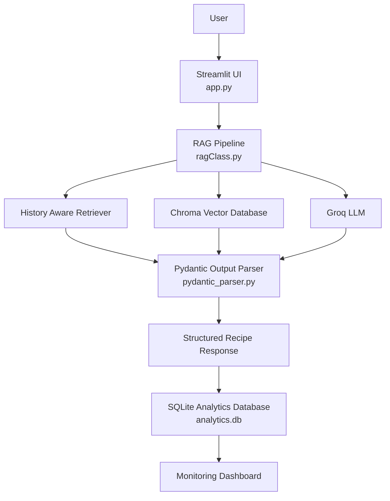

# Indian Recipe RAG

## Problem Statement
Suppose we have a recipe book and we want to search for a recipe not with it's name but by describing the recipe or the ingredients we have currently.
This is where RAG comes in and solves the problem.
My project, Indian Recipe RAG gives the user the most similar recipe to his query from the Knowledge Base(ChromaDB in this case)

## Data
The data I have used for this project is the recipes which have been scrapped by Kanishk and uploaded on GitHub.
The link to the dataset : https://github.com/kanishk307/IndianFoodDatasetGeneration
I have only selected Indian Recipes from the dataset. 


## Project structure/architecture



## 🛠️ Tech Stack

* 💻 **Python** – Core programming language
* 🧪 **Jupyter Notebook** – Experimentation and development before deployment
* ⚙️ **LangChain** – RAG pipeline, prompt templates, retrievers, chains, and output parsing
* 🗄️ **ChromaDB** – Vector database for semantic recipe retrieval
* 🎨 **Streamlit** – Web application and analytics dashboard
* 🗄️ **SQLite** – Logging requests, token usage, latency, model usage, and user feedback
* 📊 **Plotly** – Interactive dashboard visualizations

**Models Used**

* **Embedding Model (Hugging Face)**

  * `BAAI/bge-small-en-v1.5`

* **LLMs (via ChatGroq)**

  * `llama-3.1-8b-instant`
  * `llama-3.3-70b-versatile`
  * `openai/gpt-oss-20b`
  * `openai/gpt-oss-safeguard-20b`


## File structure

```text
Recipe-RAG/
│
├── app.py                      # Main Streamlit application
├── ragClass.py                 # RAG pipeline (retrieval + generation)
├── database.py                 # SQLite database operations and logging
├── pydantic_parser.py          # Pydantic output schema
├── Analytics.py                # Monitoring dashboard
├── requirements.txt            # Python dependencies
├── README.md                   # Project documentation
├── .env                        # API keys (not committed)
│
├── recipe_db/                  # Chroma vector database
│   ├── chroma.sqlite3
│   └── ...
│
├── analytics.db                # SQLite monitoring database
│
├── .streamlit/
│   └── config.toml             # Streamlit theme configuration
├── dataset/
│   ├── dataset.json
│   └── indian_recipes_rag_dataset.csv
│
├── images/                     # README screenshots
│   ├── UI.png
|   ├── input output display.png
|   ├── output and model selection.png
|   ├── dashboard.png
|   ├── dashboard2.png
│   └── dashboard3.png
│
└── notebooks/                  # Development notebooks 
    └── experimentation.ipynb
```
## Retrieval evalution

I tried vector search and used and compared retrievers with search type similarity, similarity score and mmr and the selected MMR

I also tried BM25 which is a keyword search and also tried Hybrid search which included vector search and BM25.

But both gave similar results, so selected vector search with MMR as retriever for my project.

## LLM evaluation

I tried various prompts in the notebook while developing and then selected the last one which gave good result.


## Screenshots:-
### UI


### Input Output


### Dashboard


### Output and model selection display


## How to run the project/app?

### 1. Online ( through Streamlit)

I have deployed the app onto streamlit. So check out the app there :- https://indianreciperag.streamlit.app/

### 2. Locally

You can use the app locally.
For this you just need to follow the steps below:-
1. Clone the repo
```
git clone https://github.com/Shuraimi/IndianRecipeRAG.git
```
2. move to the directory of the cloned repo
```
cd your_cloned_directory_path
```
3. pip install libraries required for the project locally from the requirements.txt file
```
pip install -r requirements.txt
```
4. create a .env file and add your groq API key 
```
GROQ_API_KEY='YOUR_API_KEY'
```
5. then in the cmd, activate the environment and run 
```
streamlit run app.py
```

Check out the app on your browser

## App preview
<video  controls>
<source src='videos\indian recipe RAG walkthrough.mp4'>
</video>

## 📝 Implementation Overview

The development process began in a Jupyter Notebook, where I experimented with different components of the Retrieval-Augmented Generation (RAG) pipeline, including data preprocessing, embedding generation, vector storage, retrieval strategies, prompt engineering, and structured output parsing. You can explore the complete experimentation process in the notebook linked above.

Notebook :- notebooks\experimentation.ipynb

After validating the pipeline, I modularized the project into separate Python scripts:

* **`ragClass.py`** – Implements the complete RAG pipeline, including the history-aware retriever, vector database integration, prompt templates, and LLM interaction.
* **`app.py`** – Provides the Streamlit-based chat interface for interacting with the recipe recommendation system.
* **`pydantic_parser.py`** – Defines the structured response schema, ensuring that every generated recipe follows a consistent format.

To monitor the application's performance, I developed a dedicated **Analytics** page in Streamlit. This dashboard visualizes key metrics such as request latency, model usage, input and output token consumption, user feedback, and recent requests.

A separate **`database.py`** module manages the SQLite database used for monitoring. It creates the required tables, logs every LLM request, and provides helper functions to retrieve aggregated statistics such as average latency, average token usage, feedback distribution, and model usage, which are then displayed in the analytics dashboard.

Finally, I added support for **dynamic model selection**, allowing users to switch between multiple Groq-hosted language models directly from the application. To enable this, the original `build_chain()` method was replaced with an `update_chain()` method, which recreates the `ChatGroq` instance and rebuilds the associated LangChain components whenever a different model is selected, ensuring the RAG pipeline always uses the currently chosen model.


## What I learnt?

1. Building a monitoring dashboard using Streamlit
2. Using SQLiteDB for storing the logs for analytical monitoring
3. Various Streamlit components while buidling the app.

## Further improvements

- replace SQLiteDB with PostgreSQLDB hosted on SupaBase

## How I used AI?

> I used ChatGPT for various pat of my project to guide me and explain the code and I wrote the code instead of copy pasting.
> Claude gave me the dataset to inlcude only indian recipes from the original list of 6000 recipes
> Used streamlit AI chat to build custom UI for streamlit prividing it material ui them as base theme
> Use this as reference for further https://github.com/streamlit/streamlit/tree/develop/lib/streamlit/.agents/skills/developing-with-streamlit/assets/templates/themes


## Review Tips (For peer review)

Use these tips when reviewing a project:

* The reviewer is given a public GitHub repo link and a `commit-hash`
   * to see the code state of the repo at the provided commit hash, use the following URL:
   * `https://github.com/{username}/{repo-name}/tree/{commit-hash}`
* It's recommended to clone the repository for the review. To clone the project at the commit hash:
  ```bash
  git clone https://github.com/{username}/{repo-name}.git
  git reset --hard {commit-hash}
  ```

## Evaluation Criteria (For peer review)

Use these criteria to score the project:

* Problem description
    * 0 points: The problem is not described
    * 1 point: The problem is described but briefly or unclearly
    * 2 points: The problem is well-described and it's clear what problem the project solves
* Retrieval flow
    * 0 points: No knowledge base or LLM is used
    * 1 point: No knowledge base is used, and the LLM is queried directly
    * 2 points: Both a knowledge base and an LLM are used in the flow
* Retrieval evaluation
    * 0 points: No evaluation of retrieval is provided
    * 1 point: Only one retrieval approach is evaluated
    * 2 points: Multiple retrieval approaches are evaluated, and the best one is used
* LLM evaluation
    * 0 points: No evaluation of final LLM output is provided
    * 1 point: Only one approach (e.g., one prompt) is evaluated
    * 2 points: Multiple approaches are evaluated, and the best one is used
* Interface
   * 0 points: No way to interact with the application at all
   * 1 point: Command line interface, a script, or a Jupyter notebook
   * 2 points: UI (e.g., Streamlit), web application (e.g., Django), or an API (e.g., built with FastAPI)
* Ingestion pipeline
   * 0 points: No ingestion
   * 1 point: Semi-automated ingestion of the dataset into the knowledge base, e.g., with a Jupyter notebook or a Python script 
   * 2 points: Automated ingestion with a special tool (e.g., Kestra, dlt, Airflow, Prefect)
* Monitoring
   * 0 points: No monitoring
   * 1 point: User feedback is collected OR there's a monitoring dashboard
   * 2 points: User feedback is collected and there's a dashboard with at least 5 charts
* Containerization
    * 0 points: No containerization
    * 1 point: Dockerfile is provided for the main application OR there's a docker-compose for the dependencies only
    * 2 points: Everything is in docker-compose
* Reproducibility
    * 0 points: No instructions on how to run the code, the data is missing, or it's unclear how to access it
    * 1 point: Some instructions are provided but are incomplete, OR instructions are clear and complete, the code works, but the data is missing
    * 2 points: Instructions are clear, the dataset is accessible, it's easy to run the code, and it works. The versions for all dependencies are specified.
* Best practices
    * [ ] Hybrid search: combining both text and vector search (at least evaluating it) (1 point)
    * [ ] Document re-ranking (1 point)
    * [ ] User query rewriting (1 point)
* Bonus points (not covered in the course)
    * [ ] Deployment to the cloud (2 points)
    * [ ] Up to 3 extra bonus points if you want to award for something extra (write in feedback for what)
