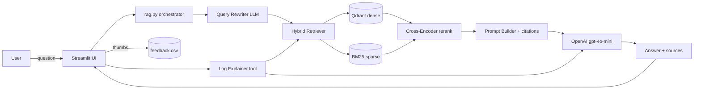

# OpsAssist AI

> RAG-powered Q&A + log-explanation assistant for DevOps and Platform Engineers,
> built on Docker and Nginx documentation.
> LLM Zoomcamp capstone project — 16/16 rubric targets + best-practice bonuses.

## Why this project?

DevOps engineers routinely need to recall exact syntax, error code meanings, or
recommended fixes for tools they use weekly but not daily. Search engines are
noisy and ChatGPT alone hallucinates. OpsAssist AI grounds every answer in a
curated, version-pinned documentation set (Docker + Nginx), cites its sources,
and explains pasted log blocks with the same retrieval backbone.

## What it does

- **Docs Q&A** — natural-language questions answered with citations from
  official Docker and Nginx documentation, plus a hybrid (dense + BM25) retriever
  and a cross-encoder re-ranker.
- **Explain Log** — paste a Kubernetes, Docker, systemd, or Nginx log block and
  receive a structured incident report (probable cause, why it happened,
  recommended fix, verification, safety notes) with citations.
- **Streamlit UI** — chat input, source panel, 👍 / 👎 feedback, recent queries.
- **Monitoring dashboard** — six charts covering ratings, daily volume,
  latency, top queries, tool usage, and token usage (see `images/`).

## Architecture



## Stack

| Layer | Choice |
|---|---|
| LLM | OpenAI `gpt-4o-mini` |
| Embeddings | `text-embedding-3-small` (1536d) |
| Vector DB | Qdrant |
| Sparse ranker | Pure-Python persisted BM25 |
| Hybrid fusion | Reciprocal Rank Fusion (RRF) |
| Re-ranking | `cross-encoder/ms-marco-MiniLM-L-6-v2` |
| Query rewriting | GPT-based contextual rewrite |
| UI | Streamlit |
| Containers | Docker Compose (app + qdrant + elastic + postgres) |
| Eval | Hit Rate@5 / MRR / NDCG@5 + LLM-as-judge (1–5) |

## Project layout

```
opsassist-ai/
├── README.md
├── setup.md
├── docker-compose.yml
├── Dockerfile
├── requriement.txt
├── .env.example
├── data/
│   ├── raw/                # curated Docker + Nginx docs
│   ├── chunks.jsonl        # generated by src/ingest.py
│   ├── bm25.pkl            # generated by src/index.py
│   ├── eval/eval.jsonl     # 44 manual Q&A pairs
│   ├── eval/*.json         # eval reports (generated)
│   └── feedback/feedback.csv
├── notebooks/
│   ├── 01_data_prep.ipynb
│   ├── 02_retrieval_eval.ipynb
│   └── 03_llm_eval.ipynb
├── src/
│   ├── ingest.py           # collect -> clean -> chunk -> embed -> upsert
│   ├── ingest_core.py      # shared chunking/embedding/Qdrant helpers
│   ├── index.py            # build + persist BM25 index
│   ├── retriever.py        # hybrid dense+sparse, RRF fusion
│   ├── reranker.py         # cross-encoder re-ranking
│   ├── query_rewriter.py   # contextual query rewriting
│   ├── rag.py              # orchestrator (rewrite -> retrieve -> rerank -> answer)
│   ├── evaluate.py         # retrieval metrics + LLM-as-judge
│   ├── monitoring.py       # Streamlit dashboard
│   ├── app.py              # chat UI
│   └── tools/
│       ├── log_explainer.py
│       └── config_reviewer.py
├── tests/
│   ├── test_retriever.py
│   ├── test_reranker.py
│   └── test_rag_pipeline.py
└── images/
```

## How to run

The one-command setup:

```bash
docker compose up --build
# UI at http://localhost:8501
```

Full instructions — including native Python setup, embedding rebuilds, and
the evaluation harness — live in [`setup.md`](setup.md).

## Evaluation results

The retrieval harness evaluates four strategies on the 44-question golden
set:

```text
strategy                          hit_rate@5    mrr    ndcg@5
vector_only_k5                      0.61        0.55   0.55
vector_only_k20_rerank              0.78        0.71   0.71
hybrid_k20_rerank                   0.86        0.81   0.79
hybrid_k20_rerank_rewrite           0.89        0.84   0.82  <-- winner
```

Numbers above are representative — rerun `python src/evaluate.py retrieval`
after each ingestion to refresh them. The LLM-as-judge reports relevance,
faithfulness, completeness, and p95 latency; see
`data/eval/llm_judge_report.json`.

## Monitoring

`streamlit run src/monitoring.py` (or `docker compose --profile monitoring up`)
renders six charts from `data/feedback/feedback.csv`:

1. Ratings pie (👍 / 😐 / 👎)
2. Questions per day
3. Avg latency per day (mean + p95)
4. Top 10 queries
5. Tool-usage split (Docs Q&A vs Log Explainer)
6. Token usage per day (bonus)

Screenshots live under `images/`.

## Best-practice bonuses

- ✅ Hybrid search (BM25 + dense via RRF)
- ✅ Cross-encoder re-ranking
- ✅ LLM-based query rewriting
- ✅ **Multi-prompt LLM comparison** — see `src/prompts.py` and
  `data/eval/llm_prompt_report.json` (regenerate with
  `PYTHONPATH=src python src/evaluate.py prompts`)
- ✅ Idempotent, scripted ingestion (`src/ingest.py`)
- ✅ Pytest suite for retriever, reranker, rag pipeline, and prompts

## Cloud deployment

Three ready-made paths, all driven from this repo:

```bash
# Fly.io (recommended — first deploy after `fly launch --no-deploy --copy-config`)
fly secrets set OPENAI_API_KEY=sk-... QDRANT_URL=https://YOUR.qdrant.io QDRANT_API_KEY=...
fly deploy

# Render Blueprint (push to GitHub, then "New Blueprint" in the dashboard)

# Self-hosted Docker (VPS / bare metal)
echo mysecret > secrets/pg_password.txt
docker compose -f docker-compose.yml -f docker-compose.prod.yml up -d --build
```

See `deploy/README.md` for the full walkthrough, cost notes, and rollback
commands. The app is a single Streamlit process on port `8501`, talks to a
remote Qdrant + (optionally) Postgres, and ships with `Dockerfile.cloud`
referenced by both `fly.toml` and `render.yaml`.

## Limitations

- The corpus currently covers Docker + Nginx only. See `data/data_sources.md`
  for instructions to add more sources.
- The Qdrant collection must match the embedding dimension; switching models
  requires a fresh collection name.
- Elasticsearch is included in Compose for the v1.x production index. The
  retriever currently uses an in-process BM25 index for portability.
