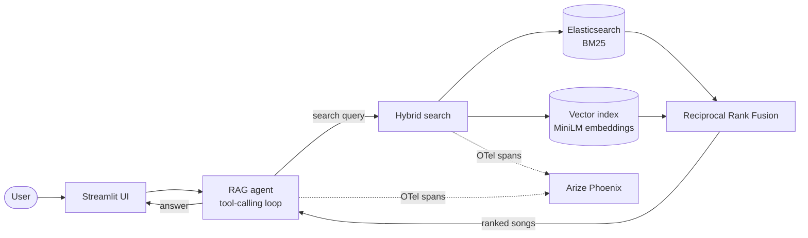

# Songs Finder

A conversational song-discovery agent. Ask for music the way you'd describe it to a
friend — *"something moody for driving alone at night"* — and get recommendations
grounded in a corpus of song lyrics, with the reasoning traced end to end.

Built as the capstone project for LLM Zoomcamp.


---

## The problem

Choosing what to listen to is hard, and existing tools do not help much with the way
people actually think about music:

- **You want something new.** You can describe the mood or occasion, but not name a track.
- **You half-remember a song.** A fragment of a line, a feeling, a theme — but not the title.
- **You want to understand a song.** What is it actually about?

Keyword search fails at all three, because it can only match the words you type.
Searching *"sad winter funeral"* finds songs with those literal words in them, not songs
that *are* sad, wintry, or funereal.

## The solution

An agent with a search tool over a song database of titles, artists, genres, release
years, and full lyrics. The agent reformulates your request into searches, reads what
comes back, and searches again until it has enough to answer — then recommends only
songs it actually found.

The corpus is currently English-only, but nothing in the design is language-specific;
the language filter is one predicate in the ETL step.

---

## How it works



### Agentic retrieval

The agent runs a tool-calling loop against the OpenAI Responses API
([`RAGAgent`](src/agent/rag_agent.py)). It is instructed to search, examine the results,
and search again with different phrasings rather than settle for one shot — so a vague
request gets refined into several concrete queries before the answer is written. The loop
runs until the model returns prose instead of a tool call, bounded at 25 turns.

Tool schemas are generated from the handler's own type hints and Google-style docstring
and validated with Pydantic at registration time
([`ToolRegistry`](src/agent/tool_registry.py)), so a malformed tool fails at startup
rather than midway through a conversation.

### Hybrid search

Every query runs through two retrievers and one fusion step
([`HybridSearch`](src/search/hybrid_search.py)):

| | Method | Catches |
|---|---|---|
| **Lexical** | Elasticsearch BM25 over lyrics and title | Exact phrases, proper nouns, quoted lines |
| **Semantic** | Cosine similarity over `all-MiniLM-L6-v2` embeddings (ONNX runtime, local) | Mood, theme, and paraphrase |
| **Fusion** | Reciprocal Rank Fusion (k=60) | Songs both retrievers agree on, without tuning score scales |

RRF is used deliberately: BM25 scores and cosine similarities live on incompatible
scales, and fusing by *rank* sidesteps the normalisation problem entirely.

### Evaluation-driven configuration

Retrieval strategy and parameters were chosen from measurements, not intuition. See
[Evaluation](#evaluation) below.

### Observability

Every stage emits OpenInference spans to [Arize Phoenix](https://phoenix.arize.com/) —
the agent loop, each tool call, both retrievers, the fusion step, and the embedding of
each query, plus auto-instrumented OpenAI and Elasticsearch calls. Retrieved documents
are attached to their retriever spans with scores, so you can see exactly what each
retriever returned, what survived fusion, and what the model was given to answer from.

---

## Getting started

**Prerequisites:** [Docker](https://docs.docker.com/get-started/get-docker/),
[uv](https://docs.astral.sh/uv/getting-started/installation/), and an OpenAI API key.

**1. Add your OpenAI credentials**

```bash
cp .env.example .env    # then add your OPENAI_API_KEY
```

**2. Start Docker Desktop**, or start the Docker daemon in your terminal.

**3. Run the app**

```bash
make run
```

This syncs dependencies, downloads the embedding model, starts Elasticsearch and
Phoenix, indexes the corpus, and opens the UI at http://localhost:8501.

> `make run` builds on the curated corpus bundled with this repo,
> so nothing is fetched from Kaggle. The first run still takes a few minutes to pull
> container images and embed the corpus; later runs reuse both. To rebuild the corpus
> from the original dataset instead, see [Data](#data).

**4. Watch the traces** at http://localhost:6006 while you chat.

### Make targets

| Command | What it does |
|---|---|
| `make install` | Sync dependencies, download the embedding model, start containers |
| `make ingest` | Index and embed the bundled corpus (no Kaggle download) |
| `make ground-truth` | Generate the ground truth question set |
| `make evaluate` | Score retrieval and answer quality |
| `make run` | Everything above, then launch the Streamlit app |
| `make down` | Stop the containers |

Targets are chained, so `make run` on a clean checkout does the whole setup. Each step
is idempotent and skips work that is already done — re-running is cheap. Add `--force`
via the underlying scripts to rebuild anyway.

---

## Evaluation

Answer quality is only as good as retrieval, so both are measured separately.

### Ground truth

[`GroundTruthBuilder`](src/evals/ground_truth_builder.py) samples 500 songs from the
corpus and has an LLM write realistic user questions for each one, where that song is
the known correct answer. Generation is parallelised across a thread pool, and a song
whose generation fails is logged and skipped rather than aborting the batch.

```bash
make ground-truth
```

### Retrieval metrics

Each ground truth question is issued to all three strategies, and the known-correct song
is looked for in the top 5 results:

- **Hit rate** — how often the right song appears at all.
- **MRR** — how *high* it appears, rewarding rank 1 over rank 5.

Running text, vector, and hybrid side by side is what justifies the added complexity of
hybrid search rather than assuming it.

### Answer metrics

An LLM judge ([prompt](src/agent/prompts.py)) scores answers on two axes:

- **Relevance** — `RELEVANT`, `PARTIAL`, or `IRRELEVANT` against the question.
- **Groundedness** — whether every song the agent recommended actually came back from
  retrieval, which is what catches hallucinated recommendations.

The judged sample uses a fixed seed, so a change in the score reflects a change in the
system rather than a different slice of questions.

```bash
make evaluate
```

### Human feedback

The UI collects a star rating and optional comment on any answer, appended to
`data/curated/feedback.parquet` — real usage signal to complement the offline metrics.

---

## Project layout

```
app.py                        Streamlit UI
src/
  agent/                      Agent loop, tool registry, LLM client, prompts
  search/                     Text, vector, and hybrid retrieval + embedder
  etl/                        Download and curate the corpus
  evals/                      Ground truth builder and evaluator
  monitoring/                 OpenTelemetry tracing setup
scripts/ingest.py             Ingestion entry point
docker-compose.yaml           Elasticsearch + Phoenix
```

**Stack:** OpenAI Responses API · Elasticsearch · ONNX Runtime · DuckDB · Streamlit ·
OpenTelemetry / Arize Phoenix · uv

---

## Data

The corpus comes from the [Genius song lyrics dataset](https://www.kaggle.com/datasets/carlosgdcj/genius-song-lyrics-with-language-information)
on Kaggle. No account or API token is required — `kagglehub` downloads it anonymously.

### The bundled corpus (default)

The curated corpus this project runs on — `data/curated/songs.parquet`, ~13 MB — ships
with the repo, so **you do not need to download anything from Kaggle**. This is what
`make ingest` uses: it runs `scripts/ingest.py --skip-etl`, which skips the download and
transform entirely and goes straight to indexing and embedding.

### Rebuild from the original dataset

Only needed if you want to change the corpus — a different slice, more songs, another
language. Run ingestion *without* `--skip-etl`, and with `--force` so it overwrites the
bundled parquet instead of skipping the transform:

```bash
uv run python3 scripts/ingest.py --force
```

Be aware:

- The download is **~8.4 GB** and is copied into `data/raw/`, so allow **~17 GB** of free
  disk and expect a slow run.
- Only the top 10,000 English songs by view count are kept (`DEFAULT_TOP_N`), producing
  the ~13 MB `data/curated/songs.parquet` described above.
- Delete `data/curated/embeddings.parquet` first. The embedding step skips whenever that
  file exists, so a rebuilt corpus would otherwise keep the old vectors.
- Once ingest finishes you can delete `data/raw/` and `~/.cache/kagglehub` to reclaim the
  space. The app only reads the curated parquet, the embeddings, and Elasticsearch.
- If Kaggle returns 403 or a rate-limit error, create a token at
  kaggle.com → Settings → API → Create New Token, then either save it to
  `~/.kaggle/kaggle.json` (`chmod 600`) or export `KAGGLE_USERNAME` and `KAGGLE_KEY`.

---

## Limitations

- The agent can only recommend songs **in the corpus** — 10,000 English tracks, weighted
  toward popular ones. It cannot know about anything else.
- It can still be wrong about what a song is about.
- Lyrics are shown as retrieved and remain the property of their rights holders.
- Questions are sent to the model provider. Do not enter private or sensitive information.
