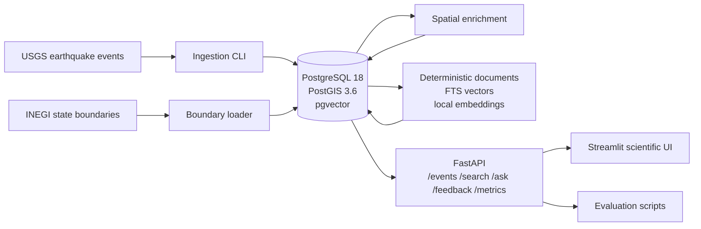
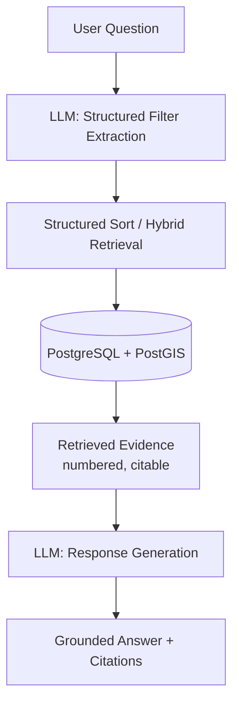

# GeoRAG

GeoRAG is a Spatial Risk Intelligence Assistant for natural-hazard questions. It combines USGS earthquake events, INEGI Mexican state boundaries, PostgreSQL/PostGIS, pgvector, deterministic analytical retrieval, hybrid lexical/vector retrieval, and grounded OpenAI answers behind a FastAPI API and a scientific Streamlit UI.

Mexico is the reference implementation. The current ingestion workflow uses a Mexico-oriented bounding box:

- latitude `14.0` to `33.5`
- longitude `-119.0` to `-86.0`

## What The Project Demonstrates

- Bounded geospatial ingestion from the USGS FDSN event service.
- Database-native spatial enrichment with INEGI state polygons and PostGIS.
- Deterministic event document generation and local `all-MiniLM-L6-v2` embeddings.
- PostgreSQL full-text search, pgvector semantic search, hybrid Reciprocal Rank Fusion, and structured analytical sorting.
- Grounded single-turn RAG answers with numbered citations and abstention behavior.
- Retrieval and grounded-answer evaluation scripts.
- Scientific Streamlit UI with answer, evidence, map, analytics, feedback, and raw JSON views.
- Feedback persistence and fixed aggregate operational metrics.

Future work could include additional geoscience layers, multi-turn interaction, monitoring dashboards, and deployment hardening. They are intentionally outside the current MVP.

## Disclaimers

GeoRAG is an educational AI Engineering capstone project. It is not a monitoring, forecasting, or emergency-response system.

- GeoRAG does **not** detect earthquakes.
- GeoRAG does **not** predict earthquakes.
- GeoRAG does **not** perform seismological analysis.
- Earthquake magnitude, location, depth, timestamps, and other event metadata are retrieved directly from the official USGS catalog. GeoRAG does not compute, estimate, or alter these values.
- Administrative state boundaries used for spatial enrichment are derived from official INEGI datasets.
- The LLM is used only for natural language understanding (structured filter extraction) and for generating a response from retrieved evidence. The LLM is **not** the source of earthquake data and has no access to a live seismological feed.
- Do not use this project for emergency response or life-safety decisions.

## Data Usage Disclaimer

GeoRAG is an educational AI Engineering capstone project. It uses publicly available earthquake and geographic datasets provided by the **United States Geological Survey (USGS)** and **Instituto Nacional de Estadística y Geografía (INEGI)**.

GeoRAG does not claim ownership of these datasets. All earthquake records, geographic boundaries, and associated metadata remain the property of and are governed by the terms established by their respective providers.

This repository is intended solely to demonstrate AI Engineering, geospatial retrieval, and retrieval-augmented generation techniques. It is not intended to replace the original data sources, redistribute them as an alternative service, imply endorsement by **USGS** or **INEGI**, or misrepresent the underlying scientific information.

## AI Usage Disclaimer

This project was developed with extensive assistance from AI tools, primarily Codex, Claude Code and ChatGPT.

AI was used in:

- architecture and implementation discussions;
- code generation and refactoring;
- debugging and test analysis;
- documentation drafting;
- evaluation design and artifact review;
- independent review of retrieval and grounded-answer results.

As the developer of this capstone project I defined the project scope and requirements, selected the final architecture, reviewed and executed the generated changes, resolved implementation decisions, and validated the system through automated tests, analytical regressions, retrieval benchmarks, and manual answer review.

The final repository reflects my understanding of the system and its trade-offs. I can explain the data model, ingestion pipeline, spatial enrichment, hybrid retrieval, grounded-answer generation, evaluation methodology, and known limitations.

AI-generated suggestions were not accepted automatically. Changes were reviewed, tested, and either accepted, revised, or rejected based on the project requirements.

The grounded-answer audit also used AI models as review assistants. Those reviews are treated as supporting evidence rather than an independent human evaluation.

## Architecture



Services:

- `db`: PostgreSQL 18 with PostGIS 3.6 and pgvector.
- `api`: FastAPI app plus ingestion, boundary, enrichment, document, search, and answer orchestration code.
- `ui`: Streamlit client that calls FastAPI over HTTP only.

Core migrations:

- `migrations/001_create_earthquake_events.sql`
- `migrations/002_create_admin_boundaries.sql`
- `migrations/003_create_event_documents.sql`
- `migrations/004_create_conversations.sql`
- `migrations/005_create_feedback.sql`
- `migrations/006_rebuild_event_document_search_vectors_english.sql`

### Deterministic Vs. Generative Components

To keep the boundary between "computed" and "generated" explicit:

Deterministic (PostgreSQL/PostGIS, no LLM involved):

- USGS ingestion, normalization, and idempotent upserts.
- Spatial enrichment (point-in-polygon state matching against INEGI boundaries).
- Full-text search (PostgreSQL English FTS), vector search (pgvector cosine similarity), and hybrid Reciprocal Rank Fusion, including the magnitude-significance ranking boost.
- Structured analytical sorting (`sort_by`/`sort_order`) and all structured filter pre-filtering (date, magnitude, state, radius).
- Citation and abstention validation on generated answers.

Generative (OpenAI LLM):

- Structured filter extraction from the natural-language question (`requested_limit`, dates, magnitude, state, sort intent, and similar).
- Final answer text generation, strictly from the numbered evidence the retrieval step already selected.

The LLM never queries PostgreSQL, never ranks or selects evidence itself, and never answers from its own background knowledge — see [Grounded Answers](#grounded-answers) for the request-level flow.

## Prerequisites

- Docker with Docker Compose v2.
- Git.
- `uv` locally for host-side evaluation scripts, compile checks, and lock validation.
- Optional `curl` for manual API examples and diagnostics; automated Make targets do not depend on host-side `curl`.
- Network access to USGS and INEGI for live data rebuilds.
- Adequate disk space for Docker images, the PostgreSQL volume, the INEGI archive, and local embedding/model caches.
- Optional OpenAI API access only for `/ask`, `make ask-smoke`, and grounded-answer evaluation.

The official integrated INEGI archive is approximately 245 MB. The first document build may download local sentence-transformer model weights.

## Quick Start

```bash
cp .env.example .env
# Edit .env. Set a strong local POSTGRES_PASSWORD and matching DATABASE_URL.
make bootstrap
```

After bootstrap:

- API: `http://localhost:8000`
- API docs: `http://localhost:8000/docs`
- UI: `http://localhost:8501`

`make bootstrap` is intentionally non-destructive. It builds images, starts PostgreSQL, applies migrations, ingests the demo/evaluation corpus window, loads INEGI state boundaries, enriches events, builds documents and embeddings, starts API/UI, and runs validation. It never deletes Docker volumes.

## Step-By-Step Setup

Use these targets for debugging or partial reruns:

```bash
make build
make db
make migrate
make ingest
make boundaries-download
make boundaries-load
make enrich
make documents
make up
make validate
```

The full corpus pipeline is:

```bash
make corpus
```

Default corpus variables are overridable:

```bash
make corpus START_DATE=2020-01-01 END_DATE=2024-12-31 MIN_MAGNITUDE=4.0
```

The public demo/evaluation default is:

- `START_DATE=2020-01-01`
- `END_DATE=2024-12-31`
- `MIN_MAGNITUDE=4.0`

`--start-date` and `--end-date` are inclusive calendar dates. Internally, the USGS request uses the next day as an exclusive `endtime` boundary.

## Environment Variables

Create `.env` from `.env.example`. Do not commit real values.

Required local infrastructure:

- `POSTGRES_DB`
- `POSTGRES_USER`
- `POSTGRES_PASSWORD`
- `POSTGRES_PORT`
- `DATABASE_URL`
- `USGS_BASE_URL`

Required only for paid generation/evaluation:

- `OPENAI_API_KEY`
- `OPENAI_MODEL`
- `OPENAI_TIMEOUT_SECONDS`

Optional pricing metadata:

- `OPENAI_INPUT_COST_PER_MILLION`
- `OPENAI_OUTPUT_COST_PER_MILLION`

Optional retrieval tuning:

- `HYBRID_SIGNIFICANCE_WEIGHT`
- `HYBRID_SIGNIFICANCE_INTENT_MULTIPLIER`

For Docker Compose, `DATABASE_URL` must use host `db` and credentials matching the PostgreSQL variables, for example:

```text
postgresql://georag:change-me-for-local-dev@db:5432/georag
```

PostgreSQL credentials are applied when the database volume is first initialized. If credentials change later, plan the reset explicitly and understand that volume deletion removes all local ingested data.

The example `.env.example` model is the project default. It must be a valid Responses API model available to your OpenAI account; change `OPENAI_MODEL` if your account does not have access to that model. Leave `OPENAI_API_KEY` empty unless you are running `/ask`, `make ask-smoke`, or grounded-answer evaluation.

`OPENAI_INPUT_COST_PER_MILLION` and `OPENAI_OUTPUT_COST_PER_MILLION` are optional USD-per-million-token values. Configure them for the model you actually use, and record the pricing source/date in local deployment notes because provider pricing changes over time. When these values are absent, the UI omits the cost metric and still shows token counts.

## Data Reproducibility

GeoRAG has two data concepts:

- Live USGS ingestion through the repository CLI.
- Frozen local benchmark artifacts under `evaluation/ground_truth/`.

The repository does not include a complete offline PostgreSQL corpus snapshot. The historical frozen benchmark was built from USGS preferred-event data for `2020-01-01` inclusive through `2025-01-01` exclusive, using `min_magnitude=4.0`. USGS preferred-event records are mutable, so a fresh live ingest may eventually differ from the historical 1,624-row benchmark corpus.

Historical frozen-corpus expectations:

- Events: `1,624`
- Distinct source event IDs: `1,624`
- Enriched events: `1,624`
- Matched state events: `421`
- Outside-state events: `1,203`
- Event documents: `1,624`
- Embeddings: `1,624`
- Embedding dimensions: `384`
- Mexico state boundaries: `32`

`make validate-db` prints these historical expectations and warns when live counts differ. It fails on structural problems, missing data, missing boundaries, missing documents, missing embeddings, invalid geometry, or missing known deterministic regression events.

Known deterministic analytical check:

- Query: strongest earthquakes in Oaxaca
- State: `Oaxaca`
- Date range: `2020-01-01` through `2024-12-31`
- Sort: `magnitude desc`
- Expected first result: `us6000ah9t`, magnitude `7.4`, date `2020-06-23`, state `Oaxaca`

The strongest event in the frozen corpus is `us7000i9bw`, magnitude `7.6`, `Michoacán de Ocampo`.

## Validation

Free/local validation:

```bash
make health
make validate
make test
make evaluate-retrieval
```

`make validate` runs:

- API/UI health checks.
- PostgreSQL, PostGIS, pgvector, table, count, boundary, enrichment, document, embedding, and known-event checks.
- Deterministic Oaxaca analytical `/search` assertion.
- Non-empty full-text Oaxaca `/search` assertion.
- Retrieval-case validator.

`make test` runs backend tests in the API container and frontend tests in the UI container.

Evaluation summaries are written under `evaluation/results/`. The scripts use atomic replacement so old Docker-owned result files do not block normal host-side evaluation when the directory itself is writable. If a previous container run left generated evaluation artifacts with the wrong owner, repair only those artifacts with:

```bash
make fix-evaluation-permissions
```

This target preserves file contents, derives your host UID/GID dynamically, and is limited to `evaluation/results/`, `evaluation/runs/`, and `evaluation/ground_truth/`. Do not use `sudo` or broad `chmod -R 777` for this repository workflow.

Paid/opt-in validation:

```bash
make ask-smoke CONFIRM_OPENAI=YES
make evaluate-answers CONFIRM_OPENAI=YES
```

These commands require `OPENAI_API_KEY` and call the configured OpenAI model.

## API Examples

Health:

```bash
curl "http://localhost:8000/health"
```

List events:

```bash
curl "http://localhost:8000/events?limit=10"
```

Canonical state filter:

```bash
curl "http://localhost:8000/events?state=Oaxaca&limit=10"
curl "http://localhost:8000/events?state=Veracruz%20de%20Ignacio%20de%20la%20Llave&limit=10"
curl "http://localhost:8000/events?state=Michoac%C3%A1n%20de%20Ocampo&limit=10"
```

Nearby events:

```bash
curl "http://localhost:8000/events/nearby?latitude=16.8&longitude=-96.7&radius_km=250&limit=10"
```

Hybrid retrieval:

```bash
curl -X POST "http://localhost:8000/search" \
  -H "Content-Type: application/json" \
  -d '{
    "query": "offshore earthquakes near Oaxaca",
    "strategy": "hybrid",
    "filters": {
      "latitude": 16.8,
      "longitude": -96.7,
      "radius_km": 500,
      "min_magnitude": 4.0
    },
    "limit": 10
  }'
```

Deterministic analytical retrieval:

```bash
curl -X POST "http://localhost:8000/search" \
  -H "Content-Type: application/json" \
  -d '{
    "query": "strongest earthquakes",
    "strategy": "hybrid",
    "filters": {
      "state": "Oaxaca",
      "start_date": "2020-01-01",
      "end_date": "2024-12-31",
      "sort_by": "magnitude",
      "sort_order": "desc"
    },
    "limit": 5
  }'
```

Grounded answer:

```bash
curl -X POST "http://localhost:8000/ask" \
  -H "Content-Type: application/json" \
  -d '{
    "question": "What were the strongest earthquakes in Oaxaca between 2020 and 2024?"
  }'
```

Feedback:

```bash
curl -X POST "http://localhost:8000/feedback" \
  -H "Content-Type: application/json" \
  -d '{
    "conversation_id": "<uuid-from-ask>",
    "rating": 1,
    "comment": "Useful answer and citations"
  }'
```

Metrics:

```bash
curl "http://localhost:8000/metrics"
```

## Example Questions

- `What were the strongest earthquakes in Oaxaca between 2020 and 2024?`
- `What were the biggest earthquakes?`
- `Earthquakes near Acapulco`
- `Earthquakes in Oaxaca`
- `Will Oaxaca have a damaging earthquake tomorrow?`

Expected behavior:

- Superlatives such as strongest/biggest map to deterministic structured sort when possible.
- Ordinary semantic questions use full-text/vector/hybrid retrieval.
- State filters use canonical INEGI names.
- Proximity wording does not imply administrative containment.
- Unsupported predictions or emergency-authority requests produce product abstentions.

## Retrieval Behavior

`POST /search` is retrieval-only. Strategies:

- `full_text`
- `vector`
- `hybrid`

Structured filters are candidate pre-filters: date, magnitude, canonical state, outside-state status, and optional radius constraints reduce the eligible set before ranking. Full-text and vector search produce ranked lists. Hybrid search uses Reciprocal Rank Fusion over those lists with deterministic event-id tie-breaking, plus a small configurable boost from normalized magnitude significance. The default `HYBRID_SIGNIFICANCE_WEIGHT=0.006` is intentionally conservative: it can surface major events among similarly relevant candidates, but it does not turn ordinary semantic retrieval into `ORDER BY magnitude`. When the query text contains an explicit significance-intent term (`major`, `large`, `big`, `strong`, `significant`, `highest magnitude`, `high magnitude`), the effective weight is multiplied by `HYBRID_SIGNIFICANCE_INTENT_MULTIPLIER` (default `8.0`), so phrasing like "major seismic events" concentrates large-magnitude events near the top of the ranked list more strongly than an ordinary query does.

Optional analytical fields:

- `filters.sort_by`: `magnitude`, `depth_km`, `event_time`, or `distance_km`
- `filters.sort_order`: `asc` or `desc`

When both are present, SQL applies all structured filters first and returns deterministically sorted analytical results. This takes precedence over semantic/vector/RRF ranking for that request. `distance_km` ordering requires `latitude`, `longitude`, and `radius_km`.

Full-text search uses PostgreSQL English text search for stored `event_documents.search_vector` values and query parsing. English stop words such as `in` are removed, and common forms such as `earthquake`/`earthquakes` stem to the same lexeme. A controlled relaxed English tsquery fallback is used when the strict query returns no rows.

For `/ask`, explicit count wording such as `top 3`, `show 10`, or `five strongest` may set `parsed_filters.requested_limit`. The server caps generated evidence at 10 items and keeps the default behavior when no count is requested. Ambiguous `similar to` questions remain ordinary semantic retrieval unless the question identifies an unambiguous source event.

An explicit non-positive count such as `zero`, `0`, `-1`, or `minus one` (for example, "show the zero strongest earthquakes") is detected deterministically before any LLM call and rejected as `invalid_filters`, rather than being sent to the model for extraction. Ordinary date/magnitude wording (`in 2020`, `magnitude 7`) is not affected and is never misread as a result-count request.

## Grounded Answers

`POST /ask` uses the same internal retrieval implementation as `/search`. Normal supported requests use two OpenAI Responses API calls, with all retrieval happening deterministically in between:



1. Structured filter extraction (LLM call 1): turns the question into filters (`state`, dates, magnitude, `requested_limit`, sort intent, and so on). This step never touches earthquake data itself.
2. Structured/hybrid retrieval (deterministic, no LLM): the validated filters run against PostgreSQL/PostGIS through the same `full_text`/`vector`/`hybrid`/`structured_sort` logic as `/search`, returning a ranked, numbered evidence set.
3. Grounded answer generation (LLM call 2): the model writes the answer using **only** the numbered evidence from step 2, with mandatory citation markers back to that evidence.

The LLM never queries PostgreSQL directly and never selects or ranks which events matter — retrieval already did that deterministically before the model sees any evidence. The model's only job with the earthquake data itself is to summarize and cite what it was given, not to recall or infer event facts from its own training. When generating the answer, the model must distinguish:

- administrative containment;
- geographic proximity;
- USGS place text.

Responses include `conversation_id`, parsed filters, retrieval strategy (`hybrid` or `structured_sort`), retrieved IDs, citations, evidence, abstention fields, model metadata, token usage, optional cost, and latency.

Product abstentions return HTTP 200 and are persisted:

- `no_evidence`
- `insufficient_evidence`
- `unsupported_request`
- `invalid_filters`

Operational failures return 5xx and are not persisted.

## Scientific UI

The Streamlit UI is a thin HTTP client. It has one question input and five tabs:

- `Answer`: grounded answer, citations, parsed filters, metadata, and feedback controls.
- `Map`: retrieved evidence points only, colored yellow-to-red by magnitude, with outlines distinguishing cited, uncited, and outside-state evidence. Styling does not imply impact or hazard severity.
- `Evidence`: safe rendered evidence table and document text.
- `Analytics`: exactly six charts plus token/cost metrics.
- `Raw JSON`: exact API response for debugging and API-contract inspection.

The UI never connects to PostgreSQL and never receives OpenAI credentials. Corpus charts fetch at most 500 events through `GET /events`.

## Evaluation

Evaluation assets live under `evaluation/`.

Retrieval benchmark:

- 43 cases.
- Categories: semantic, state, date, magnitude, combined, radius, outside-state, sort, and no-result.
- Ground truth uses stable USGS `source_event_id` values, never database serial IDs.
- Hit Rate and MRR treat any expected ID in the returned top-k/list as a hit.
- Broad semantic cases use small curated relevant sets, not every matching event.
- The benchmark is corpus-dependent.
- Final committed retrieval artifacts: `evaluation/results/retrieval_summary.json` and `evaluation/results/retrieval_summary.md`.
- Current metrics: `full_text` HR@1/HR@5/MRR `0.463/0.561/0.510`, `vector` `0.439/0.659/0.519`, and `hybrid` `0.537/0.805/0.651`.

Validate benchmark files:

```bash
make validate-retrieval
```

Run retrieval evaluation:

```bash
make evaluate-retrieval
```

The retrieval evaluator calls public `POST /search` for `full_text`, `vector`, and `hybrid`, then reports Hit Rate@1, Hit Rate@5, MRR, no-result correctness, structured-filter correctness, empty-result counts, and filter correctness over non-empty result sets. Filter correctness on an empty result set is vacuous and does not demonstrate successful retrieval.

Grounded-answer evaluation:

```bash
make evaluate-answers CONFIRM_OPENAI=YES
```

This is paid/opt-in and records small answer snapshots for manual faithfulness review. The final public run used model `gpt-5.6-luna`, prompt version `strict_grounded_v1`, and 15 directional evaluation cases. Final committed answer artifacts:

- `evaluation/results/answer_summary.json`
- `evaluation/results/answer_summary.md`
- `evaluation/results/answer_snapshots.json`

Measured citation metrics were `1.000` citation validity and `1.000` citation consistency. `abstention_correctness` is reported as `n/a` because the current frozen answer seed intentionally does not include `expected_abstained` labels. Manual faithfulness review labeled 13 cases `faithful`, 2 cases `minor_drift`, and 0 cases `unfaithful`.

No hallucination failures were observed in the final answer snapshots. The remaining observed issues are semantic/geographic interpretation limitations rather than unsupported earthquake facts: `m4-006` treats "near Oaxaca" mostly as Oaxaca containment, and `m4-012` includes Baja California Sur events while answering a "southern Mexico" summary question. These are documented limitations, not claims of perfect accuracy.

Future work after the capstone submission should expand the grounded-answer benchmark from 15 to roughly 30 carefully curated cases covering ranking, aggregation, comparison, contradictory constraints, broader temporal filters, and broader geographic coverage.

Internal Prompt A/B evaluation rows are intentionally persisted and therefore contribute to `/metrics` and the Streamlit Analytics tab.

## Data Sources And Attribution

GeoRAG re-publishes nothing of its own; every earthquake fact and every boundary shape traces back to one of these two public providers.

- **USGS Earthquake Catalog** (USGS FDSN event service) — the official source for every earthquake event in this project: magnitude, epicenter coordinates, depth, timestamps, place text, and event/update IDs. Ingested via `app/georag/usgs.py` and `make ingest`.
- **INEGI** (Instituto Nacional de Estadística y Geografía) — the official source for the Mexican state administrative boundaries used for spatial enrichment (point-in-polygon state matching). GeoRAG does not compute or approximate these boundaries.

Primary boundary source: INEGI Marco Geoestadístico 2025, UPC `794551163061`, artifact `mg_2025_integrado.zip`, state layer `conjunto_de_datos/00ent.*`.

INEGI metadata points to its terms of free use: `https://www.inegi.org.mx/inegi/terminos.html`. Attribute INEGI as the data source and do not imply INEGI endorsement. The Marco Geoestadístico is used here for statistical/geographic referencing, not as an emergency or legal boundary authority.

Licensing for USGS earthquake data and INEGI boundary data is governed by each provider's own terms; this repository does not restate or interpret that licensing beyond linking to it above. This project's own source code is separately licensed; see the License section below.

## License

GeoRAG's original source code is licensed under the GNU Affero General Public License v3.0 or later (`AGPL-3.0-or-later`). The complete, unmodified license text is in the root [`LICENSE`](LICENSE) file.

The AGPL's network-use clause applies: if you run a modified version of this software and make it available for others to use over a network, you must make the corresponding modified source code available to those users under the same AGPL terms. That obligation runs to the users you serve over the network, not to this repository — the AGPL does not require sending changes back here.

This license covers GeoRAG's original source code only. It does not relicense, and does not claim ownership of, any third-party data. USGS earthquake data and INEGI geographic boundary data remain governed entirely by their respective providers' own terms (see Data Sources And Attribution above), and attribution to USGS and INEGI must be preserved in any redistribution or derivative of this project.

## Project Structure

- `app/georag/`: FastAPI app, settings, CLIs, repositories, retrieval, document generation, LLM orchestration.
- `frontend/`: Streamlit UI, API client, map/chart transforms, frontend tests.
- `migrations/`: idempotent SQL migrations.
- `docker/db/`: custom PostgreSQL/PostGIS/pgvector image.
- `evaluation/`: retrieval/answer evaluation cases, metrics, scripts, summaries, and frozen ground-truth artifacts.
- `tests/`: backend and repository tests.
- `data/`: ignored local runtime data such as the INEGI archive.
- `.private/`, `.claude/`, `.agents/`, `.codex/`: local/private development material not part of the public workflow.

## Common Operations

```bash
make help
make ps
make logs
make restart
make down
```

`make down` preserves database volumes. Never use `docker compose down -v` unless intentionally deleting all local data.

If CLI commands, environment variables, bootstrap order, or expected validation signals change, update `Makefile`, `README.md`, and `AGENTS.md` together.

## Tests

Backend tests:

```bash
make test-backend
```

Frontend tests:

```bash
make test-frontend
```

Full local check:

```bash
make check
```

The default tests do not call OpenAI. The opt-in real-provider smoke test is:

```bash
docker compose run --rm -e GEORAG_RUN_OPENAI_SMOKE=1 api \
  uv run --no-sync pytest tests/test_real_provider_smoke.py
```

## Known Limitations

- USGS preferred-event data is mutable.
- The repository does not include a complete offline PostgreSQL corpus snapshot.
- Mexico-focused INEGI state boundaries only; no municipalities.
- OpenAI is required for generated `/ask` answers and grounded-answer evaluation.
- Local CPU embedding generation can take time on the first run.
- No multi-turn chat, Grafana dashboard, authentication, streaming, agents, or cloud deployment.
- No SQL alias or fuzzy state matching; only documented extraction and validation canonicalization is used.
- Dashboard analytics may reload bounded event data during Streamlit reruns.
- The UI maps evidence points only; it does not render INEGI state polygons.

## Future Geoscience Layers

Future extensions may add deterministic PostGIS layers for tectonic plates, subduction zones, active faults, DEM/topography, slab-depth models, volcanoes, seismic stations, focal mechanisms, and UNAM/SSN sources. These are documented as future work only; they are not implemented in the MVP.

## Rubric Evidence Map

- Ingestion pipeline: USGS CLI, idempotent upserts, Dockerized PostgreSQL.
- Vector database: pgvector in PostgreSQL with local `all-MiniLM-L6-v2` embeddings.
- Retrieval evaluation: `evaluation/evaluate_retrieval.py`, reusable metric functions, source-event ground truth, `evaluation/results/retrieval_summary.json`, and `evaluation/results/retrieval_summary.md`.
- LLM evaluation: `evaluation/evaluate_answers.py`, Prompt A/B support, citation and abstention checks, `evaluation/results/answer_summary.json`, `evaluation/results/answer_summary.md`, and `evaluation/results/answer_snapshots.json`.
- Interface: Streamlit `ui` service in Docker Compose.
- Monitoring and feedback: `POST /feedback`, `GET /metrics`, and six UI charts.
- Reproducibility: Docker Compose, Make targets, idempotent migrations, bounded CLI commands, and documented data-source flow.
