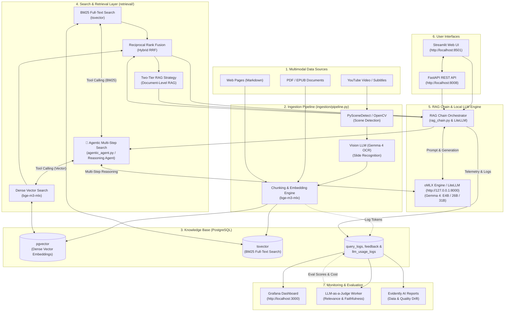

# 🎓 Multimodal RAG System (LLM ZoomCamp Capstone)

[](https://github.com/DataTalksClub/llm-zoomcamp)
[](https://www.python.org/)
[](https://developer.apple.com/metal/mlx/)
[](#-model-agnostic-architecture--provider-integration)
[](https://fastapi.tiangolo.com/)
[](https://streamlit.io/)
[](https://github.com/pgvector/pgvector)
[](https://grafana.com/)

A multimodal, **LLM-agnostic** search and retrieval-augmented generation (RAG) system for interactive work with YouTube video lectures (with timestamp precision and slide text recognition), PDF documents, EPUB books, and web pages. 

Tested on **Apple Silicon (M-series)** using local **Gemma 4** models running on a local **oMLX** server engine (and designed for seamless out-of-the-box compatibility with external cloud providers like OpenAI, Groq, etc.). Features automated search quality evaluation, LLM-as-a-Judge metrics, cost monitoring, dynamic Agentic search, and user feedback collection.

---

## 🎯 Problem Statement

### Problem Context
Educational and domain-specific knowledge is often distributed across heterogeneous sources. As a practical test dataset, this system was ingested with **culinary knowledge materials** — cooking YouTube video lectures/masterclasses, culinary PDF cookbooks, EPUB guides, and web recipe documentation (which inspired the theme and background design 🍐):

1. **YouTube Videos**: Culinary masterclasses and cooking lectures contain valuable step-by-step verbal explanations and visual slide demonstrations, but searching for a specific recipe step manually requires constant video scrubbing.
2. **Slides & Presentations**: Text on presentation slides in videos is often missing from automatic YouTube subtitles.
3. **Books & Articles**: Accompanying PDF/EPUB cookbooks and culinary web documentation contain exact proportions, formulas, and technique specifics.

### Solution
This project builds a **multimodal RAG system** that:
* **🍏 Tested on Apple Silicon with Local Gemma 4 (oMLX)**: Fully optimized for macOS Apple Silicon hardware acceleration using local **Gemma 4** models served via **oMLX** server engine (`http://127.0.0.1:8000/v1`).
* **🤖 Model-Agnostic Architecture**: Completely independent of any specific neural network provider. Easily switches between local open-source models (Gemma 4 via oMLX / Ollama / LM Studio) and cloud providers (OpenAI, Groq, Anthropic, Bedrock) without changing source code.
* Automatically extracts YouTube transcripts and indexes them with timestamp precision.
* Performs scene change detection in videos (PySceneDetect/OpenCV) and recognizes text from slide frames using **Vision-Language LLM (VL-OCR)**.
* Parses PDF/EPUB files and web pages into a unified knowledge base index.
* Employs **Hybrid Search (BM25 + Dense Vector RRF)** and **Agentic Multi-Step Search** for fast and accurate context retrieval.
* Generates comprehensive answers with **direct clickable YouTube timestamp links** (`https://youtu.be/...&t=...`) and precise document page citations.
* Collects user ratings (thumbs up/down) and tracks full latency and call cost telemetry in **Grafana**.

---

### 🤖 Model-Agnostic Architecture & Local Provider Setup (Apple Silicon + oMLX)

The system architecture is designed with a **Model-Agnostic** principle:
* **Unified Integration Layer (LiteLLM)**: All calls to LLM, multimodal generation, embeddings, and evaluation models are standardized through a single `litellm` library.
* **Apple Silicon & oMLX Setup**:
  The primary environment was tested on **Apple Silicon** with local **Gemma 4** family models served via **oMLX** on port 8000:
  - `gemma-4-E4B-it-MLX-4bit` (Default generation, document summarization, vision slide OCR)
  - `gemma-4-26b-a4b-it-4bit` (Two-tier RAG generation & LLM-as-a-Judge offline evaluation)
  - `gemma-4-31b-it-4bit` (Agentic multi-step reasoning & tool-calling agent)
  - `bge-m3-mlx-fp16` (Dense vector embeddings engine)

* **Flexible Configuration via [.env](.env)**:
  ```env
  # Local oMLX Server on Apple Silicon
  BASE_URL="http://127.0.0.1:8000/v1"
  API_KEY="omlx"

  DEFAULT_MODEL="gemma-4-E4B-it-MLX-4bit"
  TWO_TIER_MODEL="gemma-4-26b-a4b-it-4bit"
  AGENTIC_MODEL="gemma-4-31b-it-4bit"
  EVAL_MODEL="gemma-4-26b-a4b-it-4bit"

  MODEL_EMBED1="bge-m3-mlx-fp16"
  MODEL_VLM="gemma-4-E4B-it-MLX-4bit"

  # Or external cloud providers (OpenAI / Groq / etc.)
  # BASE_URL=https://api.openai.com/v1
  # API_KEY=sk-...
  # DEFAULT_MODEL=gpt-4o-mini
  # MODEL_EMBED1=text-embedding-3-small
  ```

---

### 🗄️ Storage Rationale: Why PostgreSQL + pgvector?

PostgreSQL with `pgvector` extension was chosen as the single unified database for the entire project rather than separate standalone vector databases (e.g., Pinecone/Qdrant) for key technical reasons:

1. **Native Hybrid Search in a Single Engine**: PostgreSQL natively supports full-text keyword search (`tsvector` + BM25 ranking via `ts_rank`) alongside dense vector embeddings (`vector` similarity via HNSW / IVFFlat indexes). This allows running Reciprocal Rank Fusion (Hybrid RRF) directly over relational data without maintaining sync between separate databases.
2. **ACID Compliance & Unified Schema**: Metadata (document titles, YouTube timestamp offsets, chapter TOC hierarchies), full text, vector embeddings, prompt logs (`query_logs`), user feedback (`👍`/`👎`), and telemetry metrics reside in one relational DB with strict foreign key guarantees.
3. **Grafana Compatibility**: Direct, native SQL connector in Grafana enables real-time monitoring dashboards over query logs without extra exporters.
4. **Operational Simplicity**: Single Docker container (`pgvector/pgvector:pg16`) with low memory overhead, zero network hop latency between relational metadata and vector indices.

---

## 🏗️ System Architecture



---

## 🛠️ Quick Start

### ⚙️ Prerequisites & Pre-flight Checklist

1. **Local LLM Engine (Apple Silicon)**: Ensure **oMLX** server is running locally on port `8000` with OpenAI-compatible API endpoint:
   - Endpoint: `http://127.0.0.1:8000/v1`
   - Downloaded models:
     - `gemma-4-E4B-it-MLX-4bit`
     - `gemma-4-26b-a4b-it-4bit`
     - `gemma-4-31b-it-4bit`
     - `bge-m3-mlx-fp16`
2. **Docker & Docker Compose**: Installed for starting PostgreSQL (pgvector) and Grafana.
3. **Python & uv**: Python 3.11+ installed (managed via `uv` package manager).

---

### Option 1: Launch via Docker + Local oMLX (Recommended)

To run the application services (PostgreSQL + Grafana + FastAPI + Streamlit UI) while connecting to local oMLX:

```bash
# 1. Environment configuration
cp .env.example .env
# Ensure BASE_URL="http://127.0.0.1:8000/v1" and API_KEY="omlx" are set in .env

# 2. Build and run application services in Docker
docker compose up -d --build
```

Access services:
* **Streamlit Web UI:** [http://localhost:8501](http://localhost:8501)
* **FastAPI Docs (Swagger):** [http://localhost:8008/docs](http://localhost:8008/docs)
* **Grafana Dashboard:** [http://localhost:3000](http://localhost:3000) *(Login: `admin` / Password: `admin`)*

---

### Option 2: Local Launch via Makefile (For Development)

```bash
# 1. Install Python dependencies via uv
make install

# 2. Start PostgreSQL (pgvector) and Grafana containers
make docker-up

# 3. Initialize database schema and vector indexes
make init-db

# 4. Run multimodal data ingestion pipeline
make ingest

# 5. Launch FastAPI backend (port 8008)
make run-api

# 6. In a new terminal tab: launch Streamlit UI (port 8501)
make run-ui
```

---

## 📥 Ingestion Data Sources Configuration

The ingestion pipeline (`make ingest`) automatically scans the **`input_data/`** directory for files and URLs to ingest into the knowledge base:

```
input_data/
├── youtube_links.txt   # List of YouTube video URLs and frame extraction flags
├── site_links.txt      # List of web pages/articles to fetch and parse
├── *.pdf               # PDF documents (or placed inside subfolders, e.g. input_data/books/)
└── *.epub              # EPUB books
```

### 1. YouTube Videos (`input_data/youtube_links.txt`)
Each line contains a YouTube URL. You can explicitly specify whether to perform video scene change detection (PySceneDetect) and slide OCR via Vision-LLM (`MODEL_VLM`) by appending `| true` / `| false` flag:

```text
# Standard YouTube transcript ingestion (OCR disabled):
https://www.youtube.com/watch?v=EXAMPLE_ID_1 | false

# YouTube ingestion with scene detection and VLM slide OCR enabled:
https://www.youtube.com/watch?v=EXAMPLE_ID_2 | true

```

### 2. Web Pages & Documentation (`input_data/site_links.txt`)
Add target web page URLs (one per line). The pipeline fetches content, cleans HTML into Markdown, and chunks the text:

```text
https://python.langchain.com/docs/get_started/introduction
https://docs.litellm.ai/docs/
```

### 3. PDF & EPUB Documents (`input_data/`)
Place any `.pdf` or `.epub` files directly in `input_data/` or any nested subdirectory (e.g. `input_data/lectures/book.pdf`). They will be recursively discovered, parsed into chapters/sections, and embedded into pgvector.

---

## 📈 Evaluation Benchmarks & Strategy Selection

To evaluate search and generation quality, a synthetic Ground Truth dataset (`eval/ground_truth.json` / `eval/ground_truth.csv`) generated from ingested knowledge base fragments is used.

> ℹ️ **Note on evaluation data files:** Benchmark export files (`eval/ground_truth.*`, `eval/retrieval_results.csv`, `eval/retrieval_details.csv`, `eval/generation_results.csv`, `eval/failures.json`) are generated locally during execution (`make eval-all`) and omitted from the repository to respect copyright of external source materials.

### 1. Retrieval Evaluation Results
Evaluated on **40 reference queries at Top-K=5** across 5 distinct search strategies via `make eval-search`:

| Search Strategy | Doc Hit Rate @ 5 | Doc MRR @ 5 | Chunk Hit Rate @ 5 | Chunk MRR @ 5 |
|:---|---:|---:|---:|---:|
| **BM25 Full-Text** | 0.7000 | 0.6042 | 0.4000 | 0.2446 |
| **Dense Vector Search** | 0.9250 | 0.9125 | 0.8000 | 0.6708 |
| **Hybrid RRF** | 0.9250 | 0.7875 | 0.7250 | 0.5300 |
| **Two-Tier Search** | 0.9250 | 0.7875 | 0.7250 | 0.5300 |
| **Agentic Loop** | 0.9000 | 0.7583 | 0.6500 | 0.3479 |

* Benchmark summary export: `eval/retrieval_results.csv`
* Per-query evaluation details: `eval/retrieval_details.csv`
* Retrieval failures analysis: `eval/failures.json` *(Unretrieved queries count: 3 / 40)*

### 2. Generation Evaluation Results (LLM-as-a-Judge)
RAG response generation quality evaluated via `make eval-generation` using local LLM-as-a-Judge ([`eval/llm_judge.py`](eval/llm_judge.py)):

* **Mean Faithfulness Score (Factual Groundedness):** `1.00 / 1.00` *(Zero hallucinations, all facts strictly derived from retrieved context)*
* **Mean Answer Relevance Score:** `0.97 / 1.00` *(Direct, precise, and complete answers to user queries)*
* **Mean Context Precision Score:** `1.00 / 1.00` *(Retrieved context chunks directly contain facts needed to answer)*
* Detailed generation log export: `eval/generation_results.csv`

### 🎯 Strategy Selection & Architectural Rationale

> 💡 **Recommended Default Strategy:** **`Dense Vector Search`** (or **`Hybrid RRF`**).
> - **`Dense Vector Search`** is the overall **top-performing single strategy**, achieving the highest ranking accuracy (**Doc MRR @ 5 = 0.9125** and **Chunk MRR @ 5 = 0.6708**), making it ideal for precision-critical answers.
> - **`Hybrid RRF`** (and **`Two-Tier Search`**) is the most **balanced and robust production choice**, delivering identical top coverage (**Doc Hit Rate @ 5 = 92.5%**, **Chunk Hit Rate @ 5 = 72.5%**) while preventing keyword out-of-vocabulary misses.

1. **Primary RAG Retrieval Strategy Choice: `Hybrid RRF` / `Two-Tier Search`**
   - **High Document & Chunk Coverage**: Combines keyword precision (BM25 for exact terms, names, and code snippets) with semantic understanding (Dense Vector embeddings via `bge-m3-mlx-fp16`). It achieves a top **Doc Hit Rate @ 5 of 92.5%** and **Chunk Hit Rate @ 5 of 72.5%**.
   - **Robustness**: Mitigates out-of-vocabulary failures inherent in pure BM25 (which scored low at 40% Chunk Hit Rate) and semantic drift in pure Vector search.
   - **Latency Efficiency**: Delivers single-digit millisecond retrieval latency without multi-hop LLM overhead.

2. **Agentic Search Loop Strategy Choice: `Agentic Loop`**
   - **Multi-step Reasoning**: Applied for complex, ambiguous, or multi-part queries requiring query reformulation, chapter TOC inspection, or multi-turn tool calling.
   - **Optimized Early Exit**: Configured with early termination rules so that once sufficient context is retrieved on Step 1, the agent immediately outputs the response, keeping latency low while maintaining high coverage (Doc Hit Rate @ 5 of 90.0%).

---

## 📊 Monitoring & Feedback (Monitoring & Grafana)

The system continuously collects telemetry in PostgreSQL database tables:
* **Latency Metrics:** execution time for search and LLM generation (P50, P95).
* **Costs & Tokens:** prompt/completion token counts and financial calculation in $ USD.
* **User Feedback:** recording 👍 / 👎 clicks and text comments.
* **Auto-Evaluations:** storing *Relevance* and *Faithfulness* scores from the background LLM-as-a-Judge worker.

The **Grafana** dashboard is preconfigured and automatically imported on container start ([`grafana/dashboards/llm_rag_monitoring.json`](grafana/dashboards/llm_rag_monitoring.json)).

---

## 🖼️ System Interfaces (Screenshots & Gallery)

> 📁 *All project screenshots are available in the [`img/screenshots/`](img/screenshots/) directory.*

### 1. Streamlit Web UI (`http://localhost:8501`)
*Interactive chat with clickable YouTube lecture timestamps, document source references, search mode selection (Hybrid/Two-Tier/Agentic), agentic reasoning steps, metrics, and user feedback.*

#### Hybrid Search RAG Response


#### Agentic Reasoning & Tool Steps


#### Evaluation Metrics & Token Statistics


---

### 2. Grafana Monitoring Dashboard (`http://localhost:3000`)
*Real-time operational dashboard tracking query counts, latency (P50/P95), token consumption, financial cost, user ratings, and LLM-as-a-Judge evaluations.*


---

## 🧹 Utility Commands (Makefile)

* `make eval-all` — Run complete evaluation cycle (dataset generation, retrieval benchmark, LLM-as-a-Judge evaluation).
* `make simulate-monitoring` — Generate synthetic 30-day traffic to test Grafana dashboards.
* `make clean` — Clean temporary Python cache files.
* `make reset-db` — Reset and clear all indexed vectors from database.

---

## 📋 Peer-Review Evaluation Criteria Matrix

For convenience of peer evaluation, below is a direct mapping of each **DataTalksClub LLM Zoomcamp** grading criterion to its implementation in the repository:

| Criterion | Points | Description and link to implementation in project |
|---|:---:|---|
| **1. Problem Description** | **2 / 2** | Section [Problem Statement](#-problem-statement) describing the problem, data sources, and use cases. |
| **2. Retrieval Flow** | **2 / 2** | Implemented in [`retrieval/search.py`](retrieval/search.py) (BM25 `tsvector`, Dense Vector `pgvector`, Hybrid RRF, Two-Tier, and Agentic Search). |
| **3. Retrieval Evaluation** | **2 / 2** | Implemented in [`eval/evaluate_retrieval.py`](eval/evaluate_retrieval.py) on Ground Truth questions (Hit Rate @ 5, MRR @ 5). |
| **4. LLM Evaluation** | **2 / 2** | Implemented in [`eval/evaluate_generation.py`](eval/evaluate_generation.py) following **LLM-as-a-Judge** methodology (*Relevance* and *Faithfulness*). |
| **5. Interface** | **2 / 2** | Two interfaces: Streamlit Web Chat [`app/ui.py`](app/ui.py) with clickable YouTube timestamp links and FastAPI REST API [`app/api.py`](app/api.py). |
| **6. Ingestion Pipeline** | **2 / 2** | Staged automated pipeline in [`ingestion/pipeline.py`](ingestion/pipeline.py) with YouTube fetching, OpenCV scene detection, slide OCR, PDF/EPUB parsing, and **Hybrid Map-Reduce Summary & TOC generation** using `AGENTIC_MODEL`. |
| **7. Monitoring** | **2 / 2** | Preconfigured Grafana Dashboard in [`grafana/dashboards/llm_rag_monitoring.json`](grafana/dashboards/llm_rag_monitoring.json) (10+ panels: P50/P95 latencies, costs, tokens, 👍/👎 ratings). |
| **8. Containerization** | **2 / 2** | Complete [`docker-compose.yml`](docker-compose.yml) and [`Dockerfile`](Dockerfile), starting PostgreSQL, Grafana, FastAPI API, and Streamlit UI in a single command. |
| **9. Reproducibility** | **2 / 2** | Execution instructions via [`Makefile`](Makefile), pinned dependencies in [`pyproject.toml`](pyproject.toml) and [`uv.lock`](uv.lock), template `.env.example`. |
| **10. Best Practices** | **2 / 2** | Clean modular structure, Python type annotations, configuration isolation [`config.py`](config.py), error handling, and logging. |

