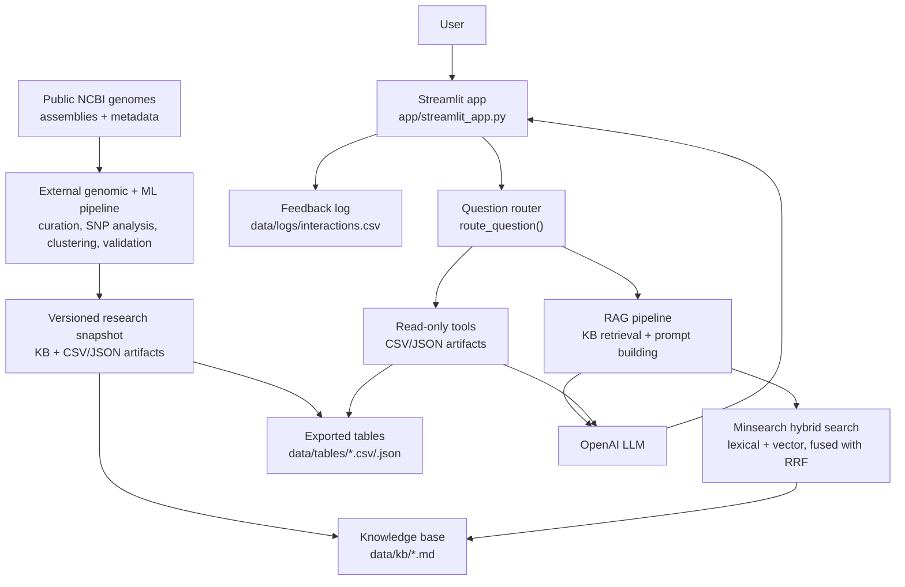

# C. auris Clade Assistant

An LLM-RAG research assistant for inspecting and interpreting genomic-surveillance
results derived from public *Candida auris* genome assemblies and metadata.

Built as a capstone project for [LLM Zoomcamp](https://github.com/DataTalksClub/llm-zoomcamp).


## Table of contents

- [Problem description](#problem-description)
- [Research context and intended use](#research-context-and-intended-use)
- [Evaluation criteria](#evaluation-criteria)
- [Quick start](#quick-start)
- [Prerequisites](#prerequisites)
- [Full setup](#full-setup)
- [Alternative setup with venv/pip](#alternative-setup-with-venvpip)
- [Testing](#testing)
- [Evaluation](#evaluation)
  - [Retrieval evaluation](#retrieval-evaluation)
  - [Answer evaluation](#answer-evaluation)
  - [Prompt selection](#prompt-selection)
- [Architecture](#architecture)
- [Read-only tools](#read-only-tools)
- [Monitoring / feedback](#monitoring--feedback)
- [Decisions and trade-offs](#decisions-and-trade-offs)
- [Project structure](#project-structure)
- [Dataset and exported artifacts](#dataset-and-exported-artifacts)
- [Limitations](#limitations)
- [Future work](#future-work)


## Problem description

Candida auris is a multidrug-resistant fungal pathogen whose emergence and
international spread make genomic surveillance important for understanding
lineages, geographic distribution, transmission patterns, and newly reported
samples.

Public repositories such as NCBI provide a growing collection of genome
assemblies and associated metadata. However, using these records in a research
workflow requires more than downloading sequences: assemblies must be curated,
processed, compared, assigned to genomic clades, validated, and connected back
to epidemiological metadata.

The upstream biological and machine-learning pipeline analyzes 876 public
*Candida auris* genome assemblies through genomic preprocessing, SNP analysis,
clustering, clade assignment, and validation workflows. It exports clade
assignments, metadata summaries, allelic-signature markers, validation metrics,
and sample-level results. These outputs are scientifically useful but are
distributed across notebooks and CSV/JSON artifacts, making routine inspection
slow and requiring familiarity with the pipeline's internal structure.

Candida auris Clade Assistant adds a conversational research layer over those
exported results. It allows researchers to inspect the current dataset,
compare clades, retrieve sample metadata, examine geographic and temporal
patterns, review validation evidence, and interpret individual clade
assignments through natural-language questions.


## Research context and intended use

This project supports an ongoing Candida auris genomic-surveillance research
workflow developed at the Federal University of Rio de Janeiro (UFRJ), with
collaboration involving the Federal University of Minas Gerais (UFMG), where
the author is formally registered as a postdoctoral researcher.

Its intended role is to support the daily research cycle around public genomic
data. The upstream genomic and machine-learning pipeline acquires, curates, and
analyzes public genome assemblies and metadata. The assistant does not rerun
those models; it provides a faster way to inspect and interpret their exported
results without repeatedly opening individual notebooks, CSV files, or JSON
artifacts.

Typical research tasks supported by the assistant include:

- checking the composition and provenance of the current dataset;
- inspecting clade counts and geographic, temporal, and source distributions;
- retrieving the curated metadata associated with a sample;
- reviewing clade-level allelic signatures and validation results;
- explaining an exported sample assignment using the available evidence;
- identifying data gaps, unusual samples, or questions that require returning
to the biological pipeline.

The assistant is therefore not a replacement for genomic analysis and does not
query or classify raw NCBI genomes directly. It is an interpretation and
inspection layer over a versioned set of results produced by the external
pipeline. As new public genomes are collected and processed, the exported
tables and knowledge base can be refreshed, turning the assistant into a
reusable interface for successive surveillance snapshots.


## Evaluation criteria

The table below maps each official [LLM Zoomcamp evaluation criterion](https://github.com/DataTalksClub/llm-zoomcamp/blob/main/project.md#evaluation-criteria) to the files that address it, so reviewers can jump straight to the relevant code.

| Criterion | Files |
|---|---|
| Problem description | This README (Problem description) |
| Retrieval flow (knowledge base + LLM) | `data/kb/*.md`, `src/cauris_assistant/rag.py`, `src/cauris_assistant/tools.py`, `src/cauris_assistant/assistant.py` |
| Retrieval evaluation (multiple approaches, best one used) | `notebooks/search_tuning.ipynb`, `data/eval/search_tuning_results.csv`, `data/eval/search_tuning_best_config.json` |
| LLM evaluation (multiple approaches, best one used) | `notebooks/prompt_tuning.ipynb`, `scripts/evaluate_answers.py`, `data/eval/prompt_comparison_results.csv`, `data/eval/answer_eval_results.csv` |
| Interface (UI) | `app/streamlit_app.py` |
| Ingestion pipeline (automated) | `scripts/ingest.py` |
| Monitoring (user feedback) | `app/streamlit_app.py` (feedback buttons), `data/logs/interactions.csv` |
| Containerization | Not implemented |
| Reproducibility | `environment.yml`, `requirements.txt`, this README (Full setup, Alternative setup) |
| Best practices: hybrid search | `notebooks/search_tuning.ipynb`, `src/cauris_assistant/rag.py` (`RAGHybrid`, `reciprocal_rank_fusion`) |
| Best practices: document re-ranking | Not implemented |
| Best practices: query rewriting | Not implemented |


## Quick start

Requires [conda](https://docs.conda.io/) (or Miniconda) and an OpenAI API key.

1. Create and activate the conda environment:

   ```bash
   conda env create -f environment.yml
   conda activate cauris-clade-assistant
   ```

2. Copy the environment file template and add your OpenAI API key:

   ```bash
   cp .env.example .env
   ```

3. Run the Streamlit app:

   ```bash
   streamlit run app/streamlit_app.py
   ```

The exported pipeline artifacts (`data/kb/`, `data/tables/`) are already included in this repository; no additional data download is required.

A `venv/pip` setup is also supported; see Alternative setup with venv/pip below.


## Prerequisites

- Python 3.11+
- [conda](https://docs.conda.io/) via `environment.yml` or `venv/pip` with `requirements.txt`
- An OpenAI API key
- No Docker required
- No external database required


## Full setup

1. Clone the repository:

   ```bash
   git clone https://github.com/lucasofalonso/cauris-clade-assistant.git
   cd cauris-clade-assistant
   ```

2. Create and activate the conda environment:

   ```bash
   conda env create -f environment.yml
   conda activate cauris-clade-assistant
   ```

3. Configure environment variables:

   ```bash
   cp .env.example .env
   ```

   Then add your OpenAI API key to `.env`:

   ```
   OPENAI_API_KEY=your_openai_api_key_here
   MODEL_NAME=gpt-5.4-mini
   ```

4. Run ingestion (builds `data/index/documents.json` from `data/kb/*.md`):

   ```bash
   python scripts/ingest.py
   ```

5. Run answer evaluation (confirms the assistant and evaluation pipeline work end to end):

   ```bash
   python scripts/evaluate_answers.py
   ```

6. Launch the Streamlit app:

   ```bash
   streamlit run app/streamlit_app.py
   ```


## Alternative setup with venv/pip

The project can also be run with a standard Python virtual environment and
`pip`. This setup was tested successfully with Python 3.13.

```bash
python3 -m venv .venv
source .venv/bin/activate

python -m pip install --upgrade pip
pip install -r requirements.txt

cp .env.example .env
# add your OPENAI_API_KEY to .env

python scripts/ingest.py
python scripts/evaluate_answers.py
streamlit run app/streamlit_app.py
```


## Testing

The project currently uses script-based and manual testing rather than a full
automated test suite.

```bash
python scripts/ingest.py
python scripts/evaluate_answers.py
streamlit run app/streamlit_app.py
```

Example questions for a quick Streamlit smoke test:

```text
What is the scope of this assistant?
How many samples are there per clade?
What are the main countries represented for Clade I?
What are allelic signature markers in this project?
```

Retrieval and answer-generation evaluations are documented below.


## Evaluation

### Retrieval evaluation

Retrieval quality was evaluated using 345 LLM-generated questions grounded in
the knowledge-base documents. The ground truth file is
`data/eval/ground_truth_retrieval.csv`.

The complete retrieval workflow is implemented in
`notebooks/search_tuning.ipynb`. It builds the lexical and vector indexes,
evaluates and tunes six configurations across lexical, vector, and hybrid
retrieval, ranks them using Hit Rate and Mean Reciprocal Rank (MRR), analyzes
retrieval misses, and saves the outputs to `data/eval/`. Hybrid retrieval uses
Reciprocal Rank Fusion (RRF) to combine lexical and vector rankings.


| Configuration | Hit Rate | MRR |
|---|---:|---:|
| Baseline text search (`top_k=5`) | 0.855 | 0.715 |
| Tuned text search (`top_k=10`, `section_boost=0.5`, `text_boost=3.0`) | 0.986 | 0.858 |
| Baseline vector search (`top_k=5`) | 0.986 | 0.876 |
| Tuned vector search (`top_k=10`) | 0.997 | 0.877 |
| Hybrid search, RRF (`top_k=5`, unboosted lexical leg) | 0.977 | 0.864 |
| Tuned hybrid search, RRF (`top_k=10`, `section_boost=0.5`, `text_boost=3.0`) | 0.997 | 0.901 |

Tuned hybrid search was selected as the production method because it achieved
the highest MRR (`0.901`) while matching the highest Hit Rate (`0.997`).
Tuning its lexical component increased MRR from `0.864` to `0.901`,
demonstrating that lexical boosting remained important within the hybrid
configuration.

The selected configuration retrieved the expected source for 344 of 345
questions within the top 10 results. The remaining result was topically related
but differed from the single source assigned in the ground truth. Full tuning
and error-analysis details are available in `notebooks/search_tuning.ipynb`.


### Answer evaluation

Answer quality was evaluated using 16 manually curated records from
`data/eval/ground_truth_answers.csv`, covering the assistant's main routes and
capabilities. For each question, `answer_question()` generated an answer, which
was compared with the reference answer by a separate LLM judge and labeled
`RELEVANT`, `PARTLY_RELEVANT`, or `NON_RELEVANT`.

This evaluation is intentionally smaller than the retrieval evaluation. Its goal
is not to be a large-scale benchmark, but to check representative answer quality
across the main assistant capabilities: scope questions, dataset questions,
clade counts, clade profiles, allelic signatures, validation, sample assignment,
and limitations.

| Metric | Value |
|---|---:|
| Questions evaluated | 16 |
| Route accuracy | 1.00 |
| RELEVANT | 16 |
| PARTLY_RELEVANT | 0 |
| NON_RELEVANT | 0 |

All 16 answers were judged `RELEVANT`, and route accuracy was 1.00. The run
cost approximately $0.040, including answer generation and judge calls, using
the selected production prompt described below.
Per-question results and the aggregated summary are stored in
`data/eval/answer_eval_results.csv` and `data/eval/answer_eval_summary.csv`.


### Prompt selection

Two system-instruction variants were compared under the same production
conditions in `notebooks/prompt_tuning.ipynb`: the baseline prompt and an
alternative with stricter grounding and response directives. Retrieval, the 16
ground-truth questions, the model, the LLM judge, and the Mermaid-formatting
instructions were kept fixed; only the grounding and directness instructions
varied.

| Prompt variant | RELEVANT | Route accuracy | Avg. answer tokens | Answer-generation cost |
|---|---:|---:|---:|---:|
| Baseline | 15/16 | 1.00 | 137 | $0.0276 |
| Alternative (stricter directives) | 16/16 | 1.00 | 125 | $0.0273 |

The alternative prompt was selected for production because it achieved 16/16
`RELEVANT` answers, compared with 15/16 for the baseline, while also producing
shorter answers at a slightly lower generation cost. The baseline miss
introduced an implementation detail that was not supported by the retrieved
context; the alternative prompt's stricter grounding directives prevented this
failure.

Full results are stored in `data/eval/prompt_comparison_results.csv` and
`data/eval/prompt_comparison_summary.csv`.


## Architecture



The architecture separates the external genomic-surveillance workflow from the
assistant itself. Public NCBI assemblies and metadata are curated and analyzed
by the external genomic and machine-learning pipeline, which exports the
versioned knowledge base and structured tables consumed by this repository.

Within the assistant, deterministic routing sends each question either to
hybrid RAG over the knowledge base or to a read-only tool over the exported
tables. The resulting context is passed to the LLM, which generates the final
answer and reports its sources.

Main components:

| Component | Role |
|---|---|
| `app/streamlit_app.py` | Streamlit interface: question input, answer/route/sources display, feedback capture |
| `src/cauris_assistant/assistant.py` | Question router (`route_question`), tool dispatcher, and `answer_question()` orchestration |
| `src/cauris_assistant/rag.py` | `RAGBase`/`RAGVector`/`RAGHybrid`: text, vector, or hybrid (RRF) search, context construction, prompt building, and LLM calls |
| `src/cauris_assistant/tools.py` | Read-only tools over exported CSV/JSON tables |
| `src/cauris_assistant/prompts.py` | Assistant instructions and prompt templates |
| `scripts/ingest.py` | Builds `data/index/documents.json` from `data/kb/*.md` |
| `scripts/evaluate_answers.py` | Runs the LLM-as-a-judge answer evaluation |
| `notebooks/search_tuning.ipynb` | Implements and evaluates lexical, vector, and hybrid retrieval, tunes the lexical and hybrid configurations, analyzes retrieval misses, and selects the production search method |
| `notebooks/prompt_tuning.ipynb` | Compares baseline vs. alternative system-instruction variants on the same 16 ground-truth questions and selects the production prompt |

Retrieval backend: [Minsearch](https://github.com/alexeygrigorev/minsearch), a
lightweight in-memory search library providing both lexical (`Index`) and
vector (`VectorSearch`) search. The production assistant uses `RAGHybrid`,
which queries both indexes and fuses the two ranked result lists with
Reciprocal Rank Fusion.


## Read-only tools

The assistant combines text RAG with deterministic read-only tools over exported CSV/JSON artifacts.

Current tools:

| Tool | Purpose | Source artifacts |
|---|---|---|
| `get_metrics(metric_name=None)` | Returns global summary metrics for the exported pipeline, either all metrics or one selected metric. | `metrics.json` |
| `get_clade_counts(clade=None)` | Returns sample counts by assigned clade, either for all clades or one selected clade. | `clade_counts.csv` |
| `get_clade_profile(clade=None)` | Returns descriptive metadata profiles by clade, including sample count, main countries, year range, isolation sources, hosts, and sequencing technologies. | `clade_profiles.csv` |
| `get_top_allelic_signatures(clade=None, n=5)` | Returns the top exploratory enriched allelic signature markers by clade, ranked by descending `delta`. | `top_signature_alleles.csv` |
| `get_sample_metadata(sample_id)` | Returns curated metadata for a single sample, searching `accession`, `vcf_sample`, and `strain`. | `sample_metadata.csv` |
| `get_validation_summary()` | Returns structured validation metrics, expert-consensus results, confusion matrix counts, and Ca9-Ca14 hold-out results. | `metrics.json`, `cv_summary.json`, `cv_consensus_confusion_matrix.csv`, `ca9_ca14_signature_predictions.csv` |
| `explain_sample_assignment(sample_id, n_markers=5)` | Explains an exported sample clade assignment using sample metadata, cluster assignment, optional Ca9-Ca14 signature prediction, validation context, and exploratory top clade markers. | `sample_metadata.csv`, `ca9_ca14_signature_predictions.csv`, `top_signature_alleles.csv`, `cv_summary.json` |


## Monitoring / feedback

Monitoring is implemented as lightweight local CSV logging, with no external
database or dashboard required.

After each answer, the Streamlit app shows a 👍 / 👎 feedback control.
Selecting either option appends one row to `data/logs/interactions.csv`
(created with a header on first use), with the following fields:

- `timestamp`
- `question`
- `answer`
- `route`
- `sources`
- `feedback` (`positive` or `negative`)

This lightweight setup is sufficient for local inspection of interactions and
feedback. Database-backed logging and dashboards are listed under Future work.


## Decisions and trade-offs

- **Minsearch instead of an external vector database.** The knowledge base is
  small enough for in-memory lexical and vector indexes. Tuned hybrid retrieval
  was selected through the comparison in `notebooks/search_tuning.ipynb`,
  avoiding the operational overhead of a hosted vector database.

- **Stricter alternative prompt over the baseline.** Two system-instruction
  variants were compared in `notebooks/prompt_tuning.ipynb`; the alternative
  reached 100% judged relevance versus 95% for the baseline, at a lower cost
  and with shorter answers, so it was selected as the production prompt. See
  Prompt selection for details.

- **Streamlit instead of Flask/FastAPI.** Streamlit made it faster to build a
  working local interface with question input, answer display, route/source
  transparency, raw-result inspection, and feedback capture, without requiring
  a separate frontend.

- **CSV logging instead of Postgres/Grafana.** Lightweight CSV logging is enough to demonstrate local monitoring and feedback
capture end to end, while keeping the project self-contained.

- **Deterministic read-only tools instead of fully agentic execution.**
  Explicit routing keeps structured queries predictable and prevents accidental
  data mutation. The tools provide a natural-language interface over exported
  counts, metadata, signatures, validation results, and sample assignments.

- **Manual `sys.path` bootstrap instead of package installation.** A small
  bootstrap allows scripts and the Streamlit entrypoint to import the local
  `src/` package. Migration to `pyproject.toml` is listed under Future work.

- **No raw genomic processing in the app.** Alignment, SNP processing,
  clustering, machine learning, and validation remain responsibilities of the
  external biological pipeline.


## Project structure

```text
cauris-clade-assistant/
├── app/
│   └── streamlit_app.py          Streamlit interface
├── src/cauris_assistant/         Core assistant package
│   ├── assistant.py              Router, tool dispatcher, answer_question()
│   ├── rag.py                    RAGBase/RAGVector/RAGHybrid: search, prompt building, LLM calls
│   ├── tools.py                  Read-only tools over CSV/JSON tables
│   ├── prompts.py                System instructions and prompt templates
│   └── config.py                 Centralized paths
├── scripts/                      Reproducible ingestion and evaluation scripts
│   ├── ingest.py
│   ├── evaluate_answers.py
│   └── evaluation_utils.py
├── data/
│   ├── kb/                       Curated markdown knowledge base (9 files)
│   ├── tables/                   Exported CSV/JSON artifacts from the biological pipeline
│   ├── eval/                     Ground-truth datasets and evaluation results
│   ├── index/                    Generated Minsearch input documents
│   └── logs/                     Local feedback/interaction log
├── notebooks/                    Ground-truth generation, retrieval-tuning, and prompt-tuning notebooks
├── assets/                       README images
├── environment.yml
├── requirements.txt
├── .env.example
└── README.md
```


## Dataset and exported artifacts

The current versioned research snapshot contains 876 public *Candida auris* genome
assemblies assigned to six clade labels:

| Clade | Samples |
|---|---:|
| I | 648 |
| II | 50 |
| III | 150 |
| IV | 24 |
| V | 1 |
| VI | 3 |


Of the 876 samples, 144 are expert-labeled anchors used to support
cluster-to-clade mapping and validation workflows. Six samples (Ca9-Ca14) are
manual hold-out samples: they were not used for expert anchoring, allelic panel
discovery, or cross-validation, and were later used as a separate check of the
frozen allelic-signature panel.

The app uses only lightweight exported artifacts, already included in this
repository:

- `data/kb/` - 9 curated markdown files forming the RAG knowledge base
- `data/tables/` - exported CSV/JSON artifacts, including clade counts, clade
  profiles, allelic signatures, sample metadata, validation results, and
  pipeline metrics

Raw FASTA files, raw VCF files, Parsnp outputs, and the full SNP genotype matrix
are **not** included in this repository. The biological pipeline that produces
these artifacts runs separately, outside this project.


## Limitations

- The assistant does not currently search NCBI in real time or process raw
  genomic inputs such as FASTA files, VCF files, sequencing reads, or Parsnp
  outputs. It interprets a versioned snapshot of artifacts produced by the
  external biological pipeline.
- The assistant does not provide clinical diagnosis, and does not infer
  antifungal resistance, virulence, or treatment recommendations from clade
  identity.
- The assistant depends on the exported `v2/base` snapshot. If the biological
  pipeline is rerun, the exported artifacts and knowledge base must be
  regenerated and updated accordingly.
- Clades V and VI have very small sample counts (1 and 3, respectively) and
  should be interpreted cautiously; they are not part of the formally
  validated classifier targets.
- The current implementation uses lightweight local CSV logging; Docker-based
  deployment, Postgres logging, and Grafana monitoring are listed under Future
  work.


## Future work

- Add Docker and Docker Compose support
- Replace local CSV logging with Postgres and Grafana monitoring
- Add `pyproject.toml`, editable installation, and broader automated testing
- Automate discovery and metadata inspection of new public NCBI *Candida auris*
  assemblies
- Build a reproducible refresh workflow for the tables, knowledge base, and
  retrieval index
- Compare successive snapshots to highlight new samples, metadata changes,
  geographic expansion, and shifts in clade composition
- Expand support for interpreting newly processed and biologically validated
  samples


