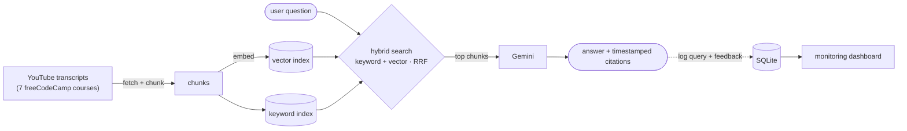

# 🎯 Course Concept Finder

> **Find which online course actually *teaches* a specific concept — with proof — before you enroll.**

An end-to-end **RAG application** built for the [LLM Zoomcamp](https://github.com/DataTalksClub/llm-zoomcamp) capstone.

---

## The problem

Course landing pages are marketing. A summary and a few "what you'll learn" bullets don't tell you whether a **specific** topic — recursion, class inheritance, web scraping with a *particular* library — is genuinely **taught**, or just mentioned in passing. So learners pay, then discover the topic they needed isn't really covered.

## The solution

This app searches the **actual transcripts** of a set of freeCodeCamp Python courses and answers *"which course covers X?"* with the **exact course, the exact timestamp, and a quote as evidence** — grounded in what's really said, not the summary.

**Example**

> **Q:** *"which course explains how a class can inherit from another class?"*
>
> **A:** Ranked by depth:
> 1. **Python OOP** — [2:06:59](https://youtu.be/iLRZi0Gu8Go?t=7619) — *"…we add some parentheses and we specify the class that this core class should inherit"*
> 2. **Python for Beginners** — [2:37:06](https://youtu.be/eWRfhZUzrAc?t=9426) — *"…now the dog class is going to inherit from the animal class"*

And when a concept **isn't** taught, it says so instead of inventing an answer.

---

## Architecture



## Tech stack

| Layer | Tool |
|---|---|
| Ingestion | `youtube-transcript-api` + Python scripts |
| Knowledge base | `minsearch` — keyword `Index` + `VectorSearch` |
| Embeddings | ONNX `all-MiniLM-L6-v2` (no PyTorch) |
| LLM | Google **Gemini** `gemini-flash-latest` |
| Retrieval | hybrid search (keyword + vector) fused with **RRF** |
| Interface | **Streamlit** |
| Monitoring | SQLite + Streamlit dashboard |
| Packaging | Docker Compose |

---

## Quickstart — test it in 5 steps

**Prerequisites:** [`uv`](https://docs.astral.sh/uv/) and a free [Gemini API key](https://aistudio.google.com/app/apikey).

```bash
# 1. clone + install (exact versions come from uv.lock)
git clone https://github.com/<you>/course-concept-finder.git
cd course-concept-finder
uv sync

# 2. add your Gemini key
echo "GEMINI_API_KEY=your-key-here" > .env

# 3. build the knowledge base (one-time; pulls transcripts, chunks, embeds)
uv run python ingest/fetch_transcripts.py   # ~1 min
uv run python ingest/chunk.py               # instant  -> 2489 chunks
uv run python ingest/embed_chunks.py        # ~30s     -> embeddings.npy

# 4. run the app
uv run streamlit run app/app.py             # http://localhost:8501

# 5. run the monitoring dashboard (separate terminal)
uv run streamlit run app/dashboard.py --server.port 8502
```

**Or run everything with Docker:**
```bash
echo "GEMINI_API_KEY=your-key-here" > .env
docker compose up          # app -> :8501   dashboard -> :8502
```

### Change the courses
Edit `data/courses.csv` (columns: `course_id,title,youtube_id`) and re-run step 3.

---

## Evaluation — reproduce the numbers

The retrieval and answer quality are measured, not assumed:

```bash
uv run python eval/gen_ground_truth.py    # LLM-generated Q→chunk ground truth
uv run python eval/evaluate_search.py     # Hit Rate / MRR: text vs vector vs hybrid
uv run python eval/judge.py               # LLM-as-judge: prompt A vs B
```

| Method | Hit Rate | MRR |
|---|---|---|
| keyword | 0.383 | 0.270 |
| vector | 0.404 | 0.253 |
| **hybrid** | **0.447** | **0.306** |

**Hybrid search wins on both metrics**, so it's what the app uses. (Measured on 47
LLM-generated questions.) Absolute values are modest because a single chunk is
counted as the only "correct" answer, while any concept is actually taught across
many overlapping transcript chunks — so a genuinely relevant retrieval often
counts as a miss. The **relative** comparison (hybrid > vector > keyword) is the
signal that matters here.

**LLM evaluation** (`eval/judge.py`): two answer prompts were compared with an
LLM-as-judge — **A** (list every course that covers the concept, ranked by depth)
vs **B** (name the single best course, warn when a course only *mentions* a
concept). Both scored equally on the sample, so the app uses **prompt A**.

## Monitoring

Every query and 👍/👎 is logged to SQLite; the dashboard (`app/dashboard.py`) shows total queries, response time over time, queries over time, top courses surfaced, and feedback breakdown.

---

## Project structure

```
course-concept-finder/
├── ingest/     # fetch transcripts → chunk → embed
├── rag/        # search (text/vector/hybrid) + Gemini answer
├── eval/       # ground truth, Hit Rate/MRR, LLM-as-judge
├── app/        # Streamlit app + monitoring dashboard
├── db/         # SQLite logging
├── data/       # courses.csv (+ generated: chunks, embeddings, db)
├── docker-compose.yaml / Dockerfile
└── README.md
```

## Notes

- **Provider-agnostic:** uses Gemini, but any LLM works — swap the client in `rag/rag.py`.
- **Gemini free tier** has a daily request quota; heavy eval runs may hit `429` — the scripts retry and resume.
- Transcripts, embeddings, the model, and the DB are generated locally (git-ignored) — build them with step 3.

## Maps to the LLM Zoomcamp rubric

| Criterion | Where |
|---|---|
| Problem description | this README |
| Retrieval flow (KB + LLM) | `rag/` |
| Retrieval evaluation (multiple, best chosen) | `eval/evaluate_search.py` |
| LLM evaluation (multiple prompts) | `eval/judge.py` |
| Interface | `app/app.py` |
| Ingestion pipeline | `ingest/` |
| Monitoring (feedback + 5-chart dashboard) | `app/dashboard.py` + `db/` |
| Containerization | `docker-compose.yaml` |
| Reproducibility | `uv.lock` + this README |
| Bonus: hybrid search + reranking (RRF) | `rag/search.py` |
