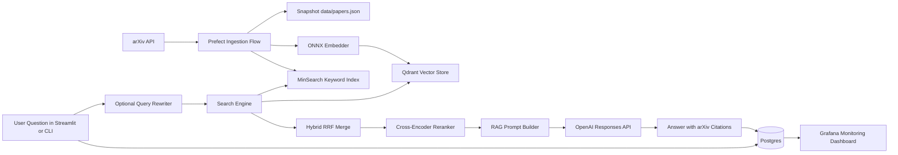

# 📚 PaperPilot — an arXiv Research Assistant (RAG)

PaperPilot is an end-to-end **Retrieval-Augmented Generation** application that
lets you ask natural-language questions about recent research papers and get
concise, **cited** answers grounded in arXiv abstracts.

> Capstone project for the [DataTalksClub LLM Zoomcamp](https://github.com/DataTalksClub/llm-zoomcamp).

## Problem

Researchers, students, and engineers cannot keep up with the firehose of new
papers — thousands are posted to arXiv every week. Skimming titles and abstracts
to answer a specific question ("what recent methods reduce hallucination in
RAG?") is slow and easy to get wrong. PaperPilot ingests a corpus of recent
papers for a chosen arXiv category, indexes them for both keyword and semantic
search, and answers questions with an LLM that is **forced to cite** the papers
it used — so every claim is traceable back to a source.

## What it does

- **Ingests** recent papers from the arXiv API into a knowledge base (Qdrant + a keyword index).
- **Retrieves** with three strategies — keyword, vector, and **hybrid (RRF)** — plus a **cross-encoder re-ranker**.
- **Rewrites** the user's question into a keyword-dense search query (LLM).
- **Answers** with the OpenAI Responses API, citing papers as `[arXiv:<id>]`.
- **Evaluates** retrieval (Hit Rate / MRR) and answers (LLM-as-a-judge).
- **Monitors** usage, cost, latency, judge scores, and 👍/👎 user feedback in **Grafana**.
- Uses **Prefect** to orchestrate ingestion in Docker and local runs.
- Ships as a single **docker-compose** stack.

## Architecture

### Data flow



### Runtime flow (step-by-step)

1. Ingestion fetches or reuses snapshot data, computes embeddings, and rebuilds the vector collection.
2. At query time, the system may rewrite the user question for better retrieval recall.
3. Retrieval runs keyword and vector search, fuses candidates with Reciprocal Rank Fusion, and optionally reranks with a cross-encoder.
4. The top papers are formatted into a grounded context and sent to the LLM.
5. The LLM returns a cited answer (`[arXiv:<id>]`) and usage metrics.
6. Question, answer, timing, cost, and feedback are persisted to Postgres and visualized in Grafana.

| Component | Tech |
|---|---|
| Data source | arXiv public API (`arxiv`) |
| Vector store | Qdrant |
| Keyword search | MinSearch (in-process) |
| Embeddings | `all-MiniLM-L6-v2` via **ONNX** (CPU, no API) |
| Re-ranker | `ms-marco-MiniLM-L-6-v2` cross-encoder (ONNX) |
| LLM | OpenAI Responses API (`gpt-4o-mini` by default) |
| UI | Streamlit |
| Monitoring | Postgres + Grafana |
| Orchestration | docker-compose + Prefect (ingestion flow) |

## Quick start (Docker — recommended)

```bash
cp .env.example .env        # add your OPENAI_API_KEY
make up                     # builds & starts qdrant, postgres, grafana, app + runs ingestion
```

Then open:
- **App:** http://localhost:8501
- **Grafana:** http://localhost:3000 (admin / admin)

The `ingest` service downloads the ONNX models, initializes Postgres, and indexes
papers (from the committed snapshot if present, otherwise a fresh arXiv fetch).
This ingestion step is executed via a Prefect flow (`papermate-ingestion`).

## Quick start (local, without Docker)

```bash
make setup                  # uv sync + download ONNX models
make up                     # start qdrant + postgres + grafana only, OR run your own
make db                     # create Postgres tables
make ingest MAX=400 CATEGORY=cs.CL   # fetch + index (or: make ingest-snapshot)
make ingest-prefect MAX=400 CATEGORY=cs.CL   # same ingestion via Prefect flow
make app                    # http://localhost:8501

# CLI
uv run python main.py "What methods reduce hallucination in RAG?"
```

## Evaluation

```bash
make eval                                   # generate LLM ground truth -> data/ground_truth.csv
uv run python evaluation/retrieval_eval.py  # keyword vs vector vs hybrid vs hybrid+rerank
uv run python evaluation/rag_eval.py        # multiple RAG variants, judged by LLM
```

Results (tables + charts) are written to `evaluation/results/`.

- **Retrieval:** Hit Rate and MRR@5 across all four retrieval strategies. **Hybrid+rerank is used in the app because it scores best.**
- **LLM:** multiple end-to-end variants (prompt style + rewrite + rerank + retrieval method) are scored by an LLM-as-a-judge on relevance. The winner is written to `evaluation/results/best_rag_config.json` and used as default runtime behavior by the app/CLI.

### Evaluation design

1. Ground-truth generation:
    - `evaluation/generate_ground_truth.py` creates `(question, paper_id)` pairs from indexed papers.
    - This enables automated retrieval benchmarking without manual labeling for each run.
2. Retrieval evaluation:
    - Script: `evaluation/retrieval_eval.py`
    - Methods compared: keyword, vector, hybrid (RRF), hybrid + rerank
    - Metrics: Hit Rate@5 and MRR@5
    - Output artifacts: `evaluation/results/retrieval_metrics.csv` and `evaluation/results/retrieval_metrics.png`
3. LLM evaluation:
    - Script: `evaluation/rag_eval.py`
    - Compares multiple full pipeline variants (prompt style + method + rewrite + rerank)
    - Judge: LLM relevance labels (`RELEVANT`, `PARTLY_RELEVANT`, `NON_RELEVANT`)
    - Output artifacts: `evaluation/results/rag_eval.csv` and `evaluation/results/best_rag_config.json`
4. Runtime policy:
    - The app and CLI can automatically load the best evaluated RAG variant from `best_rag_config.json`.

### Interpreting results

- Retrieval metrics indicate whether the correct source paper appears high in ranked results.
- LLM judge metrics indicate answer relevance quality, conditional on retrieval quality.
- If LLM quality drops while retrieval stays stable, prioritize prompt or reasoning changes.
- If both drop, prioritize ingestion freshness, retrieval tuning, or reranker quality.

Example run on a 400-paper `cs.CL` corpus with 120 LLM-generated queries:

| Method | Hit Rate@5 | MRR@5 |
|---|---|---|
| keyword | 0.917 | 0.847 |
| vector | 0.958 | 0.939 |
| hybrid (RRF) | 0.958 | 0.925 |
| **hybrid + rerank** | **0.992** | **0.986** |

(Regenerate with `make eval && python evaluation/retrieval_eval.py`; exact numbers vary with the live arXiv snapshot.)

## Monitoring

The Grafana dashboard (`PaperPilot Monitoring`) has 9 panels: total questions,
avg response time, total cost, net user feedback, questions & latency over time,
token usage over time, judge relevance distribution, retrieval-method usage, and
a recent-questions table. User 👍/👎 feedback and per-answer judge scores are
stored in Postgres and visualized live.

## Rubric coverage

| Criterion | Where |
|---|---|
| Problem description | this README |
| Retrieval flow (KB + LLM) | `papermate/search.py`, `papermate/rag.py` |
| Retrieval evaluation (multiple) | `evaluation/retrieval_eval.py` |
| LLM evaluation (multiple) | `evaluation/rag_eval.py` |
| Interface | `app/streamlit_app.py` (+ `main.py` CLI) |
| Ingestion pipeline (automated) | `papermate/pipelines/prefect_ingestion.py`, `papermate/ingest.py` |
| Monitoring (feedback + dashboard) | `papermate/db.py`, `grafana/` |
| Containerization | `docker-compose.yml` |
| Reproducibility | this README + `make` targets + snapshot |
| Best practices | hybrid search + re-ranking + query rewriting |

## CI quality gate

A GitHub Actions workflow (`.github/workflows/rubric-check.yml`) runs
`python scripts/rubric_check.py` on every push/PR touching `project/**`.
It enforces full-score evidence for every required rubric criterion and fails
the build if any criterion regresses.

## Configuration

All settings are environment variables (see `.env.example`): LLM model, arXiv
category/size, Qdrant, Postgres, and Grafana credentials.

## Cloud deployment (bonus)

The stack is portable to any Docker host (e.g. an EC2 instance or Fly.io):
provision a VM, install Docker, copy the repo, set `.env`, and run `make up`.
Point a reverse proxy at ports 8501 (app) and 3000 (Grafana).

## Project limitations

1. Corpus scope:
    - By default, ingestion targets one arXiv category and a bounded paper count, so coverage is not exhaustive.
2. Source depth:
    - Answers are grounded in title + abstract, not full-text PDFs, which can miss implementation details.
3. Judge bias:
    - LLM-as-a-judge is useful but imperfect and may not always align with human expert judgment.
4. Cost and latency:
    - Query rewrite + rerank + generation improves quality but increases latency and token spend.
5. Freshness:
    - If ingestion is not scheduled frequently, the index can lag newly published papers.

## Future enhancements

1. Full-text retrieval:
    - Parse and chunk PDFs for deeper context and more complete answers.
2. Better eval set:
    - Add a human-verified benchmark split and track agreement between human and LLM judges.
3. Adaptive retrieval:
    - Dynamically choose method/rerank depth per query difficulty and latency budget.
4. Citation validation:
    - Add automatic checks that every citation corresponds to a supporting claim.
5. Production hardening:
    - Add authentication, rate limiting, caching, and background ingestion schedules.
6. Cloud-native deployment:
    - Add IaC and managed deployment templates (e.g., ECS/GKE + managed Postgres).
