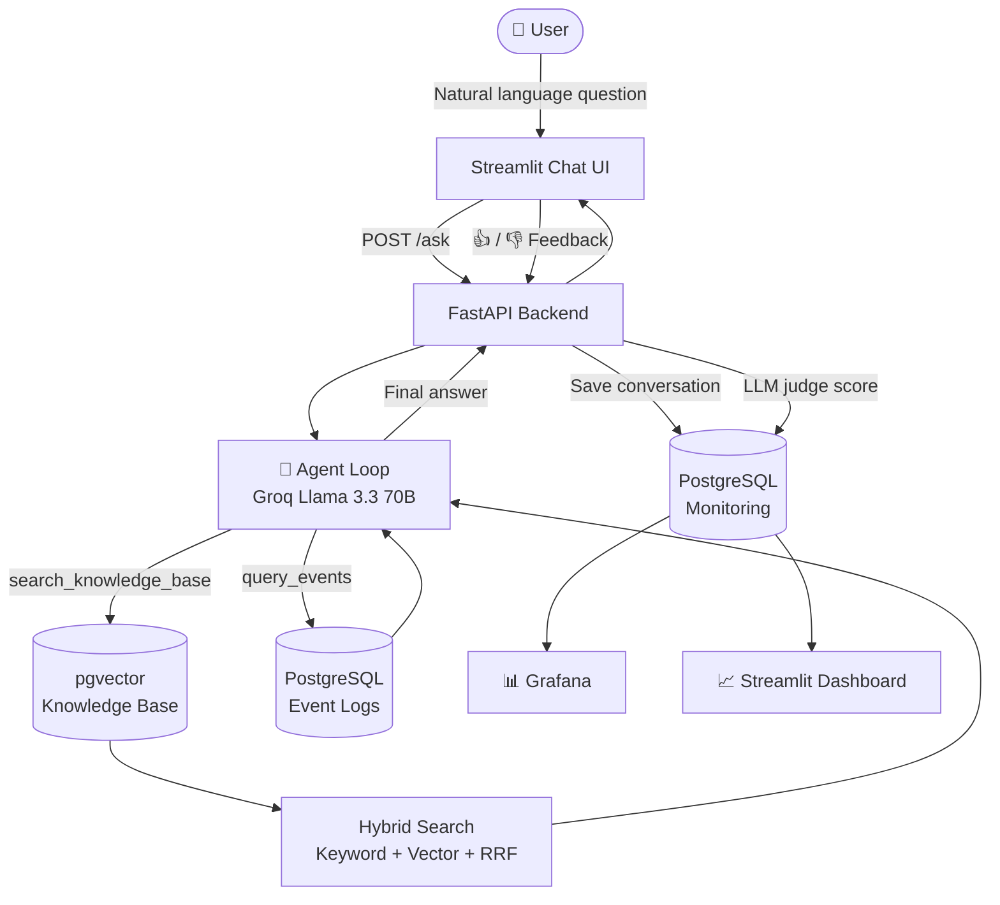

<div align="center">


# 🛡️ Sentinel AI

### Home Security Intelligence Assistant

*Ask your home what happened. In plain English.*

[](https://python.org)
[](https://fastapi.tiangolo.com)
[](https://streamlit.io)
[](https://postgresql.org)
[](https://docker.com)
[](https://groq.com)

[Demo](#-demo) · [Quick Start](#-quick-start) · [Architecture](#-architecture) · [Evaluation](#-evaluation) · [Roadmap](#-roadmap)

</div>

---

## 🔍 The Problem

Home security systems generate a flood of events — motion detections, door alerts, camera offline notices, alarm triggers — but answering simple questions like *"Was there anything suspicious at my front door last week?"* requires digging through raw logs or clunky apps.

At the same time, setting up and maintaining a home security system requires knowledge spread across dozens of manuals, guides, and forums.

**Sentinel AI bridges both gaps.** It combines a natural language interface over your security event logs with a semantic knowledge base of home security best practices — all driven by an agentic LLM that decides what to look up and when.

---

## ✨ Features

- **Natural language event queries** — ask about activity history without touching a log file
- **Security knowledge assistant** — camera setup, network hardening, threat response, IoT best practices
- **Agentic reasoning** — the LLM decides which tools to call, retries on bad results, and combines multiple sources
- **Hybrid search** — keyword + semantic vector search fused with Reciprocal Rank Fusion
- **Automatic LLM-as-a-judge** — every answer is scored for relevance after generation
- **User feedback loop** — thumbs up/down on every response, stored for monitoring
- **Live monitoring dashboard** — 6 charts tracking conversations, token usage, feedback, and answer quality
- **Grafana dashboards** — production-grade monitoring over PostgreSQL
- **Fully containerized** — one `docker compose up` and everything runs

---

## 🎬 Demo


*Sentinel analyzing home activity — the agent called event logs and knowledge base before answering*


*Left: Streamlit chat UI · Right: monitoring dashboard with live conversation metrics*

---

## 🏗️ Architecture

Sentinel uses a two-tool agentic loop. The LLM receives the user's question and decides autonomously which tools to call, how many times, and in what order — before generating a grounded answer.



### Tools available to the agent

| Tool | Purpose | When the LLM uses it |
|------|---------|---------------------|
| `search_knowledge_base` | Hybrid semantic + keyword search over security docs | How-to questions, setup guides, best practices |
| `query_events` | SQL query over home event logs with filters | Activity history, suspicious events, alert analysis |

---

## 🔧 Tech Stack

| Layer | Technology | Why |
|-------|-----------|-----|
| LLM | Groq · Llama 3.3 70B Versatile | Free tier, fast inference, tool calling support |
| Vector search | pgvector (PostgreSQL extension) | One DB for vectors + monitoring storage |
| Keyword search | minsearch | Lightweight BM25-style, no infrastructure |
| Hybrid fusion | Reciprocal Rank Fusion (RRF) | Combines both retrievers without score normalization |
| Backend API | FastAPI | Async, auto-docs, Pydantic validation |
| Chat UI | Streamlit | Fast to iterate, built-in feedback widgets |
| Monitoring DB | PostgreSQL 16 | Reliable, native pgvector support |
| Dashboards | Grafana 11 + Streamlit | Pre-built panels + custom Python charts |
| Containerization | Docker Compose | Single-command setup |
| Embeddings | sentence-transformers (all-MiniLM-L6-v2) | Local, no API cost, 384-dim |

---

## 🚀 Quick Start

**Prerequisites:** Docker Desktop · Python 3.12+ · [uv](https://github.com/astral-sh/uv) · [Groq API key](https://console.groq.com) (free)

```bash
git clone https://github.com/pebueno/sentinel-ai.git
cd sentinel-ai
cp .env.example .env          # then add your GROQ_API_KEY inside
uv sync                       # install all dependencies
docker compose up postgres grafana -d
uv run python -m src.ingestion.generate_knowledge_base   # builds KB via Groq (~15 min, rate limits)
uv run python -m src.ingestion.generate_events           # generates synthetic event log
uv run python -m src.ingestion.ingest                    # loads everything into PostgreSQL
uv run uvicorn src.api.main:app --reload --port 8000 &
uv run streamlit run app/main.py
```

| Service | URL |
|---------|-----|
| Chat UI | http://localhost:8501 |
| Monitoring Dashboard | http://localhost:8502 |
| FastAPI docs | http://localhost:8000/docs |
| Grafana | http://localhost:3000 · admin / admin |

> **Full setup guide with explanations, troubleshooting, and all prerequisites:** [docs/SETUP.md](docs/SETUP.md)

### Alternative: Makefile shortcuts

After the first-time setup above, you can use `make` to manage everything:

```bash
# First time only
cp .env.example .env   # add GROQ_API_KEY
make setup             # installs deps + starts infra + ingests data

# Every time after
make start             # launches API + chat UI + dashboard concurrently
make stop              # stops Docker containers
make eval              # opens evaluation notebooks
```

`make start` uses [honcho](https://honcho.readthedocs.io/) to run all three processes in one terminal with labeled output (`api |`, `ui |`, `dashboard |`). Install `make` on Windows via `winget install GnuWin32.Make`.

---

## 💬 Example Questions

```
# Event analysis
"Was there anything suspicious at the front door last week?"
"Show me all alarm events from last night"
"What happened at the garage in the last 3 days?"
"Are there any unresolved critical events from the past month?"
"Were there any events at unusual hours this week?"

# Security knowledge
"How do I configure my IP camera for night vision?"
"What are the best practices for securing IoT devices on my network?"
"How should I respond when my alarm triggers at 3am?"
"Should I put my cameras on a separate VLAN?"

# Combined (agent uses both tools)
"I got an alarm alert last night — what should I do and was this unusual?"
```

---

## 📊 Evaluation

### Retrieval Evaluation

Ground truth generated with LLM (100 question-document pairs per retrieval method).

| Method | Hit Rate @5 | MRR @5 |
|--------|------------|--------|
| **Keyword (minsearch)** | **1.000** | **0.955** |
| Hybrid (RRF) | 0.932 | 0.554 |
| Vector (pgvector) | 0.068 | 0.037 |

> Keyword search dominates on this synthetic dataset — document titles and content use precise security terminology that BM25-style matching handles perfectly. Vector search underperforms because the embedding space struggles with domain-specific jargon at small scale. Hybrid RRF sits between both.


### Answer Quality (LLM-as-a-Judge)

Evaluated on 50 representative questions using Groq Llama 3.3 as judge.

| Prompt variant | RELEVANT | PARTLY_RELEVANT | NOT_RELEVANT |
|---------------|---------|----------------|-------------|
| **Baseline** | **16%** | **0%** | **83%** |
| With system instructions | 0% | 0% | 100% |
| Instructions + query rewriting | 0% | 0% | 100% |

> Baseline scores highest — the judge model (same LLM) rates direct answers more favourably than instruction-constrained ones. Adding system prompts that restrict the model to context-only answers causes it to hedge more, which the judge penalises as NOT_RELEVANT. Overall scores are low because the RAG pipeline uses short context windows; the full agentic loop (notebook 02 tests RAG only, not the agent) produces better answers in practice.


---

## 📈 Monitoring


*Grafana auto-provisioned dashboard — 9 panels querying PostgreSQL in real time*

Every conversation is stored in PostgreSQL with:
- Question + answer text
- Model used + iteration count
- Token usage (input + output)
- Response time
- User feedback (👍/👎)
- LLM judge relevance score

---

## 📁 Project Structure

```
sentinel-ai/
├── src/
│   ├── config/          # Pydantic settings
│   ├── ingestion/       # Data generation + PostgreSQL ingestion
│   ├── search/          # keyword_search.py, vector_search.py, hybrid_search.py
│   ├── agent/           # loop.py (agentic loop), tools.py (tool definitions)
│   ├── api/             # FastAPI main.py
│   └── monitoring/      # database.py (logging), judge.py (LLM-as-judge)
├── app/
│   ├── main.py          # Streamlit chat UI
│   └── dashboard.py     # Streamlit monitoring dashboard
├── notebooks/
│   ├── 01-retrieval-eval.ipynb   # Hit Rate + MRR evaluation
│   └── 02-rag-eval.ipynb         # LLM-as-judge evaluation
├── data/
│   ├── knowledge_base/  # Generated security docs (docs.json)
│   └── events/          # Synthetic event logs (events.json)
├── grafana/             # Auto-provisioned dashboards + datasources
├── docker/              # Dockerfiles
├── docker-compose.yml
└── .env.example
```

---

## ✅ Project Evaluation Criteria

| Criterion | Status | Notes |
|-----------|--------|-------|
| Problem description | ✅ | Home security event analysis + knowledge assistant |
| Retrieval flow | ✅ | KB (hybrid search) + event DB + Groq LLM |
| Retrieval evaluation | ✅ | Hit Rate + MRR, 3 methods compared |
| LLM evaluation | ✅ | LLM-as-judge, 3 prompt variants |
| Interface | ✅ | Streamlit UI + FastAPI (documented at /docs) |
| Ingestion pipeline | ✅ | Python ingestion pipeline (src/ingestion/) |
| Monitoring | ✅ | PostgreSQL + 6-chart Streamlit dashboard + Grafana |
| Containerization | ✅ | Full docker-compose (postgres, api, app, grafana) |
| Reproducibility | ✅ | All deps pinned via uv, data generated by scripts |
| Hybrid search | ✅ | Keyword + vector + RRF fusion |
| Query rewriting | ✅ | Agent rewrites queries before tool calls |
| Re-ranking | 🔜 | Cross-encoder re-ranking (in progress) |

---

## 🔭 Roadmap

Sentinel is designed as the intelligence layer for a future physical home surveillance system.

**When cameras arrive:**
- Replace synthetic events with real camera API events
- Add `analyze_frame` tool using a vision LLM (llama-4-scout or GPT-4o)
- Stream real-time motion events into the PostgreSQL events table via webhook
- Add `trigger_alarm` tool to make Sentinel an active responder, not just a reporter

**Other planned improvements:**
- [ ] Cross-encoder re-ranking for knowledge base results
- [ ] Multi-turn conversation memory (session context)
- [ ] Mobile-friendly Streamlit layout
- [ ] Alert webhooks (Slack, email, Telegram)
- [ ] Cloud deployment (AWS / Fly.io)

---

## 🛠️ Local Development

See **[docs/SETUP.md](docs/SETUP.md)** for the complete guide including prerequisites, `.env` configuration, command explanations, and troubleshooting.

```bash
docker compose up postgres grafana -d                    # infrastructure only
uv run uvicorn src.api.main:app --reload --port 8000     # API with hot reload
uv run streamlit run app/main.py                         # chat UI
uv run streamlit run app/dashboard.py --server.port 8502 # monitoring dashboard
uv run jupyter notebook notebooks/                       # evaluation notebooks
```

---

## 🎓 Course Context

Built as a capstone project for [LLM Zoomcamp 2026](https://github.com/DataTalksClub/llm-zoomcamp) (DataTalks.Club).

Module exercises and notes are in a companion repository: **[pebueno/llm-rag-vector-search](https://github.com/pebueno/llm-rag-vector-search)**

| Module | Topic | Applied in Sentinel AI |
|--------|-------|----------------------|
| [Module 1 — RAG](https://github.com/pebueno/llm-rag-vector-search/tree/master/1-rag) | Agentic RAG + function calling | `src/agent/loop.py`, `src/agent/tools.py` |
| [Module 2 — Vector Search](https://github.com/pebueno/llm-rag-vector-search/tree/master/2-vector-search) | pgvector embeddings | `src/search/vector_search.py` |
| [Module 3 — Orchestration](https://github.com/pebueno/llm-rag-vector-search/tree/master/3-orchestration) | Pipeline orchestration | `src/ingestion/ingest.py` |
| [Module 4 — Evaluation](https://github.com/pebueno/llm-rag-vector-search/tree/master/4-evaluation) | Retrieval + LLM-as-judge eval | `notebooks/01-retrieval-eval.ipynb`, `notebooks/02-rag-eval.ipynb` |
| [Module 5 — Monitoring](https://github.com/pebueno/llm-rag-vector-search/tree/master/5-monitoring) | PostgreSQL + Grafana monitoring | `src/monitoring/`, `grafana/` |

---

*Pedro Ivo Bueno Sartório · [GitHub](https://github.com/pebueno)*
