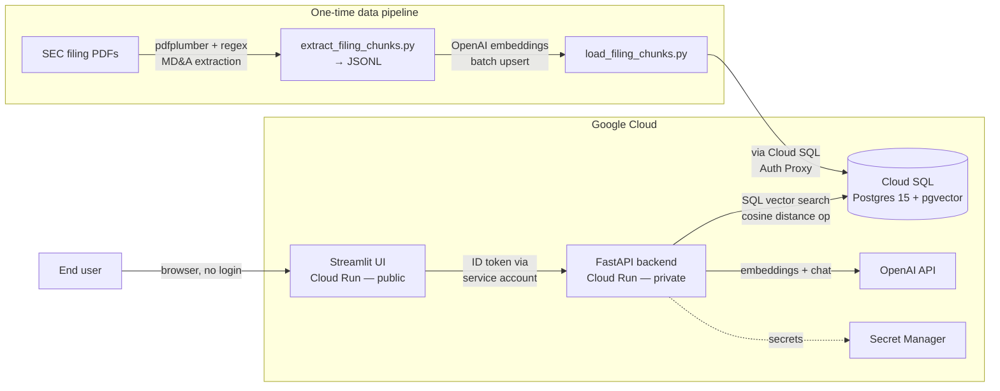

# 📊 Earnings Intelligence Agent

An AI Q&A assistant over real SEC filings — ask plain-English questions about a company's risk factors, liquidity, financial condition, or recent performance, and get an answer grounded in actual filing text, with citations back to the exact excerpt it came from.

Production-deployed on Google Cloud: a FastAPI backend does retrieval-augmented generation (RAG) over `pgvector`-embedded filing text in Cloud SQL, and a public Streamlit UI sits in front of it for end users.

**🔗 Live demo — Public UI:** **https://stocks-earnings-ui-unuam2qp7q-uc.a.run.app**

No login required. The backend API itself is authenticated-only; the UI reaches it internally using its own service account.

---

## What it actually does

Ask things like:

- *"What are Amazon's biggest risk factors?"*
- *"How is DoorDash's liquidity and cash position?"*
- *"Summarize Google's recent financial performance."*

The system semantically searches real filing excerpts (Risk Factors, MD&A, Liquidity & Capital Resources, Financial Condition, Results of Operations, Critical Accounting Policies) for the closest matches, hands only those excerpts to an LLM, and returns an answer that cites exactly which excerpt it used — so it's checkable, not a black box.

**Current data coverage:** 10 companies (`AMZN`, `DASH`, `GOOG`, `META`, `NKE`, `NTNX`, `NVDA`, `RBRK`, `TOST`, `UBER`), fiscal years 2021–2026, ~1,000 embedded filing-text chunks across 6 filing sections. A separate structured dataset (`financial_metrics`) also holds numeric SEC XBRL facts — revenue, net income, assets, liabilities — for a different set of tickers (`AAPL`, `GOOGL`, `MSFT`); the two datasets don't currently overlap on ticker, which is a known coverage gap, not a bug.

## Architecture



- **API** (`app/`): FastAPI, SQL-side vector search using `pgvector`'s `<=>` cosine-distance operator directly in Postgres — nothing loaded into memory at startup, so cold starts are fast regardless of corpus size.
- **UI** (`streamlit_app.py`): chat-style Q&A, onboarding with example questions, cited sources with match-strength scores, deployed as its own Cloud Run service so it can be public while the API stays locked down.
- **Database**: Cloud SQL for Postgres 15 with the `vector` extension, reached from Cloud Run via the native Cloud SQL connector (unix socket) — no VPC connector needed.
- **Auth model**: the API is authenticated-only (`roles/run.invoker` restricted to named principals, no `allUsers`). The UI is public, but only *it* is allowed to call the API — enforced by giving the UI's Cloud Run service account exactly one IAM grant (`run.invoker` on the API service) and nothing else.
- **Secrets**: OpenAI API key and DB password live in Secret Manager, injected into Cloud Run as secret-backed env vars — never in source, Terraform state (beyond GCP's own encryption), or image layers.
- **IaC**: everything above is provisioned by Terraform (`terraform/`), with GCS-backed remote state.

## Tools & technologies

| Layer | Tools |
|---|---|
| Backend API | Python 3.11, FastAPI, Uvicorn, Pydantic Settings |
| Frontend | Streamlit, `requests`, `google-auth` |
| Database | Cloud SQL for Postgres 15, `pgvector` extension (cosine similarity, `ivfflat` index) |
| LLM / embeddings | OpenAI `text-embedding-3-small` (embeddings), `gpt-4-turbo` (answer generation) |
| PDF → text pipeline | `pdfplumber` (extraction), custom regex-based MD&A/section splitter, JSONL as the durable intermediate artifact |
| Compute | Google Cloud Run (two services, both `min_instances=0` — scale to zero) |
| Infra as code | Terraform (`hashicorp/google` provider), GCS remote state backend |
| Secrets & IAM | GCP Secret Manager, dedicated least-privilege service accounts per service |
| Container builds | Docker (multi-stage, `linux/amd64` targets for Cloud Run), Artifact Registry |
| Package management | [`uv`](https://github.com/astral-sh/uv) (dependency groups: default, `dev`, `ui`) |
| Local DB access to Cloud SQL | `cloud-sql-proxy` |

## Data pipeline

The PDF → embedded-chunk pipeline is intentionally two decoupled, resumable steps rather than one fragile end-to-end job:

1. **Extract** (`extract_filing_chunks.py`, CPU-bound, no DB): reads SEC filing PDFs, extracts the MD&A section via regex, splits into subsections, chunks the text, and writes everything to a plain **JSONL** file — inspectable, greppable, no database dependency. Each PDF runs under a hard wall-clock timeout so one malformed file can't stall the whole batch.
2. **Embed + load** (`scripts/load_filing_chunks.py`, network-bound): reads that JSONL, batch-embeds the text via OpenAI, and upserts into `sec_filings.filing_text_chunks` in Postgres with `ON CONFLICT DO NOTHING` — safe to re-run.

This replaced an earlier Jupyter-notebook-and-`dlt` version that had two independent failure modes (an async event-loop hang in the notebook kernel, and a genuine infinite loop in the chunking logic for certain text lengths) and added an unnecessary local-Postgres staging hop. Splitting CPU-bound extraction from network-bound loading, plus writing to an inspectable file in between, made both failure modes visible and fixable instead of silent multi-hour hangs.

`scripts/migrate_and_embed.py` is a separate, smaller one-time bridge that copies the structured `financial_metrics` / `sec_filings_metadata` tables from the prototype's local Postgres into Cloud SQL — unrelated to filing text.

## Retrieval evaluation

Retrieval quality is measured, not guessed. `scripts/generate_ground_truth.py` samples chunks stratified across all 10 tickers and asks an LLM to write one realistic question each chunk uniquely answers, producing `data/ground_truth.jsonl` (100 questions). `scripts/evaluate_retrieval.py` then runs every ground-truth question through four retrieval approaches and scores Hit Rate + MRR (top-5) against the known-correct chunk:

| Approach | MRR |
|---|---|
| A: baseline vector search | 0.365 |
| B: query rewrite only | 0.276 |
| **C: ticker-boost only (winner — used in production)** | **0.370** |
| D: query rewrite + ticker-boost | 0.260 |

Query rewriting (`rewrite_query()` in `app/services/rag.py`) — asking an LLM to turn the question into a keyword-rich search query before embedding — was implemented and evaluated, but it *hurt* every time, most likely because the generic rewrite loses lexical overlap with the source chunk's exact phrasing. It's kept in the codebase (and exercised by the evaluation script) as a documented negative result rather than deleted, since `answer_question()` deliberately calls plain `vector_search_with_boost()` instead.

```bash
uv run python scripts/generate_ground_truth.py   # regenerate data/ground_truth.jsonl (optional — committed copy included)
uv run python scripts/evaluate_retrieval.py       # prints Hit Rate/MRR for all 4 approaches
```

## LLM (answer) evaluation

Retrieval is evaluated separately from answer quality (see above) — this asks a different question: given the same retrieved context, which *model and prompt* produce the best answer? `scripts/evaluate_answers.py` holds retrieval fixed (the production ticker-boosted search, via the shared `app.services.rag.retrieve_context()` helper) and compares three answer-generation approaches over the ground-truth question set:

| Approach | What varies |
|---|---|
| A: production | `gpt-4-turbo` + the current system prompt |
| B: cheaper model | `gpt-4o-mini` + the same system prompt |
| C: strict grounding prompt | `gpt-4-turbo` + a prompt that explicitly forbids inferring beyond the retrieved context |

A judge model (`gpt-4o-mini`) scores every `(question, context, answer)` triple on two 1–5 scales — **faithfulness** (are claims actually supported by the context?) and **relevance** (does the answer address the question?) — and the highest-scoring approach is the one that should back `answer_question()`.

```bash
uv run python scripts/evaluate_answers.py            # full ground-truth set (100 questions × 3 approaches × 2 LLM calls each)
uv run python scripts/evaluate_answers.py --limit 20  # cheaper trial run
```

This makes real `gpt-4-turbo`/`gpt-4o-mini` calls and costs a small amount of OpenAI credit per run (roughly a few dollars for the full set) — not yet run end-to-end against production data, so there's no results table here yet the way there is for retrieval.

## Monitoring

End users can rate any answer 👍/👎 directly in the Streamlit UI. Ratings post to `POST /feedback` and land in `sec_filings.query_feedback` (`migrations/004_create_query_feedback.sql`); `GET /feedback/stats` aggregates thumbs-up/down counts. There's no charting dashboard yet (see [Repo layout](#repo-layout) for what exists today) — feedback is currently collected but not visualized.

## Local development

```bash
uv sync

cp .env.example .env
# edit .env: point DB_* at a local Postgres with the `vector` extension available,
# and set OPENAI_API_KEY

# apply migrations against your local Postgres
psql "$DATABASE_URL" -f migrations/001_enable_pgvector.sql
psql "$DATABASE_URL" -f migrations/002_create_schema.sql
psql "$DATABASE_URL" -f migrations/003_create_filing_text_chunks.sql
psql "$DATABASE_URL" -f migrations/004_create_query_feedback.sql

uv run uvicorn app.main:app --reload
```

Endpoints: `GET /health`, `POST /query`, `POST /search`, `GET /metrics/{ticker}`, `GET /companies`, `POST /feedback`, `GET /feedback/stats`.

## Streamlit UI (local)

```bash
uv sync --group ui

# against a local dev server (uvicorn running on :8000)
API_BASE_URL=http://localhost:8000 uv run --group ui streamlit run streamlit_app.py

# against a deployed (authenticated-only) Cloud Run API
API_BASE_URL=https://<cloud-run-url> uv run --group ui streamlit run streamlit_app.py
```

Against a `*.run.app` URL, the app attaches a Google-signed identity token to every request: `google-auth`'s `fetch_id_token()` for service-account/GCE contexts (this is what runs automatically once deployed to Cloud Run), falling back to `gcloud auth print-identity-token` for a human running it locally under `gcloud auth application-default login`.

## Docker

```bash
# API
docker build -t stocks-earnings-api .
docker run -p 8080:8080 --env-file .env -e PORT=8080 stocks-earnings-api

# Streamlit UI
docker build -f Dockerfile.streamlit -t stocks-earnings-ui .
docker run -p 8080:8080 -e PORT=8080 -e API_BASE_URL=http://host.docker.internal:8000 stocks-earnings-ui
```

Cloud Run requires `linux/amd64` images — on Apple Silicon, build with `docker buildx build --platform linux/amd64 ...` instead of a plain `docker build`, or Cloud Run will reject the manifest at deploy time.

### Docker Compose (full local stack)

The fastest way to run everything — Postgres/pgvector + API + UI — with one command, no manual migrations or local Python env needed:

```bash
OPENAI_API_KEY=sk-... docker compose up --build
```

Postgres runs the SQL files in `migrations/` automatically on first init. Once the stack is healthy, load some filing data from the host (first run only — compose exposes Postgres on host port `5434`, not the default `5432`):

```bash
DB_HOST=localhost DB_PORT=5434 DB_NAME=financial_data DB_USER=postgres DB_PASSWORD=postgres \
  OPENAI_API_KEY=sk-... uv run python scripts/load_filing_chunks.py
```

Then open the UI at `http://localhost:8501` (API at `http://localhost:8000`). This is a local convenience setup only — the Cloud Run deployment below doesn't use it.

## Deploying to GCP

All steps are manual for v1 (no CI/CD yet — see `terraform/` outputs for what a future GitHub Actions workflow would need).

1. **Bootstrap Terraform state bucket** (one-time):
   ```bash
   gcloud storage buckets create gs://topstocksqaagent-tfstate \
     --location=us-central1 --uniform-bucket-level-access
   ```

2. **Provision foundational infra** (Artifact Registry, service accounts, secrets, Cloud SQL — Cloud SQL takes several minutes):
   ```bash
   cd terraform
   cp terraform.tfvars.example terraform.tfvars   # fill in invoker_members, etc.
   terraform init
   terraform apply -target=google_artifact_registry_repository.api \
                    -target=google_service_account.cloud_run_sa \
                    -target=google_sql_database_instance.main \
                    -var="openai_api_key=$OPENAI_API_KEY" \
                    -var="image_tag=bootstrap"
   ```

3. **Build and push the API image** (amd64 — see Docker note above):
   ```bash
   gcloud auth configure-docker us-central1-docker.pkg.dev
   docker buildx build --platform linux/amd64 \
     -t us-central1-docker.pkg.dev/topstocksqaagent/stocks-earnings-api/api:$(git rev-parse --short HEAD) \
     --push .
   ```

4. **Apply DB migrations against Cloud SQL** (via the Auth Proxy):
   ```bash
   cloud-sql-proxy $(terraform output -raw cloud_sql_connection_name) --port 5433 &
   psql "host=localhost port=5433 dbname=financial_data user=app_user" -f ../migrations/001_enable_pgvector.sql
   psql "host=localhost port=5433 dbname=financial_data user=app_user" -f ../migrations/002_create_schema.sql
   psql "host=localhost port=5433 dbname=financial_data user=app_user" -f ../migrations/003_create_filing_text_chunks.sql
   ```

5. **Run the data migration + chunk backfill** (once source data exists — see [Data pipeline](#data-pipeline)):
   ```bash
   cd ..
   export DB_HOST=localhost DB_PORT=5433 DB_NAME=financial_data DB_USER=app_user
   export DB_PASSWORD=$(gcloud secrets versions access latest --secret=db-password --project=topstocksqaagent)
   export OPENAI_API_KEY=...
   uv run python scripts/migrate_and_embed.py        # financial_metrics + sec_filings_metadata
   uv run python scripts/load_filing_chunks.py        # embedded filing text chunks
   ```

6. **Deploy the API Cloud Run service**:
   ```bash
   cd terraform
   terraform apply -var="openai_api_key=$OPENAI_API_KEY" \
                    -var="image_tag=$(git rev-parse --short HEAD)"
   ```

7. **Build, push, and deploy the Streamlit UI** (same amd64 requirement):
   ```bash
   cd ..
   docker buildx build --platform linux/amd64 \
     -f Dockerfile.streamlit \
     -t us-central1-docker.pkg.dev/topstocksqaagent/stocks-earnings-api/ui:$(git rev-parse --short HEAD) \
     --push .
   cd terraform
   terraform apply -var="openai_api_key=$OPENAI_API_KEY" \
                    -var="image_tag=$(git rev-parse --short HEAD)" \
                    -var="ui_image_tag=$(git rev-parse --short HEAD)"
   ```

8. **Smoke test**:
   ```bash
   # API — authenticated-only
   TOKEN=$(gcloud auth print-identity-token)
   curl -H "Authorization: Bearer $TOKEN" "$(terraform output -raw cloud_run_url)/health"

   # UI — public, no token needed
   curl "$(terraform output -raw streamlit_ui_url)"
   ```

**Cost/security note:** the Streamlit UI is deployed publicly (`allUsers` invoker) by design, so end users don't need Google credentials. That also means anyone with the URL can trigger OpenAI-billed queries with no rate limiting or login — there's currently no usage cap in front of it.

## Repo layout

```
app/                  FastAPI application code (routers, rag.py, vector_search.py, feedback.py)
streamlit_app.py       Public Q&A chat UI (talks to the API over HTTP)
Dockerfile              API image
Dockerfile.streamlit    UI image
docker-compose.yml      Full local stack: Postgres/pgvector + API + UI
migrations/            Explicit SQL DDL (schema, pgvector, filing chunks, query feedback)
scripts/
  migrate_and_embed.py      financial_metrics / sec_filings_metadata migration
  load_filing_chunks.py     embeds + loads filing text chunks from JSONL
  generate_ground_truth.py  builds the retrieval-eval ground-truth question set
  evaluate_retrieval.py     Hit Rate/MRR across 4 retrieval approaches
  evaluate_answers.py       LLM-as-judge faithfulness/relevance across 3 answer-generation approaches
data/
  filing_text_chunks.jsonl  committed source data for the ingestion pipeline
  ground_truth.jsonl        committed retrieval-evaluation ground truth (100 questions)
terraform/             GCP infrastructure (2x Cloud Run, Cloud SQL, Secret Manager, IAM)
```
