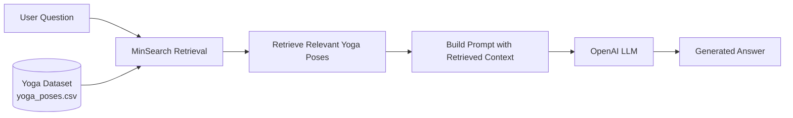

# 🧘 Yoga Assistant

<p align="center">
  
</p>

A Retrieval-Augmented Generation (RAG) application that answers yoga-related questions using a curated knowledge base of yoga poses, including pose instructions, breathing guidance, benefits, contraindications, and modifications.

Built as a course project for [LLM Zoomcamp](https://github.com/DataTalksClub/llm-zoomcamp).

---

## Demo

*To be added.*

---

## Problem

Learning yoga from scattered online resources can be overwhelming, especially for beginners. Information about yoga poses, breathing techniques, benefits, and contraindications is often spread across multiple websites with varying levels of quality.

The Yoga Assistant is a RAG application that helps users retrieve reliable information about yoga poses from a curated knowledge base.

The application is designed to help with:

1. **Yoga Pose Information** – Learn about individual yoga poses.
2. **Step-by-Step Instructions** – Retrieve guided instructions for performing poses.
3. **Breathing Guidance** – Understand the recommended breathing technique for each pose.
4. **Benefits and Contraindications** – Learn when a pose is beneficial and when it should be avoided.

Target users include beginners, yoga enthusiasts, and anyone looking for quick access to yoga pose information.

---

## Features

- 🧘 Interactive chat interface built with Flask
- 🔍 Retrieval-Augmented Generation (RAG)
- 📚 Curated yoga pose knowledge base
- 🤖 OpenAI-powered answer generation
- 👍👎 User feedback collection
- 🗄️ Conversation and feedback storage in PostgreSQL
- 📊 Grafana dashboard for monitoring application metrics
- 🐳 Docker Compose deployment
- 📈 Retrieval and RAG evaluation

---

## Getting Started

### Prerequisites

- Docker & Docker Compose (Recommended)
- OR Python 3.12+, uv, PostgreSQL
- OpenAI API Key

### Clone the Repository

```bash
git clone https://github.com/pranabsarma18/yoga-assistant.git
cd yoga-assistant
```

### Configure Environment Variables

Create a `.env` file in the project root.

```text
OPENAI_API_KEY=your_openai_api_key
```

### Run with Docker (Recommended)

```bash
docker compose up --build
```

The following services will be available:

| Service | URL |
|---------|-----|
| Yoga Assistant | http://localhost:5000 |
| Grafana | http://localhost:3000 |
| PostgreSQL | localhost:5432 |

To stop the services:

```bash
docker compose down
```

> **Note:** Avoid using `docker compose down -v` unless you want to delete the PostgreSQL and Grafana data volumes.

---

## Application Features

The application provides a modern chat interface where users can ask yoga-related questions in natural language.

For every conversation, the application records:

- User question
- Generated answer
- Model used
- Response time
- Token usage
- OpenAI API cost
- Timestamp

Users can also rate each response using **Helpful (👍)** or **Not Helpful (👎)** buttons.

All conversations and feedback are stored in PostgreSQL for analysis and monitoring.

Grafana is used to visualize:

- Conversation history
- User feedback
- Model response time
- Token usage
- Estimated OpenAI API cost

---

## Testing

There is no automated test suite. You can test the application through the web interface or by sending requests directly to the REST API.

### Ask a Question

```bash
URL=http://localhost:5000
QUESTION="What are the benefits of Tree Pose?"

curl -X POST \
    -H "Content-Type: application/json" \
    -d '{"question": "'${QUESTION}'"}' \
    ${URL}/question
```

Example response:

```json
{
    "answer": "Tree Pose helps improve balance, strengthens the legs and core, enhances concentration, and promotes better posture.",
    "conversation_id": "4e1cef04-bfd9-4a2c-9cdd-2771d8f70e4d",
    "question": "What are the benefits of Tree Pose?"
}
```

### Submit Feedback

You can submit feedback for a generated response using the conversation ID returned by the `/question` endpoint.

```bash
curl -X POST \
    -H "Content-Type: application/json" \
    -d '{"conversation_id": "...", "feedback": 1}' \
    ${URL}/feedback
```

Use:

- `1` for **Helpful (👍)**
- `-1` for **Not Helpful (👎)**

## Evaluation

### Retrieval Evaluation

The retrieval component was evaluated using a generated ground-truth dataset consisting of user questions for each yoga pose.

**Evaluation Metrics**

- **Hit Rate:** **88.9%**
- **Mean Reciprocal Rank (MRR):** **57.1%**

To improve retrieval performance, MinSearch field boost weights were optimized using a random search procedure.

Optimized boost parameters:

```python
boost = {
    "pose_name": 2.128,
    "sanskrit_name": 2.608,
    "category": 1.743,
    "difficulty": 0.807,
    "target_areas": 0.211,
    "muscles_engaged": 1.884,
    "benefits": 2.827,
    "contraindications": 2.544,
    "preparations": 2.186,
    "follow_up_poses": 1.219,
    "instructions": 0.980,
    "breathing": 0.869,
    "duration": 1.019,
    "common_mistakes": 2.044,
    "modifications": 0.058,
}
```

Evaluation notebooks:

- `notebooks/02_ground_truth_generation.ipynb`
- `notebooks/03_retrieval_evaluation.ipynb`

Ground-truth dataset:

- `data/ground-truth-retrieval.csv`

### RAG Evaluation

The complete Retrieval-Augmented Generation (RAG) pipeline was evaluated using an **LLM-as-a-Judge** approach.

For each evaluation question:

1. Relevant yoga pose information was retrieved using MinSearch.
2. The LLM generated an answer using the retrieved context.
3. A separate evaluator LLM classified the generated answer as:
   - **RELEVANT**
   - **PARTLY_RELEVANT**
   - **NON_RELEVANT**

The evaluator considered:

- Relevance to the user's question
- Correctness of the information
- Completeness of the response
- Presence of irrelevant or misleading information

#### Results

| Classification | Percentage |
|---------------|-----------:|
| **RELEVANT** | **86%** |
| **PARTLY_RELEVANT** | **4%** |
| **NON_RELEVANT** | **10%** |

These results indicate that the assistant generated relevant answers for most user queries while maintaining a relatively low rate of irrelevant responses.

Evaluation notebook:

- `notebooks/04_rag_evaluation.ipynb`

---

## Architecture



---

## Monitoring

Grafana dashboard is available at **http://localhost:3000**.

Default login credentials:

- **Username:** `admin`
- **Password:** `admin`

<p align="center">
  
</p>

The dashboard visualizes application metrics stored in PostgreSQL, including:

- Recent conversations (question, answer, relevance, timestamp)
- User feedback (Helpful 👍 / Not Helpful 👎)
- Response relevance distribution
- OpenAI API cost over time
- Token usage over time
- Model usage
- Response time over time

These metrics provide insights into application usage, model performance, and user feedback, helping monitor the overall health of the RAG system.

---

## Project Structure

```text
yoga-assistant/
│
├── app.py                  # Flask application
├── db.py                   # PostgreSQL operations
├── Dockerfile
├── docker-compose.yaml
├── README.md
├── pyproject.toml
├── uv.lock
│
├── static/
│   ├── app.js              # Frontend JavaScript
│   └── style.css           # Application styling
│
├── templates/
│   └── index.html          # Chat interface
│
├── yoga_assistant/
│   ├── __init__.py
│   ├── rag.py              # RAG pipeline
│   ├── ingest.py           # Dataset ingestion
│   └── minsearch.py        # In-memory search engine
│
├── data/
│   ├── yoga_poses.csv
│   └── ground-truth-retrieval.csv
│
├── notebooks/
│   ├── 01_dataset_generation.ipynb
│   ├── 02_ground_truth_generation.ipynb
│   ├── 03_retrieval_evaluation.ipynb
│   └── 04_rag_evaluation.ipynb
│
└── images/
    └── image.png
```

---

## Dataset

The project uses a custom-generated yoga dataset created using structured outputs from a Large Language Model.

Each yoga pose contains:

- Pose name
- Sanskrit name
- Category
- Difficulty
- Target body areas
- Muscles engaged
- Benefits
- Contraindications
- Preparatory poses
- Follow-up poses
- Step-by-step instructions
- Breathing guidance
- Recommended duration
- Common mistakes
- Beginner modifications

Dataset location:

```text
yoga_assistant/data/yoga_poses.csv
```

---

## Technologies Used

- Python
- Flask
- PostgreSQL
- Grafana
- Docker
- Docker Compose
- OpenAI API
- MinSearch
- Pandas
- Pydantic
- Jupyter Notebook
- uv

---

## Decisions and Trade-offs

- **MinSearch** was selected because the dataset is relatively small and structured, making keyword-based retrieval simple and efficient without requiring a vector database.
- **Structured outputs** were used during dataset generation to ensure every yoga pose follows a consistent schema.
- **CSV** was chosen as the storage format because it is lightweight, easy to inspect, and sufficient for a small knowledge base.
- **Boost parameter optimization** was performed using random search to improve MinSearch retrieval performance, achieving a **Hit Rate of 88.9%** and an **MRR of 57.1%**.
- **PostgreSQL** was selected to persist conversations, feedback, and evaluation metrics.
- **Grafana** was integrated to visualize application usage and monitor performance metrics.
- **Docker Compose** simplifies deployment by orchestrating the Flask application, PostgreSQL database, and Grafana dashboard.

---

## Limitations

- The dataset is AI-generated and has not been professionally reviewed by certified yoga instructors.
- The application currently relies on a relatively small knowledge base.
- The project focuses on information retrieval and is not intended to provide medical advice.
- Retrieval and RAG evaluations were performed using an automatically generated ground-truth dataset and an LLM-as-a-Judge approach. Human evaluation by experienced yoga practitioners was outside the scope of this project.
- The current retrieval system uses keyword-based search (MinSearch) rather than semantic vector search.
- Conversation history is stored in the database but is not yet available through the web interface.

---

## Future Improvements

- Conversation history in the web interface
- User authentication
- Streaming LLM responses
- Source citations
- Hybrid retrieval (keyword + embeddings)
- Semantic vector search
- Admin dashboard
- Feedback analytics
- Kubernetes deployment
- CI/CD with GitHub Actions