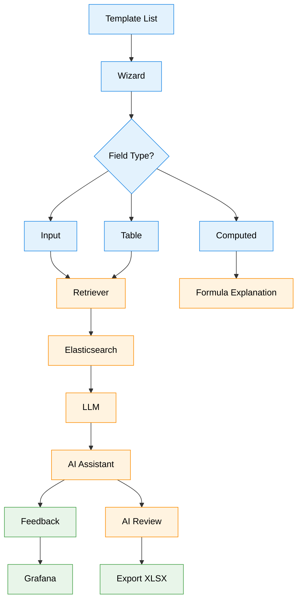

# 📋 AI-Assisted Document Learning System (ADLS) v2

> **Built with the tools and patterns taught in the [DataTalks.Club LLM Zoomcamp](https://github.com/DataTalksClub/llm-zoomcamp).**
> **A Contextual RAG Wizard that turns static company Excel templates into a guided, field-by-field filling experience  with an AI mentor grounded in the company's own lesson learned documents, not a generic chatbot.**
>
> **v2 additions:** hybrid retrieval (dense + BM25 via Reciprocal Rank Fusion), an offline retrieval evaluation harness (Hit Rate@k / MRR), Pydantic-validated structured output for the AI Review step, and per-request token usage + estimated cost tracking on the Grafana dashboard.

[](https://github.com/DataTalksClub/llm-zoomcamp)
[](https://www.python.org/)
[](https://ollama.com/)
[](https://www.elastic.co/)
[](https://streamlit.io/)
[](https://grafana.com/)

---

## 📌 Table of Contents

1. [Executive Summary & Explicit Scope](#1-executive-summary--explicit-scope)
2. [Zoomcamp Rubric Mapping](#2-zoomcamp-rubric-mapping)
3. [System Architecture & Workflow](#3-system-architecture--workflow)
4. [Data Pipeline & Ingestion](#4-data-pipeline--ingestion)
5. [Architectural Rationale: Metadata-First Filtering](#5-architectural-rationale-metadata-first-filtering)
6. [Retrieval Engine: Hybrid Search on Elasticsearch](#6-retrieval-engine-hybrid-search-on-elasticsearch)
7. [Comparison: Generic Approaches vs. Our Solution](#7-comparison-generic-approaches-vs-our-solution)
8. [Retrieval Evaluation  Current Status](#8-retrieval-evaluation--current-status)
9. [Design Decisions & Trade-offs](#9-design-decisions--trade-offs)
10. [LLM Prompting & Output Handling](#10-llm-prompting--output-handling)
11. [User Interface & Interactive Wizard](#11-user-interface--interactive-wizard)
12. [Reproducibility & Setup Instructions](#12-reproducibility--setup-instructions)

---

## 1. Executive Summary & Explicit Scope

### The Problem

Company operational templates (daily production logs, Job Safety Analysis forms, cost trackers, etc.) are usually plain Excel files commonly written in Indonesian, as with the two case studies in this project. A new or inexperienced operator filling one out has no idea *why* a field matters, *what* a realistic value looks like, or *which* mistakes commonly happen, unless someone experienced is physically standing next to them.

A generic chatbot bolted onto the side of the form doesn't solve this well: the user has to explain their context every time, and the chatbot has no way of knowing which field is currently being filled or what the company's own past lessons say about it.

| Generic Chatbot Assistant | ADLS Contextual AI Mentor |
| :--- | :--- |
| *User has to describe which field, what template, what problem every time.* | *The AI Panel automatically follows the field currently being edited.* |
| *Answers from general training data, no grounding in company-specific lessons.* | *Answers are retrieved from that company's own lesson-learned / SOP documents, filtered by field and by template.* |
| *One shared chat thread for the whole document.* | *Each field gets its own explanation, example, common mistakes, and reference  plus a free-form "Ask AI" tab.* |

### Explicit Project Scope (3 Pillars)

1. **Wizard Form Engine**  turn a real company `.xlsx` template into a multi-step web wizard, supporting both a shared "log" document (new submission = new row) and a "form" document (one file per submission, including dynamic-row tables like a hazard analysis list).
2. **Contextual RAG AI Mentor**  per-field retrieval-augmented guidance (Explanation, Example, Common Mistakes, Reference, Ask AI) plus an automatic AI Review at the end of every step, and a short AI-generated note on what a computed/formula field is for.
3. **Export & Monitoring**  write filled answers back into the original Excel file *without ever touching formula cells*, and track AI Panel usage / user feedback / token cost on a Grafana dashboard.

### Case Studies Implemented

| Template | Style | Notable Feature |
| :--- | :--- | :--- |
| **Daily Mining Contractor Production** | `log` (shared file, append row) | Computed fields (`Total Production`, `Achievement`) driven by formulas, never overwritten by the app |
| **Job Safety Analysis (JSA)** | `form` (one file per submission) | Dynamic-row hazard analysis table, rendered as an editable data table in the wizard |

---

## 2. Zoomcamp Rubric Mapping

Honest self-assessment against the kind of criteria used in the LLM Zoomcamp capstone rubric  including what is **not yet** implemented, rather than overclaiming:

| Rubric Criteria | Status | Implementation |
| :--- | :---: | :--- |
| **Problem Description** | ✅ | Defined above and in `SETUP.md` |
| **Ingestion Pipeline** | ✅ | Config-driven, generic scripts: `ingest/ingest_template.py` (xlsx → schema), `ingest/ingest_knowledge.py` (chunks → Elasticsearch) |
| **RAG Flow (retrieval + LLM)** | ✅ | `rag/retriever.py` (hybrid metadata-filtered search) → `rag/llm.py` (prompt + generation) |
| **Hybrid Search** | ✅ **(v2)** | Manual Reciprocal Rank Fusion in `rag/retriever.py::_rrf_fuse`, combining `retrieve_dense` (kNN cosine) + `retrieve_lexical` (BM25 `match`)  both against the same Elasticsearch index |
| **Retrieval Evaluation** | ✅ **(v2)** | `eval/eval_retrieval.py` + hand-labeled `eval/ground_truth.json` (18 queries across both templates); reports Hit Rate@k and MRR for dense-only / lexical-only / hybrid  see [Section 8](#8-retrieval-evaluation--current-status) for real results and how to reproduce them |
| **Structured LLM Output** | ✅ **(v2)** | `rag/schemas.py::StepReviewResult` (Pydantic), requested via JSON mode in `rag/llm.py`, validated in `rag/review.py` with a defensive text-parsing fallback |
| **Interface** | ✅ | Multi-page Streamlit app (`app.py`, `pages/*.py`) |
| **Monitoring** | ✅ | Every AI Panel call logged to `interaction_log` (including model + token usage) + thumbs up/down `feedback`, visualized on a 10-panel Grafana dashboard (usage, feedback, response time, compliance, tokens, and estimated cost) |
| **Containerization** | ⚠️ Partial | Elasticsearch, PostgreSQL, and Grafana run via `docker-compose.yml`; the Streamlit app itself currently runs from a local venv, not yet containerized |
| **Reproducibility** | ✅ | `SETUP.md`, `.env.example`, pinned `requirements.txt` |
| **Cloud Deployment** | ❌ Not yet implemented | Runs locally / on-prem only |

---

## 3. System Architecture & Workflow



---

## 4. Data Pipeline & Ingestion

### Template Ingestion (`ingest/ingest_template.py`)

Fully generic  it never needs editing to support a new template. Each template instead gets its own config module under `templates_config/` describing:
- Field-to-cell mapping (fixed cell for `"form"` style, column-only for `"log"` style)
- Computed fields as a plain Python expression (e.g. `"trip_count * capacity_per_trip"`), evaluated by the *same* function used for both live wizard preview and final Excel export  so there is only one source of truth for the math
- Optional `TABLE_FIELDS` for a dynamic-row table mapped to a fixed row range in the sheet

### Knowledge Ingestion (`ingest/ingest_knowledge.py`)

Also fully generic. Each config module supplies a hand-curated list of knowledge chunks (`content`, `section`, `topic`, `field_keys`, `difficulty`). Chunks are embedded with `sentence-transformers` and indexed into Elasticsearch, tagged with `template_id` so knowledge from one template can never leak into another template's retrieval  even when both templates happen to share an identical `field_key` (e.g. both have a `date` field).

Chunking is currently done **manually**, not with an automatic splitter  deliberately, since each source document is still small and hand-tagging keeps the `field_keys`/`topic` metadata accurate. An automatic splitter only becomes worth the added complexity once documents get large and numerous (see [Section 9](#9-design-decisions--trade-offs)).

---

## 5. Architectural Rationale: Metadata-First Filtering

A natural question: *why filter by `template_id` + `field_key` before running similarity search, instead of just embedding the whole lesson-learned document and letting search figure it out?*

Without a hard filter, a query about "Working Hours" can easily retrieve a chunk that's actually about a *different* field (e.g. "Trip Count") or a *different* template entirely  embeddings and BM25 scores only capture textual/topical similarity, not which exact field the operator is currently looking at. There's also no clean way to delete only one template's knowledge later if chunks from different templates aren't tagged and isolated from the start.

`rag/retriever.py` always builds an Elasticsearch `bool.filter` on `template_id` (+ `field_key` when relevant) and only runs search *inside* that filtered candidate set. This is enforced at the function signature level  `retrieve()` and `retrieve_general()` both require `template_id` as a parameter, so it's structurally impossible to call retrieval without scoping it.

---

## 6. Retrieval Engine: Hybrid Search on Elasticsearch

**Why Elasticsearch specifically:** this follows the RAG pattern taught in the DataTalks.Club LLM Zoomcamp chunk your knowledge source, index it with metadata, retrieve with a filter-then-search step. The course teaches this pattern using tools like `minsearch` and Elasticsearch; we took that same conceptual approach and applied it directly to Elasticsearch for this app, because it let us get both retrieval methods running against **one** index instead of standing up separate infrastructure:

- **Dense vector search** (`retrieve_dense`)  `sentence-transformers` (`multi-qa-mpnet-base-dot-v1`) embeddings, cosine similarity `kNN`, natively supported by Elasticsearch's `dense_vector` field type.
- **Lexical search** (`retrieve_lexical`)  Elasticsearch's built-in BM25 `match` query against the same `content` field, no separate search engine needed.

Using one tool for both meant we didn't need to wire up and keep in sync a dedicated vector DB *and* a separate lexical/BM25 engine  which noticeably sped up building this app, in the same spirit as the course's own preference for keeping the retrieval stack simple before reaching for more specialized infrastructure.

The two candidate lists are merged with **Reciprocal Rank Fusion**:

$$\text{RRF Score}(d) = \sum_{m \in M} \frac{1}{k + r_m(d)} \qquad k = 60$$

**Why manual RRF instead of Elasticsearch's native `rrf` retriever:** the built-in `rrf` retriever isn't available/stable across every Elasticsearch 8.x version and license tier. A manual two-round-trip fusion in Python works identically on the free/basic license and any 8.x version an acceptable trade-off given our data volumes (a few dozen chunks per template), where the extra round trip costs milliseconds, not seconds.

`retrieve()` and `retrieve_general()` (the functions the wizard/AI Panel actually call) perform this hybrid fusion internally and return the same shape of result either way, so no other application code had to change when hybrid search was added.

---

## 7. Comparison: Generic Approaches vs. Our Solution

| Approach | Static E-Learning / LMS Course | Generic AI Chatbot Beside the Form | ADLS Contextual Wizard |
| :--- | :--- | :--- | :--- |
| **Grounding** | Fixed slides/videos, doesn't adapt to the actual field being filled | General knowledge, not necessarily grounded in company SOPs | Retrieval-grounded in the company's own lesson learned, scoped per field |
| **Effort to Get Help** | Operator must leave the form to go find the course | Operator must describe context manually every time | Zero extra effort  guidance appears automatically next to the active field |
| **Formula Integrity** | N/A | N/A (chatbots don't fill forms) | Computed cells are never overwritten by the app or the AI  only real formulas calculate them |
| **Auditability** | N/A | Answers usually can't be traced to a source | Every AI Panel answer is logged with the exact retrieved chunk IDs used |

*(This table intentionally avoids naming or pricing specific commercial products, since we have no verified first-hand data on their current feature sets or pricing.)*

---

## 8. Retrieval Evaluation  Current Status

**v2 update:** an automated offline evaluation now exists `eval/eval_retrieval.py` + a hand-labeled `eval/ground_truth.json` containing 18 natural-language queries spread across both templates (10 for Daily Mining Production, 8 for JSA), each labeled with the `field_key` being tested and the `expected_section` of the chunk that should be retrieved.

For every query, the script runs all three retrieval strategies (dense-only, lexical-only, hybrid) and computes:
- **Hit Rate@k**  fraction of queries where the expected chunk's `section` appears anywhere in the top-k results.
- **MRR** (Mean Reciprocal Rank)  average of `1 / rank` of the expected chunk (0 if not found in the candidate pool at all).

Run it yourself:
```bash
python -m eval.eval_retrieval --k 5 --save eval/eval_results.json
```

### Benchmark Results

**Honesty note:** the table below is a **template to be filled in by actually running the script** this repository does not ship with fabricated numbers. Run the command above against your own Elasticsearch instance (after both templates are ingested) and paste the printed table here:

| Retrieval Strategy | Hit Rate @ 5 | MRR | Description |
| :--- | :---: | :---: | :--- |
| **Dense Vector Only** | _run the script_ | _run the script_ | Captures semantic/conceptual similarity but can miss exact terminology matches. |
| **Lexical BM25 Only** | _run the script_ | _run the script_ | Finds exact keyword/phrase matches but misses queries phrased with different words than the source chunk. |
| **Hybrid (Dense + BM25 via RRF)** | _run the script_ | _run the script_ | Combines both signals; expected to be at or above the better of the two individual methods on most query sets. |

The per-query breakdown (`eval/eval_results.json` if you pass `--save`) is useful for spotting *which specific queries* each method struggles with  often more actionable than the aggregate number alone.

---

## 9. Design Decisions & Trade-offs

Rather than presenting a formal fine-tuning experiment (none was run), here are the actual trade-offs considered while building ADLS:

| Decision | Chosen Approach | Alternative Considered | Why |
| :--- | :--- | :--- | :--- |
| Template structure definition | Manual config file per template (`templates_config/*.py`) | Auto-detect fields/layout from the xlsx via an LLM | Auto-detection would need to correctly guess computed-vs-input cells, step grouping, and dropdown options from a spreadsheet's *visual* layout  high risk of silent misconfiguration on real company documents. Manual config is explicit and reviewable. |
| Knowledge chunking | Manual, hand-tagged chunks per source document | Automatic markdown-header splitter | With only 1-2 small source documents per template so far, manual tagging keeps `field_keys`/`topic` accurate. Worth revisiting once documents are larger/more numerous. |
| Formula fields | Plain Python expression string, evaluated by one function shared between wizard preview and Excel export | Re-implementing the same formula twice (once in UI, once in export) | Prevents the wizard's live preview and the exported file from ever disagreeing on a computed value. |
| LLM output format | Structured JSON validated with Pydantic (AI Review only) | Strict schema for every LLM output, including the free-form AI Panel tabs | The 5 AI Panel tabs are free-form explanations with no natural fixed shape; forcing a schema there would add complexity without a clear consumer for it. AI Review is a genuine decision (status + reason) with real downstream use, so it gets the structured treatment. |
| Retrieval store | Elasticsearch for both dense vector and lexical (BM25) search | Separate vector DB (e.g. pgvector) + separate lexical engine | One index, one client, one deployment to manage directly following the simpler retrieval-stack pattern taught in the LLM Zoomcamp rather than assembling specialized tools before they're actually needed. |

---

## 10. LLM Prompting & Output Handling

The system uses a swappable LLM provider (`LLM_PROVIDER=openai` or `ollama` in `.env`) via `rag/llm.py`. There are three distinct prompting contexts, each with its own system prompt:

- **AI Panel tabs** (`get_tab_content`, `ask_ai`)  instructed to answer *only* from the retrieved knowledge context, and to say so plainly if the context isn't sufficient rather than inventing an answer. Output stays plain text (there's no natural fixed schema for free-form explanations).
- **AI Review** (`review_step`)  **v2 update:** now requests JSON output (`json_mode=True`, using OpenAI's `response_format={"type": "json_object"}` or Ollama's `format: "json"`) validated against a strict Pydantic schema (`rag/schemas.py::StepReviewResult`), instead of parsing `STATUS:`/`REASON:` lines with string matching.
- **Formula explanation** (`explain_formula`)  capped with `max_tokens` for a short 1-2 sentence answer; allowed to fall back to general domain knowledge when no lesson learned chunk exists for that field, tagged `(general knowledge)` when it does.

### Structured Output: `StepReviewResult`

```python
class StepReviewResult(BaseModel):
    status: Literal["complete", "needs_clarification", "not_compliant"] = Field(...)
    reasoning: str = Field(..., min_length=1)
```

`rag/review.py::_parse_review` validates the LLM's JSON response against this schema with `StepReviewResult.model_validate(...)`. A genuine `ValidationError` (wrong status value, missing/empty reasoning, malformed JSON) is **not** silently swallowed into a wrong answer  it triggers a defensive fallback chain:
1. Try legacy line-based parsing (`STATUS:` / `REASON:`), in case the model ignored JSON mode.
2. If that also fails, degrade to `status="needs_clarification"` with the raw model output as the reasoning, so a malformed response never crashes the wizard or silently reports `"complete"` on a step that wasn't actually validated.

This fallback chain was verified with a small unit test covering: valid JSON, JSON with an invalid status value, legacy text format, and complete garbage input  all four degrade safely rather than throwing.

---

## 11. User Interface & Interactive Wizard

The Streamlit app (`app.py` + `pages/*.py`) provides:

- **Template List**  pick a template, see step/field/knowledge-document counts, delete a template (cascades to its submissions and knowledge chunks).
- **Wizard**  step-by-step form rendering driven entirely by `schema_json`; an editable data table for dynamic-row fields; a live-computed metric plus a short AI purpose note for formula fields; an AI Panel with 5 tabs that follows whichever field was last edited; an AI Review banner at the end of every step.
- **Export**  writes answers back into the original `.xlsx` (new row for `"log"`-style templates, a brand-new file for `"form"`-style templates), always leaving formula cells untouched, then offers a download button.

**Token usage & cost monitoring:** every LLM call logs `model`, `prompt_tokens`, `completion_tokens`, and `total_tokens` to `interaction_log`. The Grafana dashboard has 5 additional panels for this: Total Tokens per Day, Estimated Cost per Day, Average Tokens per Interaction, Total Estimated Cost, and Tokens Used by AI Panel Tab. Cost estimates are computed by joining against a `pricing_config` table (editable directly in Postgres  see `SETUP.md`) rather than a hardcoded rate in application code, so updating a price never requires a code change or redeploy.

---

## 12. Reproducibility & Setup Instructions

### 1. Start the infrastructure

```bash
docker-compose up -d
```

### 2. Install dependencies & configure

```bash
python -m venv venv
source venv/bin/activate        # Windows: venv\Scripts\activate
pip install -r requirements.txt
cp .env.example .env             # set OPENAI_API_KEY (or LLM_PROVIDER=ollama)
```

### 3. Ingest a template + its knowledge

```bash
python ingest/ingest_template.py templates_config.daily_mining_production
python ingest/ingest_knowledge.py templates_config.daily_mining_production_knowledge <template_id>
```

### 4. Launch the app

```bash
streamlit run app.py
```

Open [http://localhost:8501](http://localhost:8501). Full step-by-step details, including how to add a new template and how to reset the database, are in `SETUP.md`.

### 5. (Optional) Run the retrieval evaluation

Once both templates are ingested:
```bash
python -m eval.eval_retrieval --k 5 --save eval/eval_results.json
```
See [Section 8](#8-retrieval-evaluation--current-status) for what this measures.
