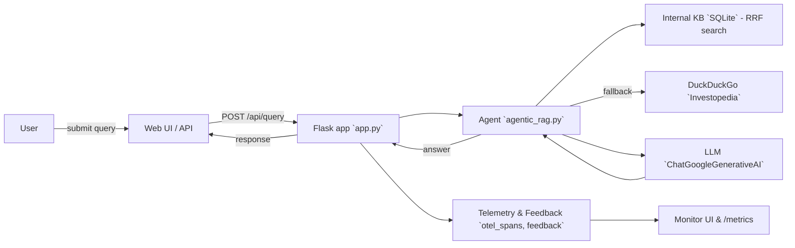

# Agentic RAG — Financial Assistant

A small Retrieval-Augmented-Generation (RAG) demo that answers financial questions using an internal SQLite knowledge base and online searches. The project provides a web UI, an HTTP API (including streaming responses), feedback collection, and basic monitoring/telemetry.

Table of contents
- Problem
- Data
- Architecture & flow
- Evaluation criteria
- Screenshots & preview
- Quick start (run)
- Files of interest
- More docs

**Problem**
This project demonstrates how to build a small, auditable financial assistant that prioritizes factual retrieval over hallucination. The agent searches an internal knowledge base (SQLite) first and supplements gaps with targeted web searches (DuckDuckGo scoped to Investopedia). The goal is to produce concise, evidence-backed answers to finance questions while recording telemetry and reviewer feedback for evaluation.

**Data**
- The project uses a local SQLite database `investopedia.db` that stores articles, FTS/embedding indexes, and telemetry tables (`otel_spans`). The DB is expected in the project root. If you don't have it, see `setup.md` for options to prepare or import data.

**Architecture & flow**
- Web frontend: [templates/index.html](templates/index.html) — simple form to submit queries and view answers.
- API endpoints: implemented in `app.py`.
  - `POST /api/query` — synchronous JSON query -> answer.
  - `POST /api/query-stream` — server-streaming NDJSON endpoint for incremental output.
  - `POST /api/feedback` — submit thumbs-up/down feedback (rating=1 or -1).
  - `/monitor` — monitoring dashboard ([templates/monitor.html](templates/monitor.html)).
  - `/metrics` and `/health` — Prometheus metrics and health check.
- RAG & agent logic: `agentic_rag.py` builds a tool-calling agent that uses:
  - `search_knowledge_base` (internal RAG search via `base_rag.RAGBase`).
  - `search_investopedia` (DuckDuckGo Investopedia-scoped web search).
  - LLM client (configured in `agentic_rag.py` via `ChatGoogleGenerativeAI`).
- Telemetry & persistence: `base_rag.py` manages spans and persists usage metadata into `otel_spans`. App stores feedback in the `feedback` table.

**Flow Diagram**


**Evaluation methods (used in this project)**
This project includes an automated evaluation workflow that was used to assess answer quality. Reviewers can reproduce the same methods rather than relying only on manual checklists.

- **Retrieval scoring (RRF-based)**: The internal retrieval component uses Reciprocal Rank Fusion (RRF) to merge vector and FTS results (see `base_rag.py::search`). For each query we record the RRF score and the top-5 retrieved documents. Evaluation items include:
  - Precision@k of retrieved documents against a seeded ground-truth set.
  - Average RRF score for queries that produce correct answers.

- **LLM-as-judge for answer quality**: Answers are evaluated automatically using a held-out LLM judge. The judge prompt compares the agent answer to the retrieved context and a reference (when available) and returns a small JSON with `score` (0-1) and `notes` fields. This enables fast, repeatable assessments and complements human feedback. Example judge prompt (adapt in your provider):

  """
  You are an objective evaluator. Given a question, a reference context (retrieved documents) and an agent answer, return JSON {"score": <0-1>, "reason": "short explanation"}. Score should be high only if the answer is supported by the reference context and contains no hallucinated facts.
  Question: {question}
  Reference: {retrieved_context}
  Answer: {agent_answer}
  """

- **Human feedback & persisted ratings**: In addition to automated judge scores, reviewers can submit thumbs-up (rating=1) or thumbs-down (rating=-1) via `/api/feedback`. Feedback is stored in the `feedback` table and shown on `/monitor`.

- **Telemetry & cost/usage**: The project persists usage metadata (input/output/total tokens and estimated cost) into `otel_spans` via the tracing wrapper in `base_rag.py`. Use `/metrics` and `/monitor` to inspect latency, token usage, and error rates.

- **Reproducibility & scripts**: To reproduce the evaluation you should:
  1. Seed `investopedia.db` with a small evaluation table containing (query, reference_answer) rows.
  2. Run queries via `/api/query` or a batch script that calls the agent and collects (retrievals, agent_answer, judge_score, rrf_score).
  3. Aggregate metrics: mean judge score, Precision@k, percentage of `rating=1` feedback, average latency, and token usage.

See [evaluation.md](evaluation.md) for a concrete checklist, example LLM-judge prompt, and reproducible steps.

Screenshots & preview

### Main UI


### Monitor dashboard


### Example query and answer


Placeholder for app preview video: `docs/assets/APP_PREVIEW.md` (replace with a short link or embed later).

Quick start — run locally
See detailed steps in [setup.md](setup.md). Minimal quick run (if dependencies and DB are present):

```bash
python app.py
# then visit http://localhost:8080
```

Files of interest
- `app.py` — Flask app, API and monitoring.
- `agentic_rag.py` — agent, tools, streaming handler.
- `base_rag.py` — RAG search logic and telemetry persistence.
- `templates/` — UI views.
- `investopedia.db` — data file (expected at project root).

More docs
- Setup and environment: [setup.md](setup.md)
- Usage examples and API: [usage.md](usage.md)
- Evaluation checklist: [evaluation.md](evaluation.md)
- Contributing guidelines: [contributing.md](contributing.md)

