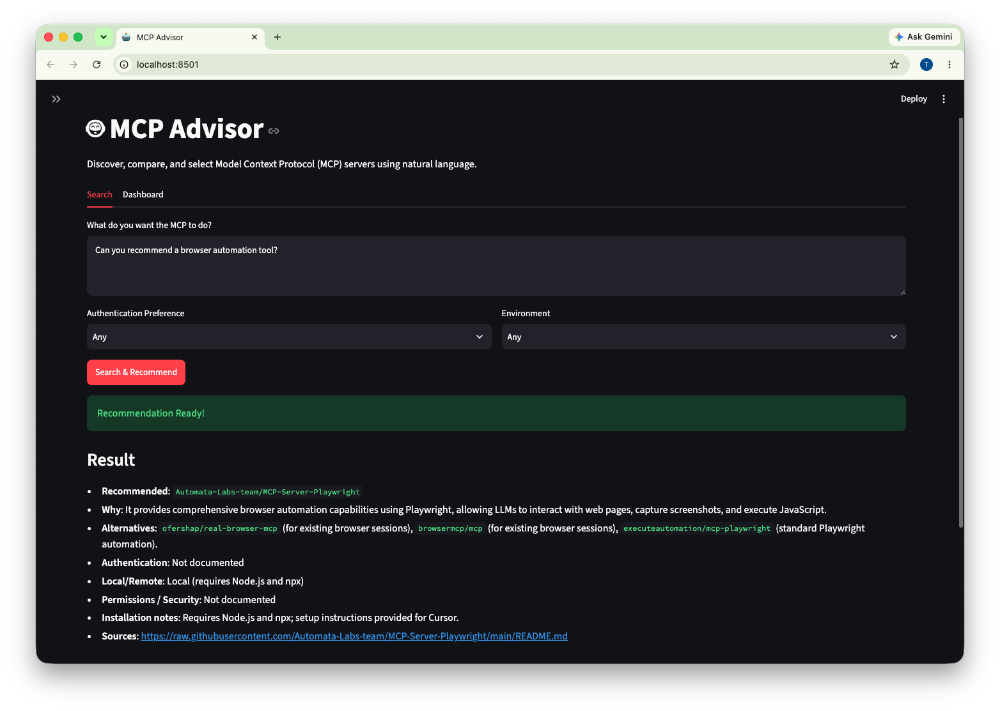
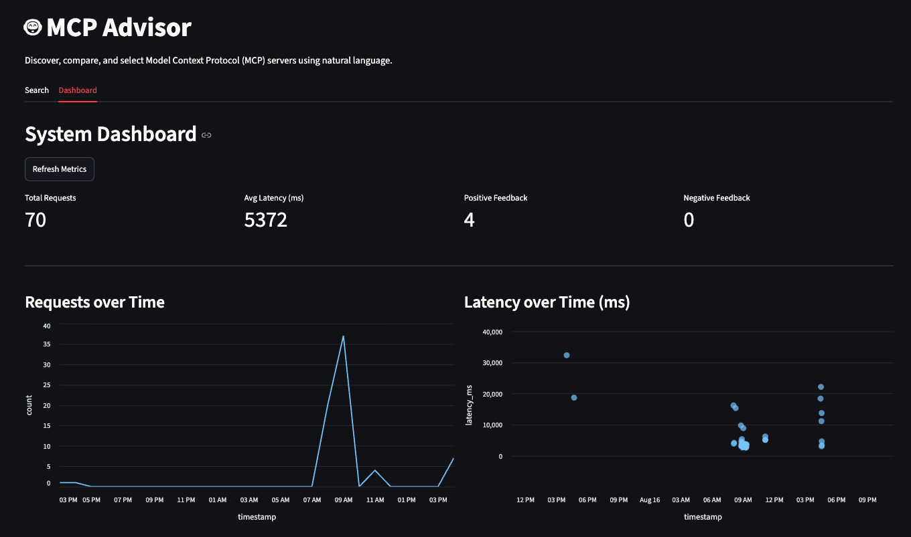
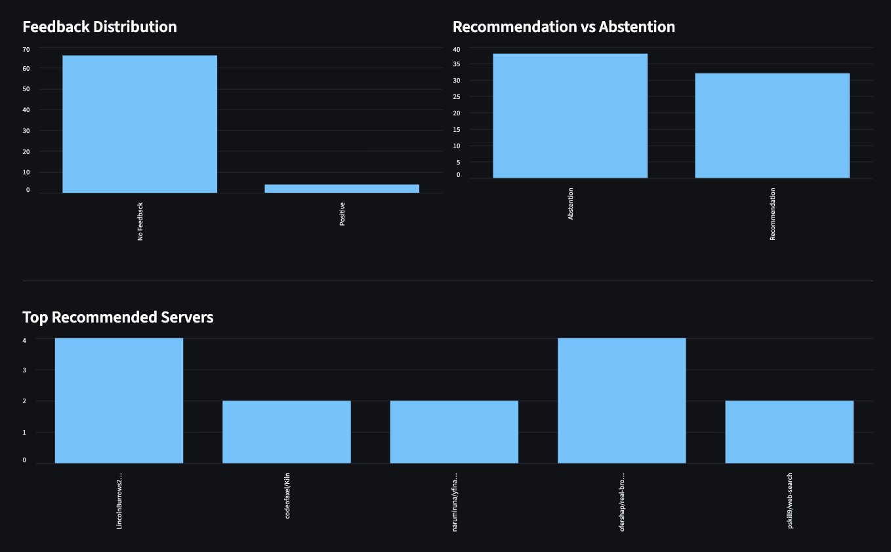

# MCP Advisor

A Retrieval-Augmented Generation (RAG) system that recommends Model Context Protocol (MCP) servers based on natural language requirements.

## 1. Problem
Developers spend significant time manually searching registries and GitHub repositories to find MCP servers. Keyword searches often fail to capture complex constraints (e.g., "I need local browser automation without relying on a cloud API key").

**MCP Advisor** solves this by searching directly through server documentation and recommending the best-fit servers based on retrieved evidence.

---

## Interface Preview

### 1. Search UI
*Example Query*: "Can you recommend a browser automation tool?"  
*Recommendation*: `Automata-Labs-team/MCP-Server-Playwright` (Matches the intent to execute browser sessions and JS).



### 2. Monitoring Dashboard
Tracks real-time system metrics, user feedback, latency distributions, and top recommended servers.




---

## 2. Dataset
The dataset is dynamically built from two primary sources:
1. **Primary**: Official MCP reference servers (`modelcontextprotocol/servers`)
2. **Supplemental**: Community curated list (`awesome-mcp-servers`)

For each server, the system fetches the `README.md` directly from its source repository, ensuring the recommendation engine has access to the most accurate, up-to-date documentation regarding capabilities, installation, and security permissions.

---

## 3. Architecture
The system consists of the following components:
- **Ingestion Engine**: Python scripts to fetch registries and crawl GitHub for documentation.
- **Search Engine**: Elasticsearch (v8.11.1) running locally via Docker.
- **Embedding Model**: `sentence-transformers/all-MiniLM-L6-v2` (384 dimensions).
- **LLM / Generator**: Google Gemini API (`gemini-3.1-flash-lite`).
- **Monitoring**: Local SQLite database capturing requests, latency, and feedback.
- **UI**: Streamlit web interface with interactive feedback and a monitoring dashboard.

---

## 4. Ingestion
The ingestion pipeline is completely reproducible and automated:
1. `fetch_registry.py`: Parses the raw markdown from official and community registries to extract stable metadata (`server_id`, `name`, `description`, `repository`).
2. `fetch_readmes.py`: Uses concurrent threads to safely download the `README.md` for all registered servers directly from GitHub.

---

## 5. Retrieval Strategy
Standard Top-30 chunk retrieval suffers from candidate generation failure. The system uses **Vector Oversampling + Server-Level Deduplication** to improve recall:
1. **Chunking**: Documents are split based on Markdown headings. We target ~1000 characters per chunk to safely fit within the embedding model's limits.
2. **Vector Oversampling**: Retrieves Top-200 chunks via dense vector search (k-NN) using `all-MiniLM-L6-v2`.
3. **Server Deduplication**: Groups the chunks by unique `server_id`, keeping the Top-5 unique servers.
4. **Context Limiting**: To prevent context window explosion, only the top 2-3 most relevant chunks per server are extracted and fed to the LLM.

---

## 6. RAG Flow
1. **Query Rewriting**: The user's input (plus constraints like "Local Execution") is rewritten by an LLM into a dense search query.
2. **Grounded Generation**: The LLM evaluates the Top-5 aggregated server documents. It is instructed to only recommend servers present in the context and to state "Not documented" for missing information.

---

## 7. Evaluation & Architecture Decisions

To ensure optimal performance and justify architecture decisions, the system was evaluated on a frozen benchmark set (`validation_realistic_v1.json`) containing 60 queries (including 7 abstention constraints).

### Retrieval Methodology & Results
We evaluated four different retrieval variants using `src/evaluation/retrieval_benchmark.py`:
- **V1: Baseline Hybrid**: Standard top-k dense and sparse search.
- **V2: Vector Oversample**: Dense search with heavy oversampling.
- **V3: BM25 Oversample**: Sparse keyword search with oversampling.
- **V4: RRF Fusion (V2 + V3)**: Reciprocal Rank Fusion of oversampled vector and sparse results.

**Results (Overall N=53 answerable queries):**
| Method | Hit@5 | MRR@5 | Candidate Recall@50 | Latency (p50) |
| --- | --- | --- | --- | --- |
| V1: Baseline Hybrid | 17.0% | 0.081 | 35.8% | 33.0ms |
| V2: Vector Oversample | 34.0% | 0.229 | 67.9% | 46.1ms |
| V3: BM25 Oversample | 15.1% | 0.076 | 43.4% | 33.2ms |
| V4: RRF Fusion | 32.1% | 0.156 | 67.9% | 72.8ms |

*Note: The dataset was re-indexed with semantic chunking. We attempt to keep chunk sizes under 1000 characters to safely fit within the embedding model's 256 token limit, while removing a previous hard 4000-character truncation limit. This increased the total index size to 92,397 chunks, significantly improving Vector Search and RRF performance.*

**Architecture Decision**: Vector Oversample (V2) is chosen as the production retrieval engine. Not only does it yield the highest `Hit@5` (34.0%) and `MRR@5` (0.229), but it is also faster and architecturally simpler than RRF, while matching the maximum `Candidate Recall@50` (67.9%). Furthermore, production retrieval is configured to extract only the Top 2-3 chunks per unique server, minimizing token overhead and preventing context window explosion when feeding evidence to the LLM.

### End-to-End Generation (RAG Ablation)
*Disclaimer: These metrics evaluate the generation pipeline in isolation using a frozen set of cached candidates retrieved before the Phase B chunking optimizations. The goal is purely to measure the effectiveness of the constraints and prompts.*

**Results (N=60 queries):**
| Metric | Baseline (Simple Prompt) | Production (Guarded + Constraints) |
| --- | --- | --- |
| Correct Recommendation | 8 | **5** (Stricter matching) |
| Correct Abstention | 0 | **6** |
| False Abstention (Missed in Context) | 0 | 6 |
| Wrong Recommendation | 11 | **2** |
| Retrieval Miss (Not in Context) | 41 | 41 |
| API Failure | 0 | 0 |

**Architecture Decision**: The production guarded pipeline provides a massive safety improvement. The baseline naive prompt makes wrong recommendations frequently (11 Wrong Recommendations) and fails to abstain when appropriate. The production system trades a slight drop in aggressive recommendation for a highly robust abstention capability, making it vastly safer for automated workflows.

---

## 8. Reliability & Safety

MCP Advisor implements multiple engineering guardrails to ensure reliable recommendations:
- **Pydantic Structured Validation**: Responses are strictly parsed to guarantee structure.
- **Constraint Gating**: Hard constraints (e.g., "Must be Local") are explicitly evaluated against retrieved context. If any constraint fails, the system abstains.
- **Anti-Hallucination Gate**: The system verifies that the recommended `server_id` actually exists in the retrieved context pool. If the LLM hallucinates an invalid ID, it triggers an automatic retry, and ultimately abstains if unresolved.
- **Untrusted External Data Treatment**: The LLM prompt explicitly treats READMEs as untrusted data, preventing prompt injection or unwanted instruction execution from the raw documentation.

---

## 9. Monitoring Dashboard

The application includes a built-in SQLite monitoring module (`src/monitoring/db.py`).
- Every interaction logs `timestamp`, `user_query`, `latency_ms`, and `recommended_server`.
- Users can provide explicit 👍 / 👎 feedback directly in the Search UI.
- The **Dashboard** visualizes 5 metrics using Streamlit charts:
  1. Requests over Time
  2. Latency over Time
  3. Feedback Distribution
  4. Recommendation vs Abstention Ratios
  5. Top Recommended Servers

---

## 10. How to Run

1. **Clone the repository**
2. **Set your API Key**
   ```bash
   cd mcp-advisor
   export GEMINI_API_KEY="your-gemini-api-key"
   ```
3. **Start the system via Docker Compose**
   ```bash
   docker compose up --build
   ```
   *Note: The `init-index` container will automatically start first, wait for Elasticsearch to boot, and index `documents.json`. If `documents.json` is missing, it will download the registry and READMEs from scratch. The `web` interface will only start once indexing is completely finished.*
4. **Access the Application**
   Open your browser to `http://localhost:8501`.


## 12. Evaluation Criteria Mapping (Reviewer Checklist)

This table maps the LLM Zoomcamp Capstone rubric criteria to the relevant project components:

| Criterion | Implementation & Evidence |
| --- | --- |
| **Problem Description** | See Section 1. |
| **Ingestion Pipeline** | Automated Python pipeline fetching from GitHub (`src/ingestion/`). |
| **RAG Flow** | User query -> LLM Rewrite -> ES Vector Oversample -> Server Dedup -> LLM Guarded Generation (`src/agent/advisor.py`). |
| **Retrieval Evaluation** | Evaluated 4 variants. Benchmark script at `src/evaluation/retrieval_benchmark.py` (See Section 7). |
| **LLM Generation Eval** | Ablation benchmark comparing Baseline vs Guarded approach. Script at `src/evaluation/generation_benchmark.py` (See Section 7). |
| **Interface** | Full Streamlit application (`app.py`). |
| **Monitoring** | SQLite + Streamlit Dashboard with 5 charts and User Feedback (See Section 9). |
| **Containerization** | `docker-compose.yml` runs Elasticsearch, `init-index`, and Streamlit UI. |
| **Reproducibility** | Data is committed (`data/documents.json`), meaning fresh clones index instantly without fetching 3,000 repos. |
